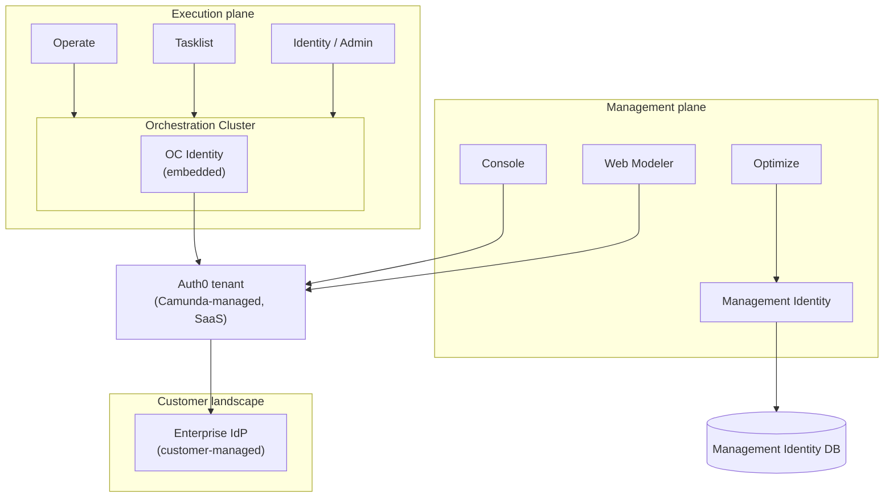
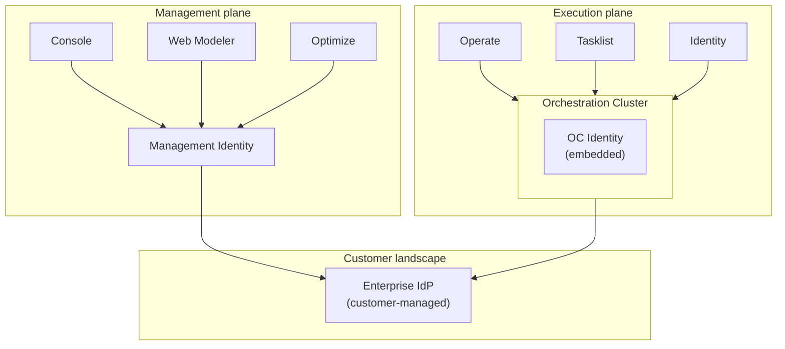

## 2. Current identity architecture (Camunda platform today)

### 2.1 Identity components

Today identity responsibilities are split across several components:

- **Orchestration Cluster Identity (OC Identity)**
  - Embedded into the Orchestration Cluster runtime.
  - Manages runtime authentication and fine-grained authorizations (process definitions, instances, tasks, tenants, cluster APIs) for Zeebe, Operate, Tasklist, and OC APIs.

- **Management Identity**
  - Separate service used to control access to Web Modeler, Console, and Optimize and other management-plane functions in earlier releases.
  - Uses Keycloak or an external OIDC provider plus its own SQL database in self-managed deployments (see existing Management Identity arc42 docs).

- **SaaS Auth0 tenant (Console / Hub)**
  - In SaaS today, Console and other management-side UIs use a Camunda-operated Auth0 tenant as their IdP/broker.
  - From the target-architecture perspective, this is an internal broker/IdP implementation detail, not part of the long-term reference model.

- **Customer Enterprise IdPs**
  - In self-managed and in the target state, the Enterprise IdP is always the customer’s IdP (Entra, Okta, Keycloak, etc.), integrated via standard OIDC.
  - SAML is supported via Keycloak.

### 2.2 Current high-level structure

#### 2.2.1 SaaS

In SaaS today:

- Console and Web Modeler authenticate users against a Camunda-managed Auth0 tenant, which acts as the IdP/broker for all SaaS tenants.
- OC Identity in each Orchestration Cluster also uses Auth0 as its OIDC IdP, applying runtime authorization for Operate, Tasklist, and cluster APIs.
- Auth0 either federates to the customer Enterprise IdP or manages user accounts directly, depending on tenant configuration. The concrete integration code lives in the respective SaaS backends (Console/Hub services and OC Identity OIDC client configuration), which use standard OAuth2/OIDC client libraries to communicate with Auth0.
- Since 8.8, Management Identity is no longer used in SaaS to serve the web applications. It is, however, still deployed **headlessly** in SaaS for two specific purposes: handling Optimize permissions, and providing RBAC for clusters on versions prior to 8.8. 
- Auth0 org membership: Today, membership of users in organizations is stored in Auth0 user metadata and surfaced as JWT claims. These claims are consumed by Hub/OC (in scope of this proposal) as well as by components outside this proposal's scope (e.g. Accounts). As Auth0 becomes an IdP like any other in the target architecture, this dependency on Auth0-specific metadata must be resolved — likely as part of [product-hub#3190](https://github.com/camunda/product-hub/issues/3190) or when multi-org Self-Managed support is introduced. Until then, the CSL cannot fully treat Auth0 as a standard OIDC IdP and must accommodate the existing Auth0 JWT claim structure for org membership.

#### 2.2.2 Self-managed

In Self-managed today:

- Management Identity is a shared service for authorization and user/group/role management, but authentication is not uniformly delegated to it as a service across management-plane components. Each component implements its own authentication flow:
  - Some (e.g. Optimize) use the Identity SDK to integrate with Management Identity and delegate authentication to it.
  - Others (e.g. Web Modeler, Accounts) implement the authentication flow themselves, either using the Identity SDK for limited integration or communicating with the Enterprise IdP directly without going through Management Identity.
  - This means there are effectively more than two identity silos — not just Management Identity vs OC Identity, but multiple per-component authentication paths that may or may not align in behavior or feature completeness.
- OC Identity is embedded into each Orchestration Cluster and directly integrates with the Enterprise IdP; it handles runtime authentication and fine-grained authorizations for Operate, Tasklist, and the cluster APIs.
- This results in fragmented identity: multiple integration patterns on the management plane, plus a separate OC Identity silo, all depending on the same Enterprise IdP but using different models, SDKs, and configuration surfaces.

### 2.3 Limitations and motivation for change

Based on the target-architecture appendix and identity roadmap, the current setup has several issues:

- Split identity
  - Separate models and configuration for Management Identity vs OC Identity.
  - Within the management plane itself, there is no single authentication integration pattern: some components use the Identity SDK, others implement authentication flows directly against the IdP without it, resulting in per-component auth behavior inconsistencies (e.g. an auth feature present in one application but absent in another).
  - SaaS and self-managed use different stacks (Auth0 vs direct IdP).
- SaaS vs self-managed parity gaps
  - Capabilities such as mapping rules, tenants, and fine-grained RBAC/ABAC differ or are missing depending on deployment.
- Manual lifecycle and configuration
  - Joiner/mover/leaver flows are not fully automated from the customer’s IdP/HR system.
  - Tenants, roles, and mappings are often configured by hand in UIs.
- Limited observability and migration tooling
  - Identity migrations (e.g. Management Identity → unified plane) and policy changes are fragile, not first-class “jobs”.
  - It is hard to see and debug identity health end to end.

These limitations motivate a unified identity plane with consistent semantics and tooling across Hub and all clusters, including multiple-Physical-Tenant and multi-logical-tenant scenarios.

---

### 2.4 Assumptions

The target architecture is based on the following assumptions:

- In SaaS, there is one shared Hub instance that serves multiple organizations. Each organization owns one or more Orchestration Clusters; Hub partitions all policy data by `organization_id`.
  - In the first iterations, identity and policy data in Hub are separated only logically, via organization-aware persistence and queries in shared Hub storage.
- In Self-Managed, the initial target scope assumes exactly one organization — the customer's own deployment. The `organization_id` field exists in the data model for architectural consistency with the SaaS multi-org model, but it is fixed to a single value in the initial Self-Managed iterations and has no operational significance there. A Self-Managed deployment may own one or more OC clusters, all belonging to that single organization. 
  - Support for multiple organizations in a Self-Managed Hub instance is a planned post-8.10 capability; the data model is already partitioned by `organization_id` to support this without structural changes when that capability is introduced.
- In full mode, each Orchestration Cluster is associated with exactly one Hub organization boundary for policy management; policies are always authored “above” the cluster in Hub and projected downward.
    - The library itself has no knowledge of how a host application discovers or tracks Orchestration Clusters. Cluster registration and enumeration are exposed as generic port interfaces: the host application calls `ClusterRegistrationService` (inbound port) to inform the library about new or updated clusters; the library calls `ClusterRegistryPort` (outbound port) when it needs to enumerate clusters for policy targeting.
  - How a specific host application learns about newly created OCs — whether by querying an external service, consuming provisioning events, or reading configuration — is entirely an integration concern for the host and not part of the library.
- In OC-only mode, the Orchestration Cluster is the local source of truth for policy; there is no Hub and therefore no cross-cluster policy coordination.
- All engines within a given Orchestration Cluster share the same OC-level; engines never talk to IdPs directly and are not configured as OIDC/SAML clients.
  - There will be one client per IDP (could be multiple per engine); we rely on roles and claims to decide which Engines each user can access and what they can do there.
  - Since engines are in the first iteration just configurable via configuration files, IDPs are also just configurable like this. In a later iteration, both should be configurable via Hub.
- Policy propagation across layers is eventually consistent:
  - Hub tracks the last acknowledged policy versions per OC.
  - Each OC tracks its own last applied policy version.
  - Engines receive policy via the OC’s internal command path and are assumed to converge towards the OC-level policy state; engines do not track separate policy versions.
- Existing infrastructure (databases, message brokers, cluster gateways, IdP configurations) is reused; no new global identity databases or dedicated identity clusters are introduced.

### 2.5 Unresolved issues

- Multiple Hub instances: The architecture diagrams show a single shared Hub instance in SaaS and a single Hub in Self-Managed full mode. Some customers require multiple Hub instances — for example to fully separate delivery stages or organizational boundaries. The library architecture supports this because each Hub instance is an independent CSL deployment with its own cluster registry and policy state. Hub-to-Hub coordination is out of scope. An OC is associated with exactly one Hub at a time; reassignment is addressed as an open question in §9.1.
- Satellite components (open scope): Two satellite runtimes that sit adjacent to Hub and OC are not yet explicitly covered:
  - App Integrations backend — operates at the management plane level. It is not yet decided whether it should receive IdP configuration managed by Hub via the CSL port model, or whether it manages its own auth independently.
  - Connectors runtime — operates at the OC level. The same open question applies: should it consume IdP config propagated by the OC CSL, or remain separately configured?
  - The hexagonal port model accommodates both being integrated as CSL consumers in the future (by providing adapter implementations) without changing the core. Whether and when to do this is a scope decision outside this document.

---

### 2.6 Preparation work and ongoing epics

- [Prepare Authentication for Hub Integration](https://github.com/camunda/camunda/issues/38556)
- Spike about extraction of code: [Spike/new replacement auth lib](https://github.com/camunda/camunda/pull/49058)

---

