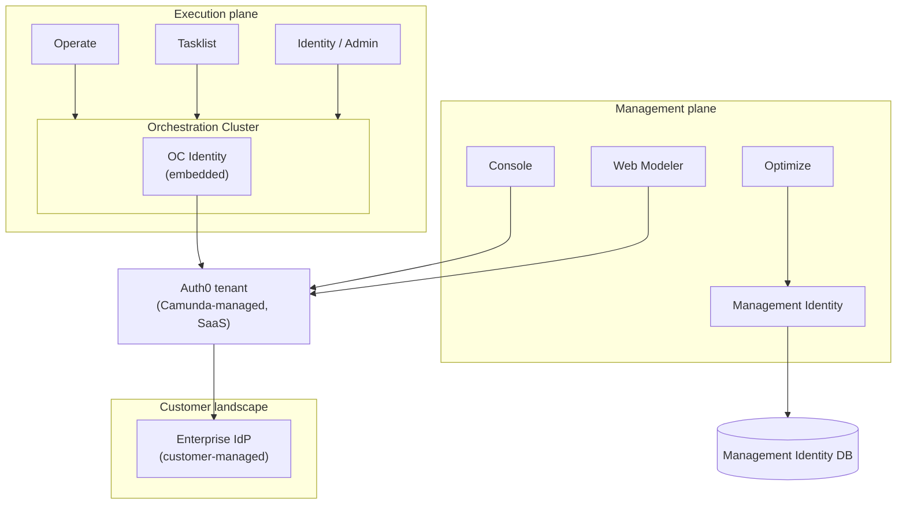
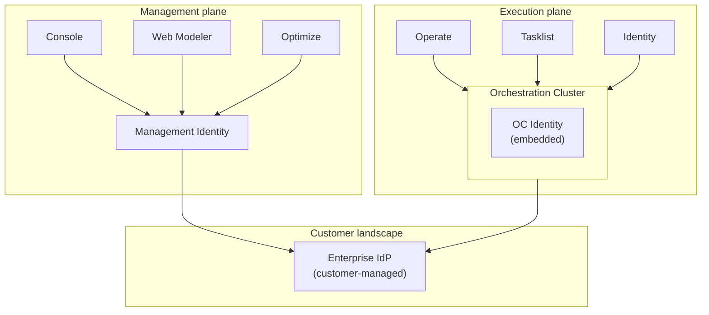

## 2. Current identity architecture: rollout status and history

> **Status and background:** §2.1–§2.3 state what has shipped and what has not, as of this
> writing. §2.4–§2.9 document the pre-CSL identity architecture, the limitations that motivated
> replacing it, and the assumptions and constraints that shaped the target architecture —
> background material, not a target architecture section. The Arc42 target architecture begins
> at [§3 – Solution Strategy](./03-solution-strategy.md).

### 2.1 Rollout status at a glance

> Release targets and rollout status live in §2.1 only. Other sections link here rather than
> restating them.

| Capability | Hub | Optimize | OC gateway/search | OC engine | State |
|---|---|---|---|---|---|
| Authentication (OIDC/basic, sessions) | CSL | CSL | CSL | n/a | Shipped 8.10 |
| Authorization — read/check — OC (one evaluator) | — | — | CSL `AuthorizationCheckPort` | CSL `AuthorizationCheckPort` (same evaluator) | Shipped 8.10 (#388) |
| Authorization — read/check — Hub, Optimize | Management Identity | Management Identity | — | — | Targeted for 8.11 |
| Authorization — write/authoring | Management Identity | Management Identity | missing | missing | Targeted for 8.11 |
| Policy distribution Hub → OC / Optimize | — | — | not implemented | — | Targeted for 8.11 |
| Engine integration artifact — CSL `core`, no separate framework | — | — | — | CSL `core`, no separate framework | Shipped 8.10 (ADR-0014, #388) |

**Design confirmed, not yet implemented:** Optimize receives policy over the same Hub → OC
snapshot/outbox distribution channel a `managed` OC uses — not a separate mechanism (see
[§4 System Context](./04-system-context.md)). The write path (OC authoring, and eventually
Hub/Optimize authoring) is designed to route through `EngineCommandPort`, which is not yet
defined in `core/port/out/`. Both remain targeted for 8.11 as shown above.

### 2.2 What CSL owns today

- **Authentication**, across all three CSL hosts — Hub, Optimize, and OC (OIDC and basic auth,
  session handling) — shipped in Camunda 8.10. Enforcement is always active, in every deployment
  strategy (see [§7 Deployment View](./07-deployment-view.md) and
  [ADR-0003](../adr/0003-no-spring-boot-auto-configuration.md)).
- **OC authorization — the read/check path**, shipped in Camunda 8.10 alongside authentication.
  One evaluator, behind `AuthorizationCheckPort` in CSL `core`, serves both the OC gateway/search
  layer and the zeebe engine — see [ADR-0014](../adr/0014-unified-authz-framework-in-core.md) and
  epic [#388](https://github.com/camunda/camunda-security-library/issues/388) (closed 2026-08-13,
  alongside #400, #393, #401, #402, #399). Details in
  [§5.5 Engine authorization integration](./05-building-block-view.md).

### 2.3 What Management Identity still owns

- **Hub and Optimize authorization**, both the read/check and write/authoring paths, still run
  through Management Identity. Moving them onto CSL is targeted for 8.11 — see §2.1.
- **OC authorization — the write/authoring path** is not yet implemented anywhere (neither
  Management Identity nor CSL); also targeted for 8.11 — see §2.1.
- Since 8.8, Management Identity is no longer used in SaaS to serve the web applications. It is,
  however, still deployed **headlessly** in SaaS for two specific purposes: handling Optimize
  permissions, and providing RBAC for clusters on versions prior to 8.8.
- Once Optimize authorization moves to CSL (targeted for 8.11 — see §2.1), Optimize persists the
  received policy projection in its own Elasticsearch store. That store is a host-side concern,
  not a CSL one: CSL is agnostic to the projection store and leaves persistence to a
  host-supplied outbound adapter — the same port model used everywhere else in this document.

---

### 2.4 Pre-CSL baseline (historical)

> The material in this subsection describes the identity architecture as it stood **before**
> CSL's Camunda 8.10 authentication rollout. It is retained as historical and motivational
> context for the limitations in §2.5 — see §2.1–§2.3 for what has shipped since. Parts of it
> (Hub and Optimize authorization) are still an accurate description of today's system, pending
> the 8.11 work tracked in §2.1.

#### 2.4.1 Identity components (historical)

Before CSL, identity responsibilities were split across several components:

- **Orchestration Cluster Identity (OC Identity)**
  - Embedded into the Orchestration Cluster runtime.
  - Managed runtime authentication and fine-grained authorizations (process definitions, instances, tasks, tenants, cluster APIs) for Zeebe, Operate, Tasklist, and OC APIs.
  - Superseded by CSL for authentication and the authorization read path — see §2.2.

- **Management Identity**
  - Separate service used to control access to Web Modeler, Console, and Optimize and other management-plane functions in earlier releases.
  - Uses Keycloak or an external OIDC provider plus its own SQL database in self-managed deployments (see existing Management Identity arc42 docs).
  - Still owns Hub and Optimize authorization today — see §2.3.

- **SaaS Auth0 tenant (Console / Hub)**
  - In SaaS, Console and other management-side UIs used a Camunda-operated Auth0 tenant as their IdP/broker (an identity federation layer: Auth0 federates customer Enterprise IdPs and issues tokens to Camunda services).
  - From the target-architecture perspective, this was an internal broker/IdP implementation detail, not part of the long-term reference model. Hub authentication now runs on CSL — see §2.2.

- **Customer Enterprise IdPs**
  - In self-managed and in the target state, the Enterprise IdP is always the customer's IdP (Entra, Okta, Keycloak, etc.), integrated via standard OIDC.
  - SAML is supported via Keycloak.

#### 2.4.2 SaaS (historical)

Before CSL, in SaaS:

- Console and Web Modeler authenticated users against a Camunda-managed Auth0 tenant, which acted as the IdP/broker for all SaaS tenants.
- OC Identity in each Orchestration Cluster also used Auth0 as its OIDC IdP, applying runtime authorization for Operate, Tasklist, and cluster APIs. OC authentication and the OC authorization read path now run on CSL instead — see §2.2.
- Auth0 either federated to the customer Enterprise IdP or managed user accounts directly, depending on tenant configuration. The concrete integration code lived in the respective SaaS backends (Console/Hub services and OC Identity OIDC client configuration), which used standard OAuth2/OIDC client libraries to communicate with Auth0.
- Auth0 org membership: membership of users in organizations is stored in Auth0 user metadata and surfaced as JWT claims. These claims are consumed by Hub/OC (in scope of this document) as well as by components outside this document's scope (e.g. Accounts). As Auth0 becomes an IdP like any other in the target architecture, this dependency on Auth0-specific metadata must be resolved — likely as part of [product-hub#3190](https://github.com/camunda/product-hub/issues/3190) or when multi-org Self-Managed support is introduced. Until then, CSL cannot fully treat Auth0 as a standard OIDC IdP and must accommodate the existing Auth0 JWT claim structure for org membership.

(The Management Identity headless-SaaS note that used to live here now lives in §2.3, to avoid
restating it.)

#### 2.4.3 Self-managed (historical)

Before CSL, in Self-managed:

- Management Identity was a shared service for authorization and user/group/role management, but authentication was not uniformly delegated to it as a service across management-plane components. Each component implemented its own authentication flow:
  - Some (e.g. Optimize) used the Identity SDK to integrate with Management Identity and delegate authentication to it.
  - Others (e.g. Web Modeler, Accounts) implemented the authentication flow themselves, either using the Identity SDK for limited integration or communicating with the Enterprise IdP directly without going through Management Identity.
  - This meant there were effectively more than two identity silos — not just Management Identity vs OC Identity, but multiple per-component authentication paths that may or may not have aligned in behavior or feature completeness.
- OC Identity was embedded into each Orchestration Cluster and directly integrated with the Enterprise IdP; it handled runtime authentication and fine-grained authorizations for Operate, Tasklist, and the cluster APIs. OC authentication and the OC authorization read path now run on CSL instead — see §2.2.
- This resulted in fragmented identity: multiple integration patterns on the management plane, plus a separate OC Identity silo, all depending on the same Enterprise IdP but using different models, SDKs, and configuration surfaces.

### 2.5 Limitations that motivated the change

Based on the target-architecture appendix and identity roadmap, the setup described in §2.4 had
several issues:

- Split identity
  - Separate models and configuration for Management Identity vs OC Identity.
  - Within the management plane itself, there was no single authentication integration pattern: some components used the Identity SDK, others implemented authentication flows directly against the IdP without it, resulting in per-component auth behavior inconsistencies (e.g. an auth feature present in one application but absent in another).
  - SaaS and self-managed used different stacks (Auth0 vs direct IdP).
- SaaS vs self-managed parity gaps
  - Capabilities such as mapping rules, tenants, and fine-grained RBAC/ABAC differed or were missing depending on deployment.
- Manual lifecycle and configuration
  - Joiner/mover/leaver flows were not fully automated from the customer's IdP/HR system.
  - Tenants, roles, and mappings were often configured by hand in UIs.
- Limited observability and migration tooling
  - Identity migrations (e.g. Management Identity → unified plane) and policy changes were fragile, not first-class "jobs".
  - It was hard to see and debug identity health end to end.

These limitations motivated the unified identity plane described from §2.2 onward, with
consistent semantics and tooling across Hub and all clusters, including multiple-Physical-Tenant
and multi-logical-tenant scenarios.

---

### 2.6 Assumptions

The target architecture is based on the following assumptions:

- In SaaS, there is one shared Hub instance that serves multiple organizations. Each organization owns one or more Orchestration Clusters; Hub partitions all policy data by `organization_id`.
  - In the first iterations, identity and policy data in Hub are separated only logically, via organization-aware persistence and queries in shared Hub storage.
- In Self-Managed, the initial target scope assumes exactly one organization — the customer's own deployment. The `organization_id` field exists in the data model for architectural consistency with the SaaS multi-org model, but it is fixed to a single value in the initial Self-Managed iterations and has no operational significance there. A Self-Managed deployment may own one or more OC clusters, all belonging to that single organization. 
  - Support for multiple organizations in a Self-Managed Hub instance is a planned capability beyond current rollout scope (see §2.1); the data model is already partitioned by `organization_id` to support this without structural changes when that capability is introduced.
- In full mode, each Orchestration Cluster is associated with exactly one Hub organization boundary for policy management; policies are always authored “above” the cluster in Hub and projected downward.
    - The library itself has no knowledge of how a host application discovers or tracks Orchestration Clusters. Cluster registration and enumeration are exposed as generic port interfaces: the host application calls `ClusterRegistrationPort` (inbound port) to inform the library about new or updated clusters; the library calls `ClusterRegistryPort` (outbound port) when it needs to enumerate clusters for policy targeting.
  - How a specific host application learns about newly created OCs — whether by querying an external service, consuming provisioning events, or reading configuration — is entirely an integration concern for the host and not part of the library.
- In OC-only mode, the Orchestration Cluster is the local source of truth for policy; there is no Hub and therefore no cross-cluster policy coordination.
- Each physical tenant (engine) has its own identity configuration and authorization projection. Physical tenants never talk to IdPs directly and are not configured as OIDC clients — IdP client configuration is defined at the OC/gateway level and applied to the cluster as a whole. Mapping rules and authorizations determine which physical tenants and resources a given principal can access.
  - In the first iteration, IdP configuration is static (configuration files). In a later iteration, both IdP and physical tenant configuration should be manageable via Hub.
- Policy propagation across layers is eventually consistent:
  - Hub tracks the last acknowledged policy versions per OC.
  - Each OC tracks its own last applied policy version.
  - Engines receive policy via the OC’s internal command path and are assumed to converge towards the cluster-scoped policy projection; engines do not track separate policy versions.
- Existing infrastructure (databases, message brokers, cluster gateways, IdP configurations) is reused; no new global identity databases or dedicated identity clusters are introduced.

### 2.7 Constraints

The following constraints bound the CSL design and limit what can change without an architectural decision:

- **Embedded library, not a standalone service.** CSL runs inside host applications (Hub, OC); it has no own process, database, or network endpoint.
- **Host-provided infrastructure.** Hosts supply all persistence, IdP clients, engine command channels, and outbox delivery via port adapter implementations. CSL `core` has zero framework or persistence dependencies (enforced by ArchUnit).
- **No Spring Boot auto-configuration by default.** Hosts explicitly activate CSL configuration classes via `@ImportAutoConfiguration`; nothing activates from adding the Maven dependency alone (see [ADR-0003](../adr/0003-no-spring-boot-auto-configuration.md)).
- **No dedicated global identity database.** Existing host infrastructure (Hub DB, OC DB) is reused; no new shared identity cluster is introduced.
- **Standalone OC without Hub is a first-class deployment mode.** OC-only must continue to work fully without any Hub dependency.

---

### 2.8 Preparation work and ongoing epics

- [Prepare Authentication for Hub Integration](https://github.com/camunda/camunda/issues/38556)
- Spike about extraction of code: [Spike/new replacement auth lib](https://github.com/camunda/camunda/pull/49058)

---

### 2.9 Unresolved issues

Open issues and technical debts are tracked in [§11 Technical Debts, Risks, and Open Design Questions](./11-technical-debts-risks.md).
