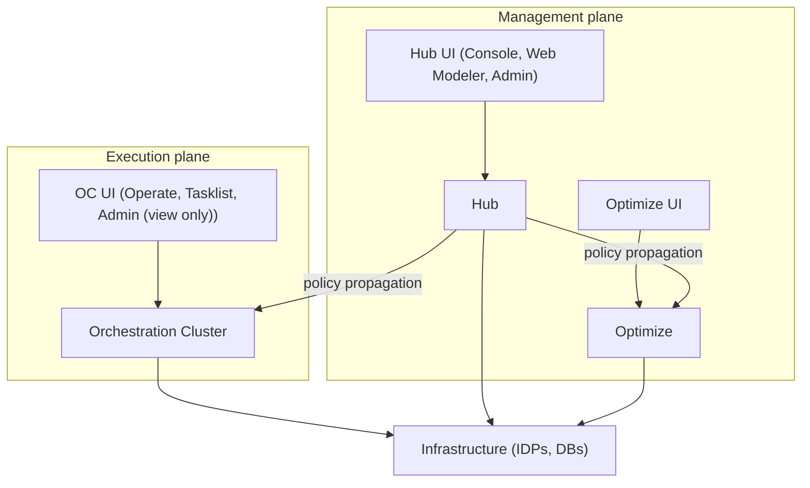
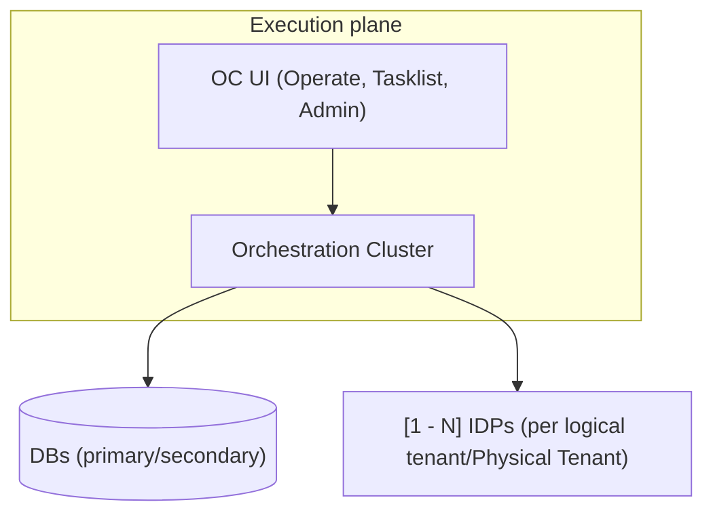
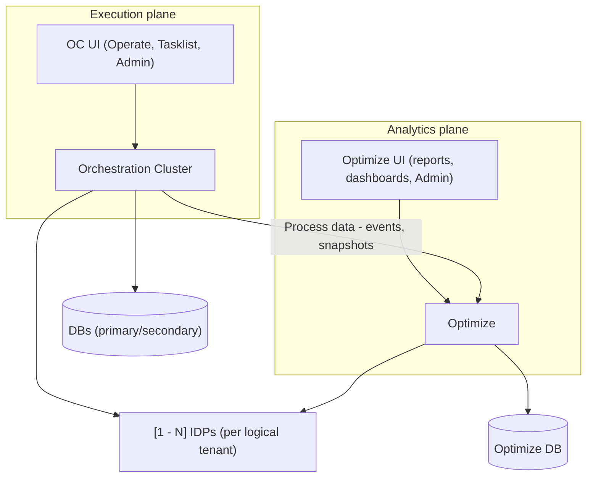

## 4. Target system context

This section describes the unified identity system at a high level, showing how the new library integrates into the platform across three supported deployment modes. The diagrams illustrate key components (Hub, Orchestration Clusters, Optimize, identity UIs, infrastructure) and their relationships.

### 4.1 Full mode (Hub + OC + Optimize)

In full mode, the platform runs with Hub (management/control plane), Orchestration Cluster (execution plane), and Optimize (analytics plane). All three use the same identity model and the same Camunda Security Library.

Configuration flows top-down: Hub is the central source of truth for all policy. Configuration is authored once in Hub and propagated to both OC and Optimize through a platform-owned transport channel, while OC and Optimize maintain local projections and enforce policy for their respective domains. OC receives process data from engines; Optimize consumes both policy and process data from OC for analytics. The Admin UI in OC runs in read-only mode, showing the local projection of Hub policy.

In SaaS, this full-mode topology is realized by one shared Hub instance serving multiple organizations, where each organization owns one or more OC clusters.

In Self-Managed, the same topology applies but with exactly one organization: Hub manages a single customer organization and its OC clusters, so `organization_id` is fixed and the multi-org partitioning is present in the model but not operationally relevant.

- Hub and each OC use the same Camunda Security Library as the shared identity and policy engine.
- Hub and Optimize use the same Camunda Security Library; Optimize applies policies locally and enforces access to analytics and reporting.
- Hub is the single source of truth for all policy and configuration.
- Hub propagates policy changes to OC through a platform-owned propagation channel; OC maintains a local projection and handles runtime enforcement per engine/tenant.
- Hub also propagates policy changes to Optimize through the same platform-owned channel; Optimize maintains a local projection and enforces access policies for analytics.
- Existing infrastructure is reused, no new databases or services are introduced.
- Hub and OC gateway-layer instances of the framework integrate with one or more IdPs (per organization/cluster and mapped to logical Tenants and Physical Tenants) via standard OIDC/SAML clients; engines never integrate with IdPs directly.
- Optimize integrates with the same Enterprise IdP to authenticate users/machines accessing analytics and enforces the same policy model for analytics access control.
- Optimize consumes both policy state (via propagation channel or API) and process execution data (events, process instances, tasks) from OC for analysis and reporting.

### 4.2 OC-only mode (standalone OC without Hub or Optimize)

In OC-only mode, Hub and Optimize are not present. The Orchestration Cluster becomes the local source of truth for all policy and configuration. OC is a first-class deployment option and acts as top-level policy authority for its engines. This mode is useful for development environments and self-contained production scenarios that do not require analytics.

Configuration flows locally: OC manages all policies directly, and the Admin UI in OC runs in read-write mode, allowing full policy authoring and management. Configuration then propagates from OC to individual engines.

- OC is the single source of truth for all policy and configuration.
- The same Camunda Security Library is used but configured for standalone operation.
- Existing infrastructure is reused, no new databases or services are introduced.
- OC owns the IdP client configurations for its tenants and engines; engines still only consume OC-level identity decisions and never call IdPs directly.

### 4.3 OC + Optimize without Hub

In this deployment mode, Optimize is deployed alongside an Orchestration Cluster without Hub. Policy is managed independently in both OC and Optimize — there is no policy distribution between them. Optimize only depends on OC for process execution data (events, process instances, task data) required for analytics and reporting.

Both OC and Optimize have their own Admin UIs and manage their own policies independently. Users must configure policies separately in each system. Optimize authenticates via the same Enterprise IdP as OC.

- Policy is managed independently in OC and Optimize — no policy distribution between them.
- Both OC and Optimize have their own Admin UI for policy management (read-write mode in both).
- Optimize only depends on OC for process execution data (events, process instances, snapshots).
- Both OC and Optimize authenticate users and machines via the same Enterprise IdP.
- Optimize maintains a dedicated datastore for analytics caching, session state, and its own policy projection.

### 4.4 Infrastructure implications for policy distribution and Optimize

**Ownership boundary:**

Hub -> OC/Optimize data distribution (transport, retries, sequencing, dispatch, and delivery operations) is **outside this library**. It is a broader Hub/OC platform concern because the same channel must propagate multiple data categories (for example identity policy, secrets, and connection/configuration data), not only identity.

Propagation architecture and operational details are documented in **[docs/hub-oc-data-propagation.md](hub-oc-data-propagation.md)**.

**Datastore and policy persistence for Optimize (CSL-relevant):**

Optimize requires dedicated storage for policy and session state, with different characteristics depending on mode:

- In full-mode deployments, Hub distributes policy to both OC and Optimize through the platform-owned propagation mechanism.
  - Optimize maintains a local database for:
    - Policy projections (tenants, roles, groups, mapping rules, authorizations)
    - Session and authentication state
    - Last applied policy version tracking (`last_applied_version`)
    - Analytics caching and query results

- In OC + Optimize mode (without Hub), policy is maintained independently in each system:
  - OC and Optimize each manage their own policy via their respective Admin UIs
  - No policy propagation occurs between OC and Optimize
  - Optimize maintains a dedicated datastore for:
    - Its own policy state (managed directly, not derived from OC)
    - Session and authentication data
    - Process data consumed from OC (events, snapshots)
    - Query results and analytics caching

**Policy enforcement across planes:**

Optimize enforces the same policy model as OC, using the Camunda Security Library to:
- Authenticate users and machines via the Enterprise IdP (same as OC)
- Derive roles, groups, and tenant assignments from mapping rules
- Enforce per-tenant and per-role access controls on analytics and reports
- Ensure that users can only view reports and data they are authorized to access within their tenant scope

---

