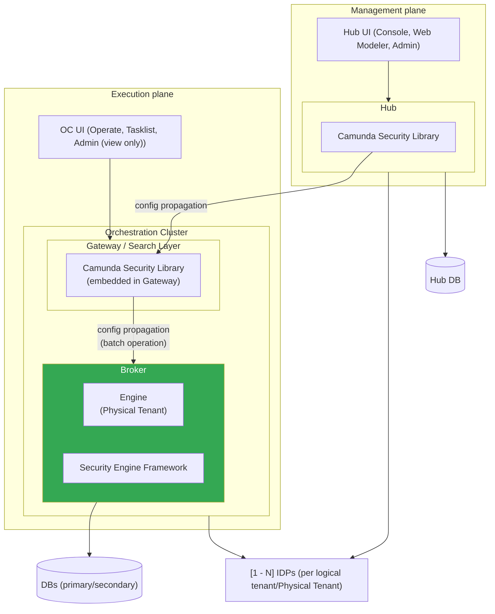
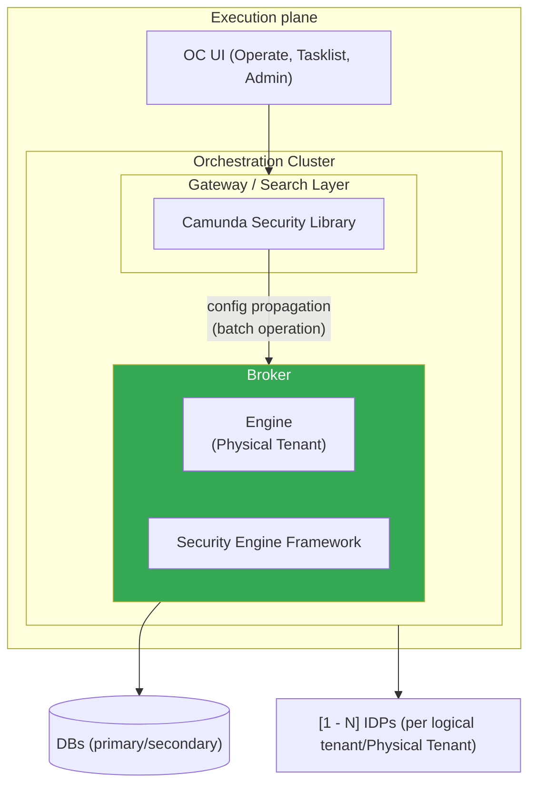
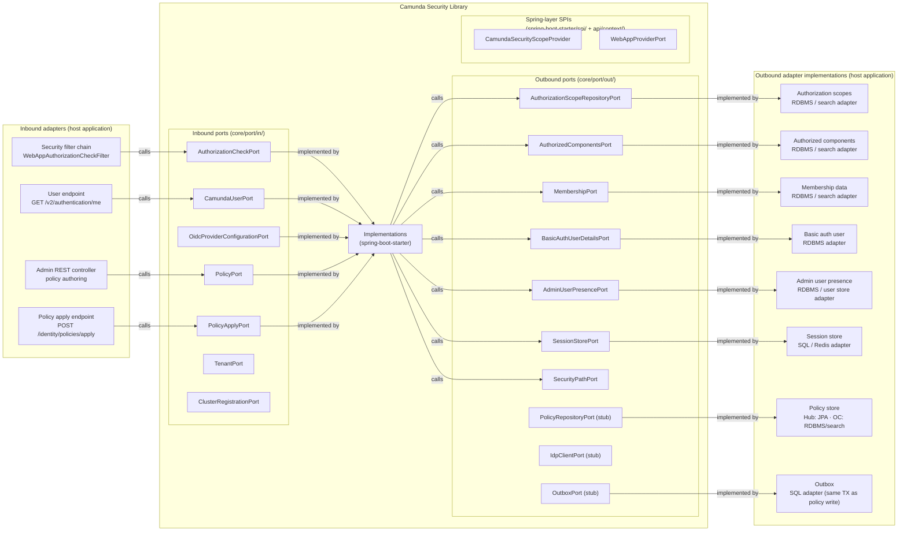
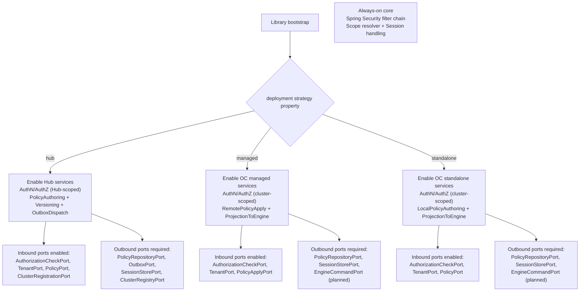
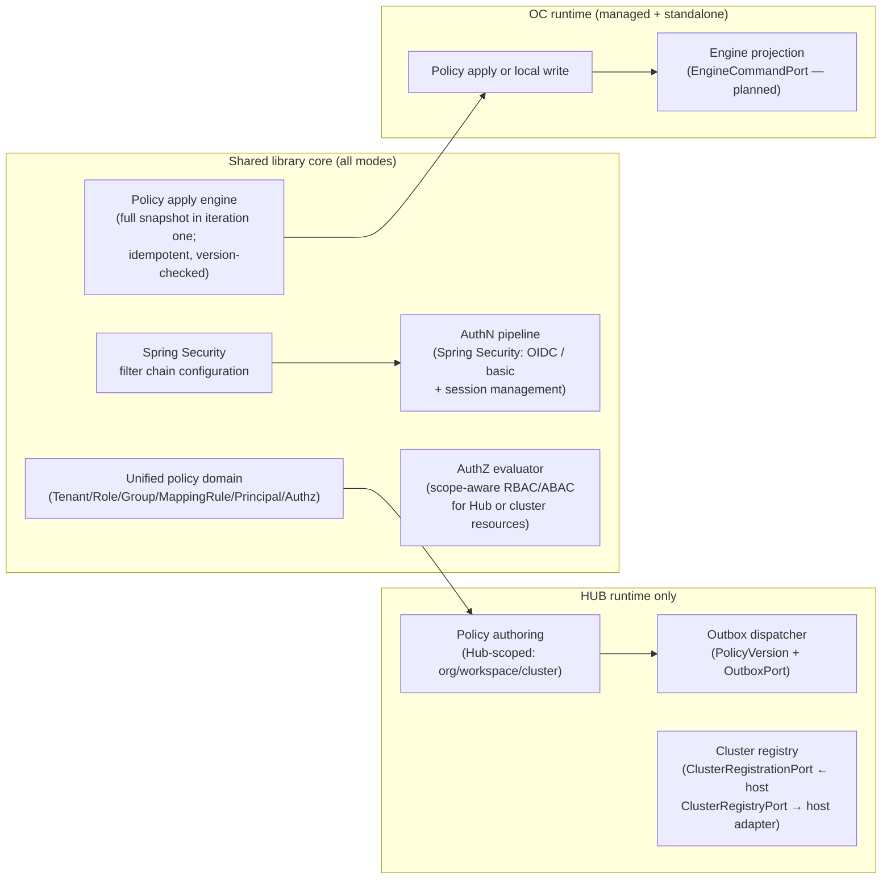
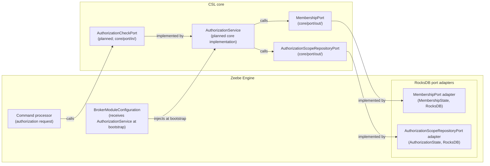
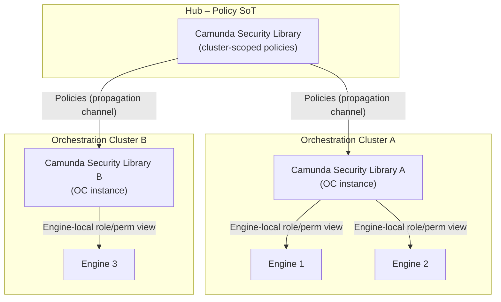
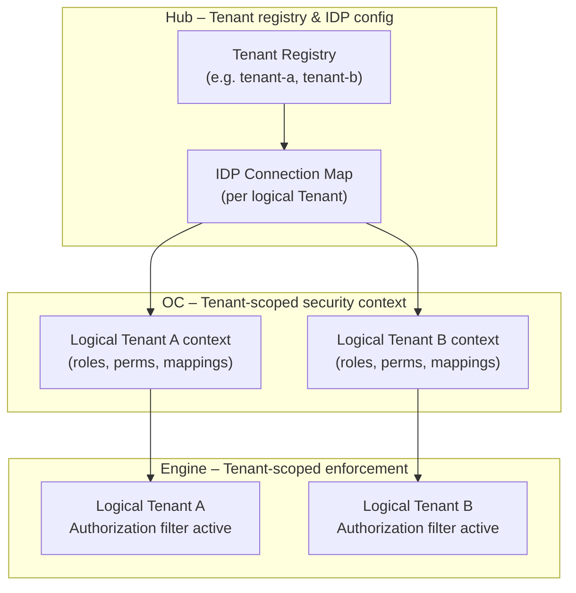

## 5. Building block view (target)

### 5.1 High-level components

The following diagrams show the internal structure of Hub and Orchestration Cluster, including how Camunda Security Library instance connects to frontend applications, infrastructure, and (in multiple-Physical-Tenant scenarios) individual engine instances.

Both the Hub and OC instances of the Camunda Security Library maintain their own local state:

- A cluster-scoped policy projection for the relevant cluster(s) they manage.
- Local tracking of the last applied policy version (`last_applied_version` on the OC side, `last_acked_version` per OC on the Hub side).
- Local session state.

#### 5.1.1 Full mode Simple (Hub + OC with one Engine)



Key building blocks in full mode simple:

- Hub UI: Unified frontend in the management plane. It includes modeling, management, and admin capabilities, and allows full policy authoring for all configurable layers (Hub, OCs, engines, tenants).
- Hub + Camunda Security Library: Central source of truth. Manages all policy configuration for all clusters, OCs, and engines. All policy changes originate here.
- OC UI: Unified frontend in the execution plane. Its admin section shows the cluster-local projection of Hub policy; configuration there is read-only.
- OC + Camunda Security Library: Per-cluster policy enforcement and projection layer. Receives policy snapshots from Hub via the Hub-to-OC propagation channel. Propagates scoped policy views via batch operation to the single engine.
- Engine (Physical Tenant): A single execution context (Zeebe engine) inside the Broker. A Physical Tenant is an independent execution unit that hosts one or more logical Tenants (e.g., `default`, `retail`). Receives its scoped projection of cluster policy from OC. No direct Hub connection.
- Security Engine Framework: Engine-specific policy enforcement layer.
- Infrastructure (IDPs, DBs): Shared existing persistence and IdP connectivity for authentication and authorization across all layers.

> **Important:** A **Physical Tenant** is an Engine (a physical execution unit). A **Tenant** (like `default`, `retail`, `wholesale`) is a logical partition for data and access. Multiple logical Tenants can execute within a single Physical Tenant (Engine). The authorization levels are: `ALL` (cluster-wide), `TENANT` (specific logical tenant) or `PHYSICAL_TENANT` (specific physical tenant).

Configuration propagation chain: Hub → OC → Physical Tenant (Engine).

For concrete deployment topologies (including multi-gateway and multi-broker layouts), see section [7. Deployment view](./07-deployment-view.md).

#### 5.1.2 OC-only mode Simple (standalone OC with one Engine)

> **Note on physical layout:** In this diagram, the OC box represents the full logical cluster. At the physical level the Camunda Security Library runs inside the **Gateway / Search Layer** (one or more Zeebe Gateways), and each Broker contains one or more **Engines (Physical Tenants)**. See section 1.1 for details.



Key building blocks in OC-only mode simple:

- OC UI: Unified runtime frontend that interacts directly with OC. Its admin section allows full policy authoring (no Hub restrictions).
- OC + Camunda Security Library: Local source of truth. Manages all policy and authorization directly without Hub coordination. All policy changes originate here.
- Engine (Physical Tenant): A single execution context (Zeebe engine) inside the Broker. A Physical Tenant is an independent execution unit that hosts one or more logical Tenants (e.g., `default`, `retail`). Receives its scoped projection of local OC policy. No direct Hub connection.
- Security Engine Framework: Engine-specific policy enforcement layer.
- Infrastructure (IDPs, DBs): Local persistence and IdP connectivity; no cross-cluster replication or Hub involvement.

> **Important:** A **Physical Tenant** is an Engine (a physical execution unit). A **Tenant** (like `default`, `retail`, `wholesale`) is a logical partition for data and access. Multiple logical Tenants can execute within a single Physical Tenant (Engine).

For more complex OC-only deployments with multiple brokers and multiple engines per broker, see section [7.1.3 OC-only mode – multi-instance example](./07-deployment-view.md#713-oc-only-mode--multi-instance-example-n-gateways--m-brokers).

#### 5.1.3 Full mode Complex (Hub + OC with multiple Brokers and multiple Engines)

This section defines the conceptual behavior only; the complete deployment examples are maintained in section [7. Deployment view](./07-deployment-view.md).

- Full mode keeps the same propagation chain: Hub (policy SoT) -> OC gateway/search layer (Camunda Security Library) -> broker/engine layer (Security Engine Framework).
- OC may run one or many gateways and one or many brokers depending on scale and availability targets.
- Each broker may host one or many engines (Physical Tenants), and each engine hosts one or many logical tenants.

For concrete diagrams:

- Single-node full mode: [7.1.2 Full mode (Hub + Orchestration Cluster + Optimize, self-managed)](./07-deployment-view.md#712-full-mode-hub--orchestration-cluster--optimize-self-managed)
- Standalone multi-node OC-only mode: [7.1.3 OC-only mode – multi-instance example](./07-deployment-view.md#713-oc-only-mode--multi-instance-example-n-gateways--m-brokers)

---

## 5.2 Unified policy model

The unified identity architecture is built around a single policy model that is shared between Hub Identity & Policy and OC Identity. Hub is the source of truth for this model per cluster; in shared-Hub deployments, Hub stores it per organization and cluster. Each OC hosts a cluster-local projection of the same concepts for enforcement.

In CSL, a **Policy** means the effective access configuration for a scope, derived from roles, groups, mapping rules, principals, and authorizations.

Iteration one models these building blocks directly (roles, groups, mapping rules, principals, and authorizations) and propagates them as versioned snapshots. We intentionally defer introducing a separate first-class `Policy` aggregate until there is a concrete need for additional abstraction.

At a high level, the shared policy model consists of:

- **Organization**
  - Hub-side partitioning boundary for identity and policy data.
  - In SaaS, one Hub instance serves multiple organizations, so all Hub policy tables and queries must be organization-aware.
  - In early iterations, this separation is logical only: shared Hub infrastructure and databases remain in place, but all policy state is keyed and filtered by organization.
  - Each Orchestration Cluster belongs to exactly one organization boundary for policy propagation at a given time.

- **Tenant**
  - Logical partition for data and access in a cluster (for example `default`, `retail`, `wholesale`, `customer-x`).
  - Used to scope where a principal is allowed to read or write data.
  - Tenant configuration (names, descriptions, flags) is authored in Hub and projected to each OC.

- **Group / Role**
  - **Group**
    - Collection of principals (users, mapping rules, clients) that should share the same permissions.
  - **Role**
    - Reusable set of permissions that can be attached to groups, users, or clients.
    - Roles are used both on the management plane (Hub apps) and execution plane (cluster APIs and UIs).

- **MappingRule**
  - Declarative rule that maps **IdP claims** to Camunda concepts:
    - `claimName` (for example `groups`, `org`, `department`).
    - `operator` (for example `EQUALS`, `CONTAINS`).
    - `claimValue` (for example `camunda-platform-admin`, `Retail`).
  - Targets one or more **roles**, **groups**, and **tenants**:
    - When an incoming token’s claims match, the principal automatically receives those roles/groups/tenants.
  - This is the main mechanism that turns IdP attributes into platform-level permissions.

- **Principal**
  - Represents an actor that can authenticate and be authorized:
  - **User principal**
    - Identified by an IdP user claim (for example `preferred_username`, `email`).
    - May have direct role/group assignments in addition to mapping-rule derived ones.
  - **Machine principal**
    - Identified by client credentials (for example `client_id`).
    - Used by workers, automation, and integrations (job workers, CI/CD, connectors, etc.).

- **Authorization**
  - Fine-grained permission record that ties **owners** to **resources** and **actions**:
  - Conceptually:
    - `(ownerType, ownerId, resourceType, resourceId, permissions[])`
  - Examples:
    - Owner: `GROUP:RetailDevelopers`
      ResourceType: `PROCESS_DEFINITION`
      ResourceId: `*`
      Permissions: `[READ_PROCESS_DEFINITION, READ_PROCESS_INSTANCE, CREATE_PROCESS_INSTANCE]`
    - Owner: `ROLE:ClusterAdmin`
      ResourceType: `CLUSTER_API`
      ResourceId: `*`
      Permissions: `[MANAGE_CLUSTER_SETTINGS, MANAGE_USERS]`
  - The same structure is used on:
    - **OC side** for engine and cluster resources (definitions, instances, tasks, cluster APIs).
    - **Hub side** for management resources (orgs, workspaces, projects, assets, clusters).

#### 5.2.1 Hub vs. OC responsibilities

Both Hub and OC use exactly the same policy model, but with different responsibilities.

- **Hub Identity & Policy** (central policy authoring and propagation)
  - Acts as **policy source of truth** for all clusters in full-mode deployments.
  - Authoring location for tenants, roles, groups, mapping rules, and authorizations (all authorization levels: `ALL`, `TENANT`, `PHYSICAL_TENANT`).
  - Stores organization-scoped `PolicyVersion` records per cluster and drives propagation via Outbox/`OutboxEvent`.
  - Handles authentication for Hub applications (Console, Web Modeler, Admin UI) via the same Camunda Security Library instance.
  - Does **not** enforce authorization for runtime execution APIs; that is strictly an OC responsibility.

- **OC Identity** (cluster-local policy enforcement)
  - Hosts a **cluster-local projection** of the same entities received from Hub (or locally authored in OC-only mode).
  - Enforces authorizations for all incoming requests:
    - The OC UI (Operate, Tasklist, Admin).
    - Cluster runtime APIs (gRPC/REST) for workers and integrations.
  - Validates IdP tokens for users and machines accessing the cluster.
  - Derives tenant assignments and roles from token claims via mapping rules.
  - Routes identity-scoped policy updates to engines via the `EngineCommandPort`.
  - Does not invent new policy; it only applies and enforces what Hub (or, in standalone mode, local OC configuration) defines.

This unified model allows:

- The same concepts (tenants, roles, groups, mapping rules, authorizations, principals, scope metadata) to be used consistently on both **management** and **execution** planes.
- Identity-as-code and migrations to operate on one canonical representation (`PolicyVersion`) per cluster, with clear ownership (Hub or OC-local) and enforcement (OC or engine-local).

#### 5.2.2 Responsibility matrix (IdP and policy-related information)

The following table summarizes which information must be known to which component:

| Information type                             | Hub (full mode)                                                | OC (full mode)                                                      | OC-only mode (OC)                | Engine                                 |
|---------------------------------------------|-----------------------------------------------------------------|---------------------------------------------------------------------|----------------------------------|----------------------------------------|
| IdP client credentials (client IDs/secrets) | Yes (managed centrally or per logical Tenant)                  | Yes (cluster-local credentials / secrets per OC / logical Tenant / Physical Tenant) | Yes                              | No                                     |
| IdP connections per logical Tenant (OIDC/SAML) | Yes (for Hub apps)                                          | Yes (for cluster-side authn)                                        | Yes                              | No (trusts OC)                         |
| Organization / cluster ownership metadata   | Yes (organization boundary + OC enumeration via `ClusterRegistryPort`) | Yes (cluster-local identity context)                                | No                               | No                                     |
| Logical Tenant                              | Yes (SoT)                                                      | Yes (projection per cluster)                                        | Yes                              | Indirectly via OC commands             |
| Mapping rules (claims → roles/tenants)      | Yes (SoT)                                                      | Yes (projection per cluster)                                        | Yes                              | No                                     |
| Roles and groups                            | Yes (SoT)                                                      | Yes (projection per cluster)                                        | Yes                              | No (only resulting permissions)        |
| Authorizations (role/group → resource perms)| Yes (SoT)                                                      | Yes (projection per cluster; Physical-Tenant-scoped and logical-Tenant-scoped views) | Yes                              | Indirectly (via engine-local projections) |
| Policy versions and propagation state       | Yes (`PolicyVersion`, `EntityRevision`, optional `PolicyVersionChange`, and per-target acknowledgement state), scoped by organization + cluster in shared Hub deployments | Yes (`last_applied_version` per cluster)                            | Yes (local policy versions only) | No explicit versioning; consumes cluster-level policy updates |
| Session data                                | Yes (Hub sessions only)                                        | Yes (cluster sessions only)                                         | Yes                              | No                                     |

Engines only need to know the effective permissions resulting from the policy model; they neither talk to IdPs nor store policy versions.

### 5.3 Policy propagation boundary and semantic versioning (Hub → OC / Optimize)

For this architecture document, transport mechanics are intentionally out of scope. Hub-to-OC/Optimize delivery (channel type, retries, sequencing, dispatch operations) is a Hub/platform integration concern and is documented in `docs/hub-oc-data-propagation.md`.

What remains in scope for CSL architecture:

- CSL defines propagation semantics and contracts (`PolicyVersion`, `POLICY_SNAPSHOT`, and apply rules).
- Hub persists versioned policy state per organization/cluster using `PolicyVersion`, `EntityRevision`, and optional `PolicyVersionChange`.
- Receiver CSL (`PolicyApplyService`) owns semantic apply behavior: apply newer versions, ignore already-applied versions, and handle replay idempotently.
- Hub tracks per-target acknowledgement state (`last_acked_version`); each receiver tracks local apply progress (`last_applied_version`).
- Engines do not track policy versions; they consume OC-projected effective state.

These rules preserve deterministic policy convergence while keeping transport implementation fully outside the library.

#### 5.3.1 First-iteration semantic contract

In iteration one, CSL semantic apply uses full snapshots:

- Hub emits `POLICY_SNAPSHOT` for each new `PolicyVersion`.
- Receivers apply the snapshot as the desired full state at target version `V`.
- Incremental diff propagation (`POLICY_DIFF`) remains a future optimization and is not required for semantic correctness.

#### 5.3.2 Transport/semantic split

- Transport outcome (`ACK`/`NACK`, retries, sequencing, dead-letter) is platform-owned.
- Semantic correctness (version checks, idempotent replay, state replacement rules) is CSL-owned.
- A successful transport delivery does not replace semantic validation in `PolicyApplyService`.

#### 5.3.3 Linking `PolicyVersion` with the policy data model

At an architecture level, policy state linkage in Hub uses three semantic layers:

- `PolicyVersion`: organization + cluster-scoped commit marker (`version_number`).
- `EntityRevision`: immutable per-entity revision payload (or tombstone) introduced by a specific `PolicyVersion`.
- `PolicyVersionChange` (optional): ordered change index for a `PolicyVersion`, useful for auditability and potential future diff optimization.

This linkage is CSL domain semantics, independent of transport implementation.

#### 5.3.4 Model for policy-version linking

Minimal conceptual schema:

```text
PolicyVersion
  id
  organization_id
  cluster_id
  version_number
  base_version       -- optional; reserved for possible future diff-based propagation

EntityRevision
  id
  organization_id
  entity_type
  entity_id
  introduced_in_policy_version
  authorization_level
  authorization_level_id
  is_deleted
  payload            -- single referenced entity JSON

PolicyVersionChange
  policy_version_id
  organization_id
  entity_type
  entity_id
  operation          -- UPSERT | DELETE
  authorization_level         -- ALL | TENANT | PHYSICAL_TENANT
  authorization_level_id
  revision_ref       -- reference to concrete entity revision payload

OcSyncState
  organization_id
  oc_id
  cluster_id
  last_acked_version -- semantic acknowledgement progress per target
  last_sync_at
```

Snapshot materialization rule for target version `V`:

- Select revisions with `introduced_in_policy_version <= V` for the target cluster.
- Group by `(entity_type, entity_id, authorization_level, authorization_level_id)` and keep the latest revision.
- Drop tombstones (`is_deleted = true`) from the final set.
- Emit the remaining resource set as the effective snapshot at `V`.

#### 5.3.5 Semantic consistency guarantees

- **Eventual convergence:** Hub commit -> receiver apply -> engine projection.
- **Idempotent apply:** same `policyVersionId` replay has no semantic side effects.
- **Monotonic versioning:** receivers accept newer versions and ignore stale/duplicate versions.
- **Deterministic replacement:** snapshot apply reconstructs one known-good effective policy state for target version `V`.

#### 5.3.6 Semantic progress tracking

- Hub tracks per-target semantic acknowledgement (`last_acked_version`).
- Each receiver tracks semantic apply progress (`last_applied_version`).
- Engines do not track policy versions explicitly; they converge to OC-projected effective state.

Example snapshots (semantic contract):

```json
{
  "organizationId": "org-acme",
  "clusterId": "oc-a",
  "policyVersion": 1,
  "kind": "POLICY_SNAPSHOT",
  "tenants": [{"id": "default"}],
  "roles": [{"id": "role-cluster-admin", "permissions": ["MANAGE_CLUSTER_SETTINGS", "MANAGE_USERS"]}]
}
```

```json
{
  "organizationId": "org-acme",
  "clusterId": "oc-a",
  "policyVersion": 2,
  "kind": "POLICY_SNAPSHOT",
  "tenants": [{"id": "default"}],
  "roles": [
    {"id": "role-cluster-admin", "permissions": ["MANAGE_CLUSTER_SETTINGS", "MANAGE_USERS"]},
    {"id": "role-support-agent", "permissions": ["READ_PROCESS_INSTANCE", "READ_TASK", "UPDATE_TASK"]}
  ]
}
```

---

### 5.4 Camunda Security Library – hexagonal architecture

#### CSL and Spring Security

The Camunda Security Library is built on top of Spring Security but does not replace it. Spring Security provides the filter chain, `SecurityContext` management, and the `HttpSecurity` DSL. The CSL configures and extends the Spring Security infrastructure by:

- Assembling Spring Security OIDC infrastructure (`ClientRegistrationRepository`, `JwtDecoder`, token validators) from configuration sourced via `OidcProviderConfigurationPort`.
- Installing a scope-aware authorization filter (`WebAppAuthorizationCheckFilter`) backed by `AuthorizationCheckPort`.
- Providing a set of `SecurityFilterChain` configuration classes that consuming applications activate by explicit `@Import`.

Consuming applications should not need to write Spring Security configuration from scratch. CSL ships a set of `@Configuration` classes in the `spring-boot-starter` module, each covering a specific concern (authentication method, session management, OIDC provider wiring, etc.). Nothing activates automatically from adding the Maven dependency alone — see [ADR-0008](../adr/0008-no-spring-boot-auto-configuration.md).

The preferred integration path is via `@ImportAutoConfiguration` — either with the umbrella `CamundaSecurityAutoConfiguration` or with individual CSL configuration classes. Spring Boot's auto-configuration phase runs after all regular `@Configuration` classes, so host-registered override beans are already present when CSL's `@ConditionalOnMissingBean` conditions are evaluated. Directly `@Import`-ing individual CSL configuration classes is also supported but requires care: if a CSL class is processed before the host's override bean is registered, `@ConditionalOnMissingBean` may not see the override and will create the CSL default instead.

> Design constraint — lesson from the Identity SDK: The Identity SDK precedent shows that when consuming applications must write significant boilerplate around a shared security library, inconsistencies emerge: auth features present in one application (e.g. Operate) but missing in another (e.g. Tasklist), or bugs fixed in one integration but not others. The CSL must minimize the glue code required in each consumer. All auth logic that is not host-infrastructure-specific belongs in the CSL core, not in consuming-application code.

#### Hexagonal architecture

The Camunda Security Library is a [hexagonal (ports and adapters)](https://herbertograca.com/2017/09/14/ports-adapters-architecture/) library. Its core domain never imports a concrete database class, OIDC library, or Zeebe API — all external dependencies are hidden behind port interfaces that the host application (Hub, OC) wires in.

Key rule: all port interfaces — both inbound and outbound — are defined inside the library core. The host application depends on the library, never the other way around.

In addition to core ports, the library is structured across four Maven modules:

- `core/` — framework-free domain logic and all port interface definitions (`port/in/`, `port/out/`). Zero Spring or persistence dependencies.
- `api/` — public, host-facing surface: model records (`api/model/`), context/helper contracts (`api/context/`), and configuration classes bound by Spring in the starter (`api/model/config/`). No dependency on `core/`.
- `validation/` — centralized validators for identity initialization data (users, groups, tenants, roles, mapping rules, authorizations). Used by the starter to validate initialization configuration.
- `spring-boot-starter/` — Spring configuration classes, filter chain assembly, and default port implementations. Hosts activate these via explicit `@Import` (see [ADR-0008](../adr/0008-no-spring-boot-auto-configuration.md)).

The `api` contracts are consumer-facing and do not need to be outbound host-implemented adapters.

- **Inbound (driving) side:** A Spring MVC controller or security filter lives in the host application. It imports and calls an inbound port interface (e.g. `AuthorizationCheckPort`) from the library. The implementation lives in `spring-boot-starter` and may delegate to outbound ports for data.
- **Outbound (driven) side:** The implementation calls an outbound port interface (e.g. `AuthorizationScopeRepositoryPort`) defined in the library. The host application provides the concrete adapter implementation.



> Ports marked **Active** have their wiring complete today: inbound Active ports have a default implementation in `spring-boot-starter`; outbound Active ports are consumed by the current starter and require a host-side adapter. Ports marked **Stub** have their contract interface defined in `core/port/in/` or `core/port/out/` but no current CSL wiring — they are reserved for the policy work (Hub/OC strategy enablement).

**Inbound port responsibilities:**

| Inbound port | Responsibility | Status | Deployment strategies | Typical host-side callers |
|---|---|---|---|---|
| `AuthorizationCheckPort` | Checks whether a `CamundaAuthentication` is authorized for a `RequiredAuthorization`, returning `Either<AuthorizationRejection, Void>` (right = authorized). The library ships a default implementation, `AuthorizationService`, backed by `AuthorizationScopeRepositoryPort` and `MembershipPort`. | Active | all | `WebAppAuthorizationCheckFilter` |
| `CamundaUserPort` | Returns the currently-authenticated user view and bearer token. The library ships OIDC and basic auth defaults. | Active | all | User-info REST endpoints |
| `OidcProviderConfigurationPort` | Returns OIDC provider configurations keyed by registration ID, supporting multi-IdP and per-tenant OIDC setup. | Active | all | OIDC decoder factory, login picker, client registration |
| `PolicyPort` | Queries and authors the unified policy model (roles, authorizations, mapping rules) in the local source-of-truth runtime. | Stub | `hub`, `standalone` | Admin REST controller, Hub UI / OC UI backend |
| `PolicyApplyPort` | Applies a policy snapshot received from Hub to the local projection. Owns version checks and idempotent apply semantics. | Stub | `managed` | `POST /identity/policies/apply` endpoint |
| `TenantPort` | Tenant lifecycle and lookup operations. | Stub | all | Admin REST controller, request filter |
| `ClusterRegistrationPort` | Registers and deregisters Orchestration Clusters against Hub. | Stub | `hub` | Hub adapter triggered by provisioning events |

**Outbound port responsibilities:**

| Outbound port | Responsibility | Status | Deployment strategies | Typical host-side implementations |
|---|---|---|---|---|
| `AuthorizationScopeRepositoryPort` | Resolves resource-access grants (`AuthorizationScope` records — wildcard, specific-ID, property) the authenticated principal holds, for search pre-filtering, point-resource checks, and permission discovery on resource detail views. | Active | all | RDBMS / search adapter |
| `AuthorizedComponentsPort` | Returns the list of webapp components the authenticated principal is allowed to access. | Active | all | RDBMS / search adapter |
| `MembershipPort` | Resolves a principal's memberships through a chain: mapping rule IDs → group IDs → role IDs → tenant IDs. | Active | all | RDBMS / search adapter |
| `BasicAuthUserDetailsPort` | Loads a user by username (with stored password hash) for HTTP Basic authentication. | Active | all | RDBMS adapter |
| `AdminUserPresencePort` | Reports whether an admin user has been provisioned; consulted by the admin-user bootstrap filter. | Active | all | RDBMS / user store adapter |
| `SecurityPathPort` | Provides HTTP path patterns the filter chain protects or permits: API paths, webapp paths, unprotected paths, static resource suffixes, admin bypass paths. | Active | all | Host-provided path configuration |
| `SessionStorePort` | Persists and retrieves authenticated web sessions (`get`/`upsert`/`delete`/`getAll` for expiry sweep). | Active | all | SQL session adapter, Redis adapter |
| `PolicyRepositoryPort` | Persists and reads the unified policy projection (tenants, roles, groups, mapping rules, principals, authorizations). | Stub | all | Hub: JPA adapter; OC: RDBMS / search adapter |
| `IdpClientPort` | Communicates with external Identity Providers for OIDC operations. | Stub | all | OIDC client adapter (Keycloak, Entra, Auth0) |
| `OutboxPort` | Records outbox events that carry policy changes from Hub to OCs in the same transaction as the triggering policy write. | Stub | `hub` | SQL propagation adapter |
| `ClusterRegistryPort` | Reads and maintains the registry of known Orchestration Clusters for policy propagation targeting. | Stub | `hub` | Hub adapter backed by cluster registry |
| `FeatureTogglePort` | Evaluates runtime feature toggle values for mode-gated behavior. | Stub | all | Spring `@ConfigurationProperties` adapter, Unleash adapter |

> `EngineCommandPort` — planned outbound port for emitting engine-scoped projection commands from OC to engines. Not yet defined in `core/port/out/`; pending the policy propagation work.

This design guarantees that **swapping a database, replacing the IdP client, or adding engine projection requires only a new adapter class** — no changes to the domain core.

Inbound and outbound ports are CSL boundaries; concrete transport adapters on both sides are owned by host platform integration.

#### 5.4.1 Property-driven runtime mode switching

The same library core is reused in all deployments. **In every runtime mode, AuthN and AuthZ enforcement is always active** — the library always configures a Spring Security filter chain to authenticate inbound requests and enforce scope-aware authorization decisions. What differs per mode is which additional capabilities (authoring, policy propagation dispatch, engine projection) are switched on.

Mode activation is property-driven via Spring Boot conditions (`@ConditionalOnProperty`, or a small custom `@Conditional` when multiple properties contribute to the decision), not via Spring profiles.

**Current implementation state:** authentication method selection (`camunda.security.authentication.method=basic|oidc`) is active today and governs which filter chains are assembled. The deployment strategy property (`hub` / `managed` / `standalone` — current property values use an `oc-` prefix: `oc-managed`, `oc-standalone`) is defined in the configuration model but is not yet consumed by the filter chain layer — it is planned for the policy work that wires `PolicyPort`, `PolicyApplyPort`, and the Hub/OC-specific outbound ports.

Hub enforces AuthN/AuthZ for the Hub UI using the same `AuthorizationCheckPort` used by OC, configured with Hub-scoped resources. `IdpClientPort` is a planned outbound port for external IdP interactions; the current OIDC integration wires `OidcProviderConfigurationPort` instead.

**Camunda Security Library responsibilities by deployment strategy:**

| Deployment strategy | AuthN/AuthZ enforcement | Policy source | Policy authoring | Outbox dispatch to OCs | Engine projection | Cluster registry | Runtime context |
|---|---|---|---|---|---|---|---|
| `hub` | ✅ Hub-scoped (org, workspace, cluster resources) | Hub is SoT | ✅ via Hub UI/API | ✅ via `OutboxPort` | ❌ no engines in Hub | ✅ `ClusterRegistrationPort` + `ClusterRegistryPort` | Hub authentication and policy management for the Hub UI |
| `managed` | ✅ Cluster-scoped (engine, tenant, task resources) | Receives from Hub | ❌ (read-only in the admin section of the OC UI) | ❌ | ✅ via `EngineCommandPort` | ❌ | OC receives policy via `/identity/policies/apply` endpoint from Hub; enforces for all cluster requests and exposes the applied policy through the admin section of the OC UI |
| `standalone` | ✅ Cluster-scoped (engine, tenant, task resources) | OC is local SoT | ✅ via the admin section of the OC UI and OC APIs | ❌ | ✅ via `EngineCommandPort` | ❌ | OC is fully autonomous; local policy authoring and engine projection through the admin section of the OC UI |





- There is no dedicated or separate IdP "for the gateway"; the framework acts as the OIDC client against the configured IdPs.

#### 5.4.2 Why a shared Camunda Security Library layer?

The extra layer between UIs/clients and engines is intentional:

- Centralized policy enforcement
  - The Hub UI, the OC UI, and all API clients (workers, automation, integrations) talk to the same policy engine per deployment boundary (Hub or OC).
  - Engines no longer need to embed IdP and policy logic; they only evaluate engine-local projections and commands.
- Reuse across Hub and OC
  - The same library, with the same domain model and ports, is embedded into Hub and OC.
  - Differences between full mode (Hub + OC) and OC-only mode are expressed via adapters and configuration, not divergent business logic.
- Clean separation of concerns
  - IdP integration, session handling, multi-tenancy, mapping rules, and authorization decisions are handled in one place.
  - Engine integration is reduced to a narrow command API (Security Engine Framework) that can evolve independently.
- Pluggable backends
  - Concrete persistence (SQL, search), propagation transport, and IdP clients can be swapped or customized by providing alternative adapters, without changing the domain model.

#### 5.5 Engine authorization integration

Rather than a separate authorization sub-framework embedded in the engine, the zeebe engine uses CSL's `core` authorization model directly — see [ADR-0028](../adr/0028-unified-authz-framework-in-core.md). Implementation is tracked in [#388](https://github.com/camunda/camunda-security-library/issues/388).

**Authorization checks (command-time, planned per ADR-0028 / [#388](https://github.com/camunda/camunda-security-library/issues/388)):** The target design introduces `AuthorizationCheckPort` as a unified inbound port in `core/port/in/`, with `AuthorizationService` as its default implementation wired in `spring-boot-starter`. Today, CSL provides `AuthorizationChecker` (`core/authz/`) as the shared scope-evaluation component used by the search layer. The full port-based engine integration — including RocksDB-backed adapter implementations of `MembershipPort` and `AuthorizationScopeRepositoryPort` — is tracked in [#388](https://github.com/camunda/camunda-security-library/issues/388).

**Policy state propagation (planned):** OC CSL will propagate identity state changes (tenants, roles, authorizations) to each engine through `EngineCommandPort` (planned outbound port). See section 5.5.2.

**Key rule:** engines never talk to IdPs directly, never hold policy versions, and never interpret scope metadata beyond what is needed for their own authorization decisions. The Camunda Security Library on the OC side is responsible for deciding what to forward and how to scope it; see [ADR-0004](../adr/0004-oc-identity-data-persistence-and-engine-command-scope.md) for the open decision on how scope metadata flows into the engine.



**`AuthorizationCheckPort` responsibilities:**

| Port | Responsibility |
|---|---|
| `AuthorizationCheckPort` | Unified authorization check port used by both the search layer and the zeebe engine. Covers scope-based, tenant, and property-based checks; returns `Either<AuthorizationRejection, Void>` with the failure reason (tenant vs. permission), or a `boolean` skip-checks query for hot-path short-circuiting. Implemented by `AuthorizationService` in `core`. |

**Engine-provided outbound port adapters:**

| Port | Responsibility | Engine adapter |
|---|---|---|
| `MembershipPort` | Resolves principal memberships (mapping rules → groups → roles → tenants). | RocksDB `MembershipState` adapter |
| `AuthorizationScopeRepositoryPort` | Resolves resource-access grants for authorization checks. | RocksDB `AuthorizationState` adapter |

> `EngineCommandPort` — planned outbound port on the OC CSL side for propagating identity state (tenants, roles, authorizations) to engines. See section 5.5.2.

#### 5.5.1 Why a shared CSL authorization framework for engine and search layer?

Using CSL's `core` authz framework for both layers is intentional:

- **Single evaluation kernel, no drift (planned):** ADR-0028 proposes a shared `AuthorizationCheckPort` implemented by a core `AuthorizationService`. Today, CSL already provides `AuthorizationChecker` (`core/authz`) as the shared scope-evaluation component.
- **No new port contracts:** the engine integrates against existing `MembershipPort` and `AuthorizationScopeRepositoryPort` — no new outbound ports to stabilize before the engine migration begins.
- **Richer failure detail:** `AuthorizationCheckPort` exposes failure reasons (tenant vs. permission) via an `Either`-style result (`Either<AuthorizationRejection, Void>`), per ADR-0028 — the single authorization surface for both the search layer and the engine, replacing the earlier boolean-only inbound port.
- **Spring-free auth context (planned):** ADR-0028 proposes `ClaimsAuthenticationConverter` in `core` to convert raw claims to `CamundaAuthentication` without Spring dependencies.
- **Primary-storage-optimized adapters:** engine-side caching remains an adapter concern; CSL core stays dependency-free and cache-agnostic.

#### 5.5.2 Config propagation to the engine via batch operations

When the OC Camunda Security Library needs to propagate a policy change to a Physical Tenant (Engine) inside a Broker, it must create a potentially large number of identity commands and/or resources inside the engine (tenants, roles, mapping rules, authorizations). Creating these one-by-one would be fragile and slow.

**The propagation is therefore implemented using the engine's existing Batch Operation feature.** The `EngineCommandPort` adapter creates for each Physical Tenant a single batch operation. This gives us:

- **Atomicity:** all identity resources for one policy update land in the engine together as one batch job.
- **Scalability:** the batch operation infrastructure already handles large volumes of commands efficiently.
- **Observability:** batch operation progress and failure are visible through existing batch operation monitoring.
- **Consistency with the engine's design:** no new ad-hoc bulk command mechanism is introduced; we reuse an already-solved problem.

This is the primary mechanism by which the OC Gateway/Search Layer propagates Physical Tenant configuration to Brokers and their engines.

Open Topic: Currently, in batch operation we just handover lists of numbers to the engine. For this feature, we need to push a list of objects ...

### 5.6 Persistent sessions

Persistent sessions are required for the OC authentication UX and remain part of the unified architecture.

#### Current status

- OC already uses persistent server-side web sessions.
- Sessions are backed by existing secondary storage integrations (RDBMS or search backends).
- Session cleanup and logout invalidation are already implemented in the current authentication module.

#### Target in unified architecture

- Keep persistent sessions as the default behavior in `Camunda Security Library`.
- Expose session persistence behind a `SessionStore` port so integrating applications can choose the backend.
- Enforce timeout-based expiry (idle and absolute timeout) and explicit logout invalidation.
- Keep session handling local per deployment:
  - In full mode, Hub and each OC manage their own sessions independently.
  - In OC-only mode, OC is the only session authority.
- Session data is not propagated via the policy propagation flow.

### 5.7 Frontend integration (Hub and OC)

For frontend composition, the target approach is **Option 2 from ADR-0005**: integrate the identity Admin UI as a **versioned npm package** in both Hub and OC.

This aligns with current Camunda frontend practices in this monorepo, where shared UI capabilities are consumed as packages in React-based applications.

#### 5.7.1 Chosen integration model (Option 2)

- Deliver the identity Admin UI as an npm package consumed by:
  - Hub UI (management plane)
  - OC UI (execution plane)
- Keep package contracts narrow and explicit:
  - input props/configuration
  - callbacks/events
  - auth/session and tenant context expectations
- Compose through existing host providers (routing, auth, i18n, theming, telemetry), instead of introducing an isolated embedding boundary.

#### 5.7.2 Why this model

- Matches existing package-based composition already used in Camunda frontend codebases.
- Preserves type-safe contracts and compile-time validation in TypeScript.
- Reduces integration friction for Hub and OC teams by reusing established React patterns.
- Keeps versioning and dependency management explicit per consuming application.

#### 5.7.3 Fallback strategy

If a future host cannot consume React packages directly, add a thin web-component adapter on top of the npm package instead of changing the primary delivery model.

Reference: [ADR-0005: Frontend integration approach for Hub and Orchestration Cluster Admin UI](../adr/0005-frontend-integration-for-hub-and-oc.md).

### 5.8 Scoped Policies

#### 5.8.1 Physical Tenant support (formerly: Multi Engine support)

The unified identity plane supports multiple Physical Tenants (Engines) per Orchestration Cluster in both deployment modes. Each Physical Tenant is an Engine inside a Broker — a scoped execution context with its own identity projection (see section 1.1).

- Full mode (Hub + OC): Hub as SoT defines cluster-scoped policies (roles, mappings, logical Tenants, authorizations), OC projects them, and engines consume scoped views.
- OC-only mode: OC is SoT for local policies and propagates scoped views directly to engines.
- The policy model supports three authorization levels for multiple-Physical-Tenant and multi-logical-tenant operation: `ALL` (cluster-wide), `TENANT` (logical-tenant-wide) and `PHYSICAL_TENANT` (Physical-Tenant-wide).
- In both modes: Engines do not define their own identity models.
- One Physical Tenant can host multiple logical Tenants.



- In full mode, Hub is the single SoT; policy flows downward: Hub -> all OCs -> all Physical Tenants.
- OC identity instances maintain cluster-local projections and handle Physical-Tenant-level scoping.
- OC identity instances also enforce logical-Tenant-level scoping and combined logical-Tenant+Physical-Tenant scoping where required.
- Engines consume the cluster-level projection; they do not define their own identity models and cannot override OC policy.
- In OC-only mode, the same projection model applies with local flow: OC → Engines.

#### 5.8.2 Logical Tenant support

Logical multi-tenancy is a first-class concern in the policy model. Logical Tenant configuration is authored once in Hub and propagated top-down to OC and then to engines. Each layer maintains logical-tenant-aware roles, mapping rules, and authorizations.



On each request, the Camunda Security Library:

1. Resolves the logical-tenant context from token claims and/or headers.
2. Loads the logical-tenant-specific policy view (roles, mappings, authorizations).
3. Enforces permissions within the logical-tenant boundary, preventing cross-tenant data access.

#### 5.8.3 Global and level-specific authorizations (logical Tenant and Physical Tenant)

The policy model supports both:

- Global roles and permissions
  - Roles (for example `ClusterAdmin`, `SupportAgent`) are defined once per cluster in Hub or OC.
  - Authorizations with authorization level `ALL` apply across all engines in the cluster.
- Logical-Tenant- and Physical-Tenant-level authorizations
  - The same role can have additional authorizations restricted to a logical Tenant (`authorization_level = TENANT`) or a specific Physical Tenant (`authorization_level = PHYSICAL_TENANT`).
  - Example: `SupportAgent` role may have:
    - Global read/update access to user tasks across all engines (`ALL`).
    - Additional read access to process instances only on `engine-2` (`PHYSICAL_TENANT`).
    - Access to process instances only for tenant `retail` (`TENANT`).

Roles and groups are always defined at the OC/cluster level; engine-specific behavior is expressed through the authorization level set on authorizations, not through engine-local role definitions.

---

