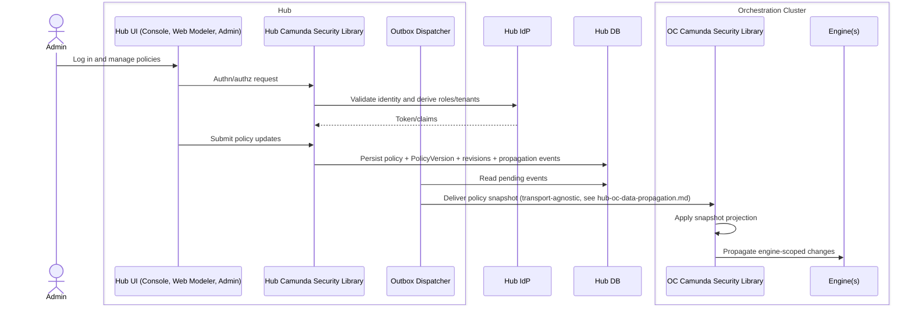
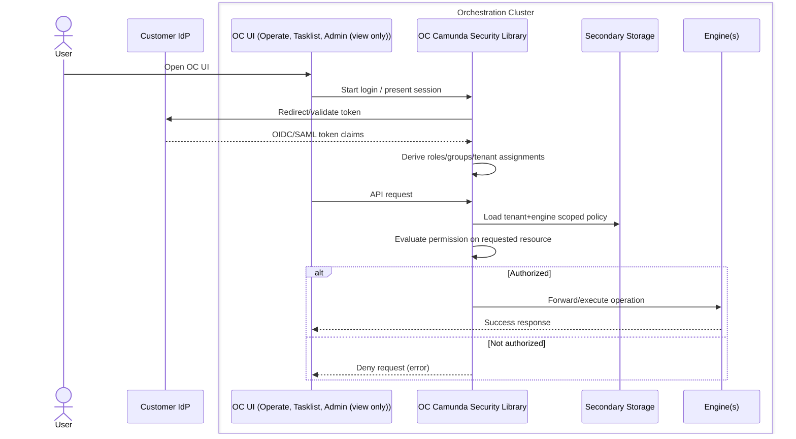
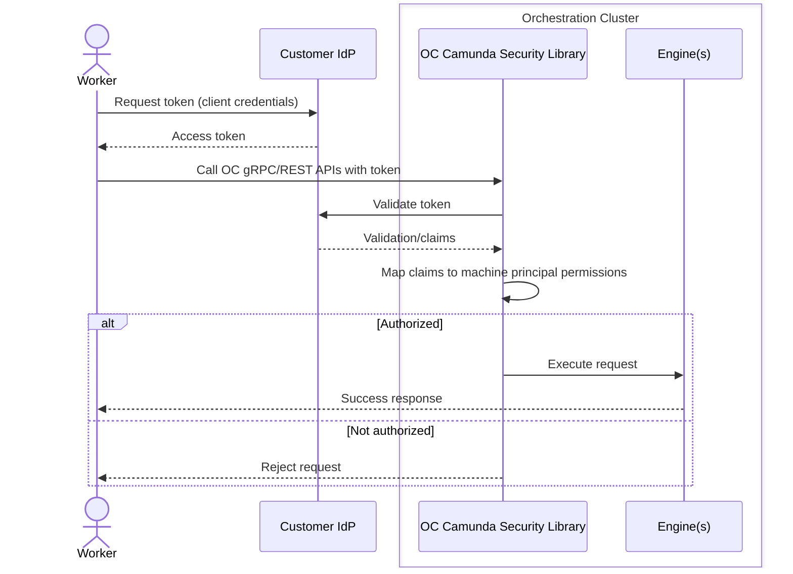

## 6. Runtime view (selected scenarios)

This section illustrates selected runtime flows as concrete user journeys, focusing on who performs which action at which point in time.

### 6.1 Admin configures cluster policies in full mode (Hub + OC)

> **Not yet implemented.** This scenario describes the design target for Hub-authored policy and
> Hub → OC distribution — neither Hub policy authoring on CSL (still Management Identity) nor the
> `PolicyVersion`/outbox/`POLICY_SNAPSHOT` distribution path exists today. See
> [rollout status](./02-current-state.md#21-rollout-status-at-a-glance). Only step 1 (Hub login)
> reflects shipped behaviour.

1. Admin logs into the Hub UI.
2. Hub Camunda Security Library authenticates the user against the configured IdP for the Hub organization and derives roles/tenants via mapping rules.
3. Admin creates or updates tenants, roles, mapping rules, and authorizations for a specific Orchestration Cluster in the Hub UI.
4. Hub Camunda Security Library:
- Resolves the organization and target cluster context via `ClusterRegistryPort`.
- Validates and persists the changes in the Hub DB under that organization scope.
- Writes a new `PolicyVersion` and associated `EntityRevision` and `PolicyVersionChange` rows.
- Writes one or more `OutboxEvent`s in status `PENDING` for the affected OCs.
5. Outbox Dispatcher picks up the new events and delivers the full `POLICY_SNAPSHOT` for the target `PolicyVersion` to each affected OC — and, in full mode, to Optimize over the same channel — via the configured transport (see `docs/hub-oc-data-propagation.md`).
6. OC Camunda Security Library:
- Applies the full policy snapshot to its local projection and updates `last_applied_version`.
- Propagates engine-scoped changes to engines via the engine command path, backed by CSL `core` (embedded in the broker/engine layer) rather than a separate framework — see [ADR-0014](../adr/0014-unified-authz-framework-in-core.md).

Once implemented, this is the intended experience: from the admin’s perspective, all policy changes are made centrally in Hub; the OC and engines converge asynchronously.

### 6.2 End user uses the OC UI in full mode

1. User opens the OC UI in the browser.
2. The OC UI delegates authentication to the OC's Camunda Security Library (for example via OAuth2 login flow or existing session cookie).
3. OC Camunda Security Library:
- Redirects or talks to the configured IdP for the user's logical Tenant.
- Validates the returned OIDC/SAML token and derives the principal's roles, groups, and logical-Tenant assignments from mapping rules and direct assignments.
4. For each incoming request from the OC UI:
- OC resolves the logical-Tenant context (from token claims and/or headers).
- Loads the logical-Tenant- and Physical-Tenant-scoped policy view from its local projection.
  (In OC-only mode this projection is authored locally; Hub-synchronized projection is the
  design target and not yet implemented — see
  [rollout status](./02-current-state.md#21-rollout-status-at-a-glance).)
- Evaluates whether the principal has the required permissions on the requested resource (for example reading process instances in a given logical Tenant).
5. If the check passes:
- OC forwards or executes the corresponding operation against the engine(s).
- Engines apply the same `AuthorizationCheckPort` evaluation as the gateway/search layer — one
  evaluator behind CSL `core`, not a separate engine-side check — see
  [ADR-0014](../adr/0014-unified-authz-framework-in-core.md).
6. If the check fails:
- OC denies the request and returns an appropriate error to the OC UI.

The user never interacts directly with Hub. The authentication and authorization checks shown
here are shipped today; Hub centrally defining the policy that OC enforces depends on the
not-yet-implemented distribution path described in §6.1 — see
[rollout status](./02-current-state.md#21-rollout-status-at-a-glance).

### 6.3 Worker authenticates against cluster APIs

1. A worker application gets a token from the customer’s IdP using the configured client credentials (machine principal).
2. The worker calls OC gRPC/REST APIs with the token.
3. OC Camunda Security Library:
- Validates the token against the IdP.
- Maps its claims to machine principal permissions via mapping rules and authorizations (for example which tenants and which process instances the worker can access).
4. If authorized, the worker’s request is executed against the engine(s); otherwise it is rejected.

The same policy model governs both human users and machine principals.

### 6.4 End user uses Optimize in full mode

1. User opens the Optimize UI in the browser.
2. Optimize delegates authentication to Optimize's Camunda Security Library instance against the
   same Enterprise IdP as OC — shipped, see
   [rollout status](./02-current-state.md#21-rollout-status-at-a-glance).
3. For each incoming request, Optimize is designed to load its local policy projection (received
   from Hub over the same distribution channel as OC, per §6.1) and evaluate the user's
   permissions on the requested analytics/reporting resource. This authorization step is not yet
   implemented on CSL — Optimize authorization still runs through Management Identity, see
   [rollout status](./02-current-state.md#21-rollout-status-at-a-glance).
4. If authorized, Optimize serves the requested report or dashboard data.

Optimize's authentication is shipped today; its policy receipt and authorization enforcement on
CSL are targeted work — see §2.1 for the current split.

---

