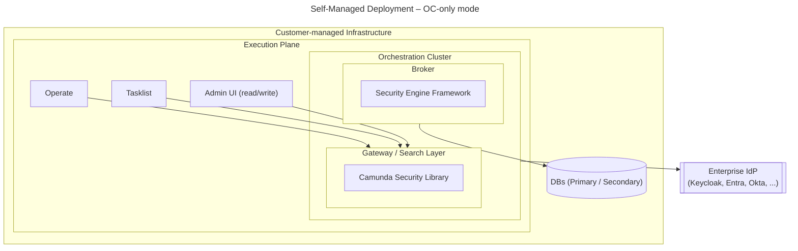
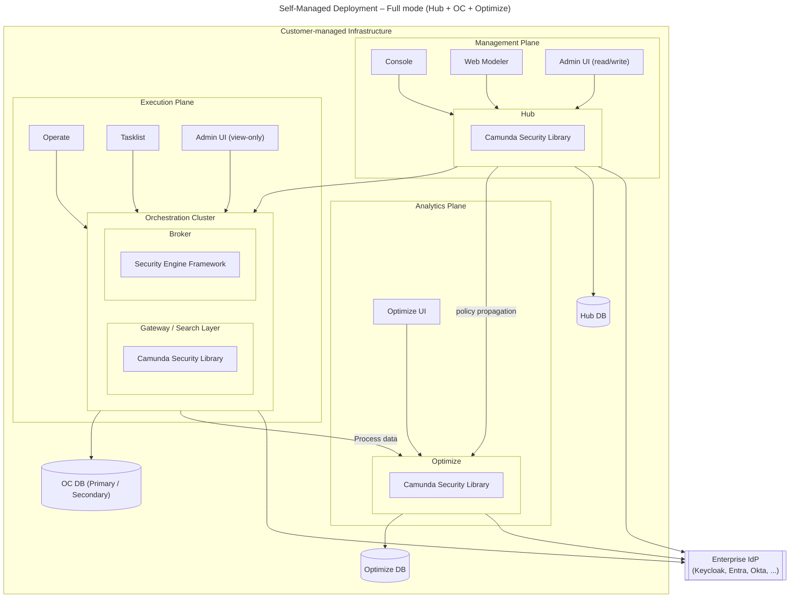
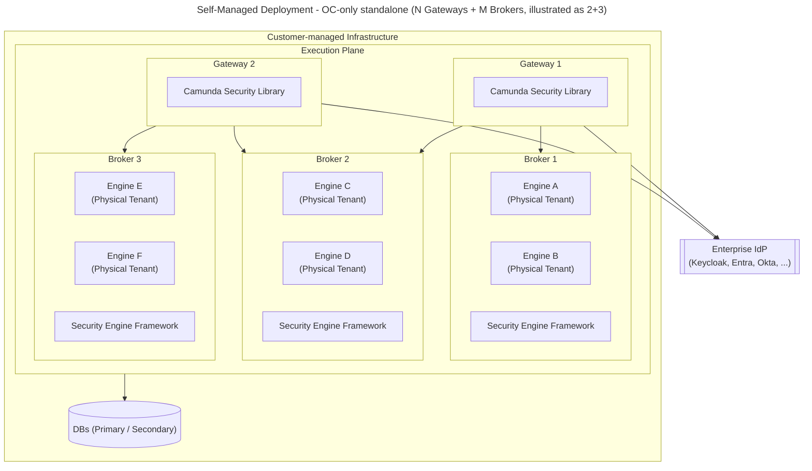
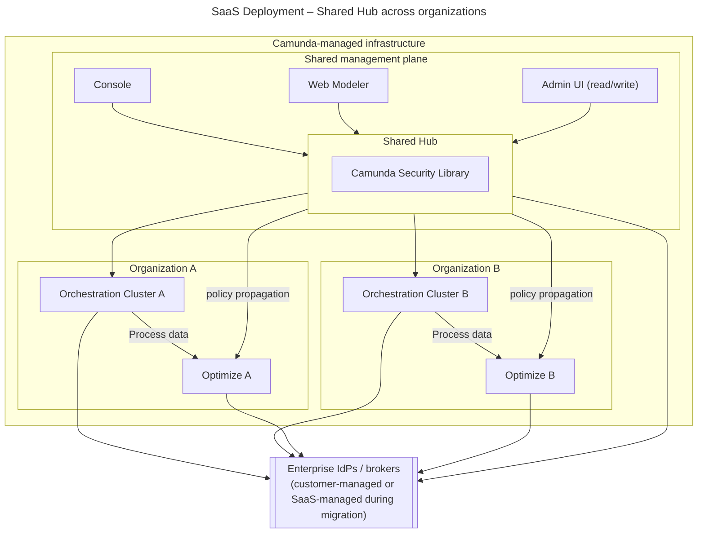

## 7. Deployment view

> The diagrams in this section use a **whitebox view** that shows internal component layers (Gateway/Search, Broker/Engine). This contrasts with the context views in §4, which treat Hub, OC, and Optimize as black boxes. The whitebox style is used here to show where Camunda Security Library and Security Engine Framework are embedded within each deployment.

### 7.1 Self-Managed deployment

In Self-Managed, the customer owns and operates all infrastructure. Three deployment views are shown below, mirroring the general modes and scaling variants from section 4.

#### 7.1.1 OC-only mode (standalone Orchestration Cluster)

- OC acts as local SoT for identity and policy.
- The Enterprise IdP is integrated directly via OIDC/SAML; no Camunda-operated broker is involved.
- OC includes an embedded gateway/search layer and a broker/engine layer; policy is enforced by Camunda Security Library (gateway) and Security Engine Framework (broker/engine).
- Multiple engines per cluster are supported with cluster-level policy propagation.
- Suitable for production use cases that do not require cross-cluster policy management.

#### 7.1.2 Full mode (Hub + Orchestration Cluster + Optimize, self-managed)

An advanced Self-Managed topology where the customer also operates Hub. Hub becomes the central policy SoT, and policy is propagated to each OC and Optimize via the platform-owned channel. The Admin UI on OC runs in read-only mode; all policy authoring happens in Hub. Optimize uses the same Camunda Security Library and receives policy from Hub.

- Hub and all OC and Optimize instances are deployed and operated by the customer on their own infrastructure.
- The Enterprise IdP is integrated at both Hub (management plane auth) and OC/Optimize (execution/analytics plane auth) levels.
- Cluster discovery and registration are handled via the `ClusterRegistryPort` and `ClusterRegistrationService` ports; the host application's adapter determines how new OCs are discovered and registered.
- OC is configured with an embedded gateway/search layer and broker/engine layer; Camunda Security Library runs in gateway, Security Engine Framework runs in broker/engine.
- Policy flows top-down: Hub -> Gateway -> Broker(Engine), same as in SaaS, but without a Camunda-operated broker.
- Suitable for large-scale or multi-cluster Self-Managed environments requiring centralized policy governance.

#### 7.1.3 OC-only mode – multi-instance example (N gateways + M brokers)

Standalone OC topology for higher throughput and availability. Hub is not present; OC remains the local policy source of truth. This diagram shows 2 gateways and 3 brokers as an illustrative example. The same topology scales to any N gateways and M brokers; each gateway runs CSL and each broker runs Security Engine Framework.

- Each gateway runs the Camunda Security Library and connects clients (Operate, Tasklist, Admin UI, workers) to the cluster.
- Each broker runs the Security Engine Framework and receives policy snapshots from the gateway layer.
- Each broker hosts multiple engines (Physical Tenants); logical tenants are scoped onto those engines using `ALL`, `TENANT` and `PHYSICAL_TENANT`.
- Suitable for larger standalone Self-Managed deployments that need horizontal scale without Hub.

> **Note on storage in multi-instance topologies:** The `DBs` node in the diagram is a summary. In practice, each engine (Physical Tenant) has its own dedicated storage scope: embedded primary storage (RocksDB — one instance per engine, internal to the broker) and its own secondary storage (Elasticsearch, OpenSearch, or RDBMS — either a dedicated database per engine or a dedicated schema within a shared database instance).

---

### 7.2 SaaS deployment

In SaaS, Camunda operates one shared Hub instance for many customer organizations. The unified identity library therefore has to support multi-organization policy authoring and propagation inside a single Hub runtime.

- One shared Hub instance serves **many organizations** (one per customer); policy and identity data in Hub must therefore be partitioned by organization. Each organization owns one or more OC clusters. This is in direct contrast to Self-Managed, where there is always exactly one organization.
- In the first iterations, this partitioning is logical only: shared Hub infrastructure and databases are reused, while policy tables and queries are keyed by `organization_id`.
- Each OC remains associated with exactly one organization boundary for policy propagation.
- Cluster discovery and registration in Hub are handled via `ClusterRegistryPort` (outbound) and `ClusterRegistrationService` (inbound) ports. How Hub's adapter implementation populates the cluster registry is a host-application integration concern, not a library concern.
- During migration, SaaS may still keep Auth0 or another broker as an internal implementation detail; this does not change the target policy model.

---

