# Unified Identity Architecture

SCIM provisioning is part of the planned end-state target architecture, but it is intentionally out of scope in this document; from the library perspective, SCIM is handled as an additional inbound port/adapter.

---

## 1. Introduction and goals

This document describes the planned Unified Identity Architecture for Camunda Hub and Orchestration Clusters in an arc42-style structure. It:

- Summarizes the current identity architecture across Camunda platform components (OC Identity, Management Identity, SaaS Auth0).
- Proposes a target architecture with a single identity plane, implemented as a hexagonal library reused in Hub and Orchestration Clusters.
- Shows how the architecture supports multiple Physical Tenants per broker/cluster and multi-tenancy.
- Emphasizes that standalone Orchestration Cluster (without Hub) remains a first-class deployment option.
- Outlines how a single shared frontend and pluggable backends (persistence, OC command creation, etc.) fit into the design.
- Keeps SCIM out of this draft intentionally to focus early feedback; SCIM is planned as another inbound port/adapter on top of the same library.

### 1.1 Terminology

This section defines the terms used throughout the document so diagrams and runtime descriptions can be read consistently.

#### 1.1.1 Orchestration Cluster (OC): logical vs physical view

The term **Orchestration Cluster (OC)** is used at two abstraction levels:

- **Logical view (architecture level):**
  - The OC is the logical execution unit owned by one organization and associated with one policy boundary.
  - High-level diagrams show this as one OC box contrasted with Hub.
- **Physical/deployment view (runtime level):**
  - An OC deployment consists of one or more **Gateways** (the Gateway/Search layer) and one or more **Brokers**.
  - Each Broker contains one or more **Engines**.
  - The Camunda Security Library (CSL) is embedded in the Gateway/Search layer and enforces authentication and authorization before broker/search access.

In high-level diagrams, OC is intentionally simplified as one logical component. In detailed building-block and deployment diagrams (section 5.1 and below), Gateway/Search and Broker/Engine layers are shown explicitly.

#### 1.1.2 Tenant naming and scope rules

- What older drafts called **multi-engine support** is now **Physical Tenant support**.
- In identity-model terms, an **Engine** is a **Physical Tenant**.
- In this document, **Tenant** means **logical Tenant** unless explicitly written as **Physical Tenant**.
- One Physical Tenant can host multiple logical Tenants.
- Multiple Brokers, or multiple Engines within a Broker, create multiple Physical Tenants in one OC.
- In the policy model, `scope_type = PHYSICAL_TENANT` refers to Physical Tenant scope.

#### 1.1.3 Hub UI and OC UI

The terms **Hub UI** and **OC UI** refer to aggregated frontend applications, not separate per-component UIs.

- **Hub UI** (management plane)
  - A single management-plane frontend that consolidates Console, Web Modeler, Admin, and related management capabilities.
  - Hub-side components authenticate and authorize through one CSL instance.
- **OC UI** (execution plane)
  - A single execution-plane frontend that consolidates Operate, Tasklist, and cluster administration capabilities.
  - OC-side components authenticate and authorize through one CSL instance.
  - In full mode (Hub + OC), the admin section is read-only and reflects policy projected from Hub.
  - In OC-only mode, the admin section is read-write and supports local policy authoring.

Both UIs follow the same identity and multi-tenancy model provided by the CSL.

---

## 2. Current identity architecture (Camunda platform today)

### 2.1 Identity components

Today identity responsibilities are split across several components:

- **Orchestration Cluster Identity (OC Identity)**
  - Embedded into the Orchestration Cluster runtime.
  - Manages runtime authentication and fine-grained authorizations (process definitions, instances, tasks, tenants, cluster APIs) for Zeebe, Operate, Tasklist, and OC APIs.

- **Management Identity**
  - Separate service used to control access to Web Modeler, Console, and Optimize and other management-plane functions in earlier releases.
  - Uses Keycloak or an external OIDC provider plus its own SQL database in self-managed deployments (see existing Management Identity arc42 docs).

- **SaaS Auth0 tenant (Console / Hub)**
  - In SaaS today, Console and other management-side UIs use a Camunda-operated Auth0 tenant as their IdP/broker.
  - From the target-architecture perspective, this is an internal broker/IdP implementation detail, not part of the long-term reference model.

- **Customer Enterprise IdPs**
  - In self-managed and in the target state, the Enterprise IdP is always the customer’s IdP (Entra, Okta, Keycloak, etc.), integrated via standard OIDC.
  - SAML is supported via Keycloak.

### 2.2 Current high-level structure

#### 2.2.1 SaaS

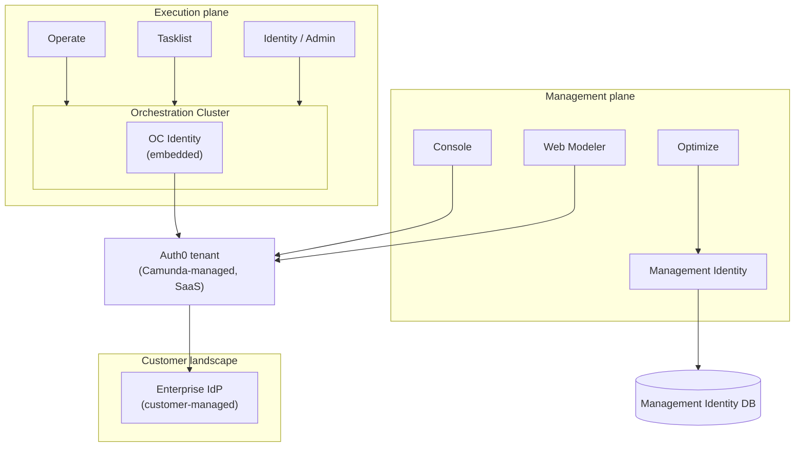
```mermaid
flowchart TB
  subgraph SaaS_Mgmt["Management plane"]
    ConsoleHub["Console"]
    WebModeler["Web Modeler"]
    Optimize["Optimize"] --> ManagementId["Management Identity"]
  end

  subgraph Execution["Execution plane"]
    Operate["Operate"]
    Tasklist["Tasklist"]
    Identity["Identity / Admin"]

    subgraph OC["Orchestration Cluster"]
      OCId["OC Identity</br>(embedded)"]
    end
  end

  subgraph Customer["Customer landscape"]
    CustIdP["Enterprise IdP</br>(customer-managed)"]
  end

  SaaSAuth0["Auth0 tenant</br>(Camunda-managed, SaaS)"]
  
  ManagementIdDBUse[("Management Identity DB")]

  ConsoleHub & WebModeler --> SaaSAuth0
  Operate & Tasklist & Identity  --> OC

  OCId --> SaaSAuth0
  SaaSAuth0 --> CustIdP
  
  ManagementId --> ManagementIdDBUse
```

In SaaS today:

- Console and Web Modeler authenticate users against a Camunda-managed Auth0 tenant, which acts as the IdP/broker for all SaaS tenants.
- OC Identity in each Orchestration Cluster also uses Auth0 as its OIDC IdP, applying runtime authorization for Operate, Tasklist, and cluster APIs.
- Auth0 either federates to the customer Enterprise IdP or manages user accounts directly, depending on tenant configuration. The concrete integration code lives in the respective SaaS backends (Console/Hub services and OC Identity OIDC client configuration), which use standard OAuth2/OIDC client libraries to communicate with Auth0.
- Since 8.8, Management Identity is no longer used in SaaS to serve the web applications. It is, however, still deployed **headlessly** in SaaS for two specific purposes: handling Optimize permissions, and providing RBAC for clusters on versions prior to 8.8. 
- Auth0 org membership: Today, membership of users in organizations is stored in Auth0 user metadata and surfaced as JWT claims. These claims are consumed by Hub/OC (in scope of this proposal) as well as by components outside this proposal's scope (e.g. Accounts). As Auth0 becomes an IdP like any other in the target architecture, this dependency on Auth0-specific metadata must be resolved — likely as part of [product-hub#3190](https://github.com/camunda/product-hub/issues/3190) or when multi-org Self-Managed support is introduced. Until then, the CSL cannot fully treat Auth0 as a standard OIDC IdP and must accommodate the existing Auth0 JWT claim structure for org membership.

#### 2.2.2 Self-managed

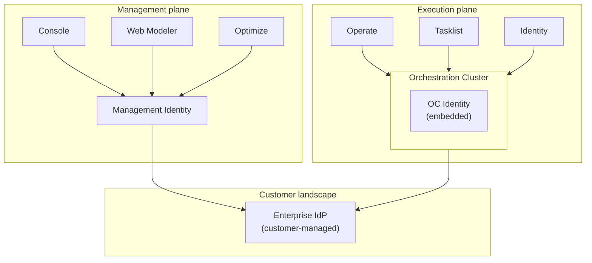
```mermaid
flowchart TB
  subgraph Mgmt["Management plane"]
    Console["Console"]
    WebModeler["Web Modeler"]
    Optimize["Optimize"]

    MgmtId["Management Identity"]
  end

  subgraph Execution["Execution plane"]
    Operate["Operate"]
    Tasklist["Tasklist"]
    Identity["Identity"]

    subgraph OC["Orchestration Cluster"]
      OCId["OC Identity</br>(embedded)"]
    end
  end

  subgraph Customer["Customer landscape"]
    CustIdP["Enterprise IdP</br>(customer-managed)"]
  end

  Console & WebModeler & Optimize --> MgmtId

  MgmtId --> CustIdP

  Operate & Tasklist & Identity --> OC

  OC --> CustIdP
```

In Self-managed today:

- Management Identity is a shared service for authorization and user/group/role management, but authentication is not uniformly delegated to it as a service across management-plane components. Each component implements its own authentication flow:
  - Some (e.g. Optimize) use the Identity SDK to integrate with Management Identity and delegate authentication to it.
  - Others (e.g. Web Modeler, Accounts) implement the authentication flow themselves, either using the Identity SDK for limited integration or communicating with the Enterprise IdP directly without going through Management Identity.
  - This means there are effectively more than two identity silos — not just Management Identity vs OC Identity, but multiple per-component authentication paths that may or may not align in behavior or feature completeness.
- OC Identity is embedded into each Orchestration Cluster and directly integrates with the Enterprise IdP; it handles runtime authentication and fine-grained authorizations for Operate, Tasklist, and the cluster APIs.
- This results in fragmented identity: multiple integration patterns on the management plane, plus a separate OC Identity silo, all depending on the same Enterprise IdP but using different models, SDKs, and configuration surfaces.

### 2.3 Limitations and motivation for change

Based on the target-architecture appendix and identity roadmap, the current setup has several issues:

- Split identity
  - Separate models and configuration for Management Identity vs OC Identity.
  - Within the management plane itself, there is no single authentication integration pattern: some components use the Identity SDK, others implement authentication flows directly against the IdP without it, resulting in per-component auth behavior inconsistencies (e.g. an auth feature present in one application but absent in another).
  - SaaS and self-managed use different stacks (Auth0 vs direct IdP).
- SaaS vs self-managed parity gaps
  - Capabilities such as mapping rules, tenants, and fine-grained RBAC/ABAC differ or are missing depending on deployment.
- Manual lifecycle and configuration
  - Joiner/mover/leaver flows are not fully automated from the customer’s IdP/HR system.
  - Tenants, roles, and mappings are often configured by hand in UIs.
- Limited observability and migration tooling
  - Identity migrations (e.g. Management Identity → unified plane) and policy changes are fragile, not first-class “jobs”.
  - It is hard to see and debug identity health end to end.

These limitations motivate a unified identity plane with consistent semantics and tooling across Hub and all clusters, including multiple-Physical-Tenant and multi-logical-tenant scenarios.

---

### 2.4 Assumptions

The target architecture is based on the following assumptions:

- In SaaS, there is one shared Hub instance that serves multiple organizations. Each organization owns one or more Orchestration Clusters; Hub partitions all policy data by `organization_id`.
  - In the first iterations, identity and policy data in Hub are separated only logically, via organization-aware persistence and queries in shared Hub storage.
- In Self-Managed, the initial target scope assumes exactly one organization — the customer's own deployment. The `organization_id` field exists in the data model for architectural consistency with the SaaS multi-org model, but it is fixed to a single value in the initial Self-Managed iterations and has no operational significance there. A Self-Managed deployment may own one or more OC clusters, all belonging to that single organization. 
  - Support for multiple organizations in a Self-Managed Hub instance is a planned post-8.10 capability; the data model is already partitioned by `organization_id` to support this without structural changes when that capability is introduced.
- In full mode, each Orchestration Cluster is associated with exactly one Hub organization boundary for policy management; policies are always authored “above” the cluster in Hub and projected downward.
    - The library itself has no knowledge of how a host application discovers or tracks Orchestration Clusters. Cluster registration and enumeration are exposed as generic port interfaces: the host application calls `ClusterRegistrationService` (inbound port) to inform the library about new or updated clusters; the library calls `ClusterRegistryPort` (outbound port) when it needs to enumerate clusters for policy targeting.
  - How a specific host application learns about newly created OCs — whether by querying an external service, consuming provisioning events, or reading configuration — is entirely an integration concern for the host and not part of the library.
- In OC-only mode, the Orchestration Cluster is the local source of truth for policy; there is no Hub and therefore no cross-cluster policy coordination.
- All engines within a given Orchestration Cluster share the same OC-level; engines never talk to IdPs directly and are not configured as OIDC/SAML clients.
  - There will be one client per IDP (could be multiple per engine); we rely on roles and claims to decide which Engines each user can access and what they can do there.
  - Since engines are in the first iteration just configurable via configuration files, IDPs are also just configurable like this. In a later iteration, both should be configurable via Hub.
- Policy propagation across layers is eventually consistent:
  - Hub tracks the last acknowledged policy versions per OC.
  - Each OC tracks its own last applied policy version.
  - Engines receive policy via the OC’s internal command path and are assumed to converge towards the OC-level policy state; engines do not track separate policy versions.
- Existing infrastructure (databases, message brokers, cluster gateways, IdP configurations) is reused; no new global identity databases or dedicated identity clusters are introduced.

### 2.5 Unresolved issues

- Multiple Hub instances: The architecture diagrams show a single shared Hub instance in SaaS and a single Hub in Self-Managed full mode. Some customers require multiple Hub instances — for example to fully separate delivery stages or organizational boundaries. The library architecture supports this because each Hub instance is an independent CSL deployment with its own cluster registry and policy state. Hub-to-Hub coordination is out of scope. An OC is associated with exactly one Hub at a time; reassignment is addressed as an open question in §9.1.
- Satellite components (open scope): Two satellite runtimes that sit adjacent to Hub and OC are not yet explicitly covered:
  - App Integrations backend — operates at the management plane level. It is not yet decided whether it should receive IdP configuration managed by Hub via the CSL port model, or whether it manages its own auth independently.
  - Connectors runtime — operates at the OC level. The same open question applies: should it consume IdP config propagated by the OC CSL, or remain separately configured?
  - The hexagonal port model accommodates both being integrated as CSL consumers in the future (by providing adapter implementations) without changing the core. Whether and when to do this is a scope decision outside this document.

---

### 2.6 Preparation work and ongoing epics

- [Prepare Authentication for Hub Integration](https://github.com/camunda/camunda/issues/38556)
- Spike about extraction of code: [Spike/new replacement auth lib](https://github.com/camunda/camunda/pull/49058)

---

## 3. Solution strategy: unified identity plane and library

The target architecture introduces one consistent identity and policy model shared between Hub and all Orchestration Clusters:

- Hub Identity & Policy
  - Source of Truth (SoT) for users, groups, roles, tenants, mapping rules, and authorizations for all clusters and Hub apps.
- OC Identity
  - Per-cluster projection and enforcement of that policy, optimized for runtime access checks, and aware of multiple engines/tenants per cluster.
- Single identity plane for all consumers
  - Web UIs, user apps, workers and integrations are all just API clients authenticated by the Enterprise IdP and authorized against the policy model.

Technically, this is implemented as a pluggable identity/security library:

- Embedded into Hub and Orchestration Cluster.
- Exposes Authentication (OIDC/SAML) and Authorization (RBAC/ABAC) capabilities via well-defined SPIs.
- Reuses the host application’s existing storage and infrastructure via SPI interfaces (no new standalone database or service).

Key design principles (selected):

- One identity plane for Hub and OC, with Hub as policy SoT whenever present.
- One Hub runtime in SaaS, serving many organizations, with organization-aware policy partitioning in shared Hub storage.
- SaaS / self-managed parity: same concepts (tenants, mapping rules, fine‑grained permissions, BYO IdP) in both deployment models.
- Generic library with no product-specific code: the library contains no knowledge of how clusters are discovered or provisioned in any particular host application. All cluster lifecycle interactions go through two dedicated port interfaces — `ClusterRegistrationService` (inbound: host notifies library of new or updated clusters) and `ClusterRegistryPort` (outbound: library queries host for the current cluster list). How a host application (Hub in SaaS, Hub in Self-Managed full mode) learns about new OCs is exclusively an adapter concern and never leaks into the library domain.
- Hexagonal architecture: all persistence, messaging, OC command creation, and engine‑level wiring are behind interfaces; default implementations can be swapped or replaced entirely.
- IdP-agnostic: only relies on OIDC and SAML standards, so any compliant IdP can integrate.
- Automated lifecycle and migrations: IdP claim mapping and policy replication, with idempotent and observable migrations.
- Standalone OC support: OC can act as the top-level policy authority when Hub is absent, mirroring the fallback topologies in existing docs.

### 3.1 Functional user journeys

The following user journeys describe, from a functional perspective, which actors perform which actions in which subsystem. They are not sequence diagrams, but concrete scenarios tying together Hub, Orchestration Clusters, and IdPs.

#### 3.1.1 Configure cluster policies in full mode (Hub + OC)

Short- to midterm target: Admins configure cluster policies (including Physical Tenant-scoped (`PHYSICAL_TENANT`) and Tenant-scoped permissions) primarily in Hub. The admin section of the OC UI exposes a read-only view of the applied policy for that cluster.

- Actor: Organization / platform administrator (Hub)
- Goal: Adjust who can do what on a given Orchestration Cluster and its engines/tenants.
- Main steps:
  1. Admin signs into the Hub UI.
  2. Admin selects a specific Orchestration Cluster and opens its policy configuration.
  3. Admin edits tenants, roles, groups, mapping rules, and authorizations for that cluster, including:
  - Cluster-wide permissions (for example cluster admins).
  - Tenant-scoped permissions (for example `retail` vs `wholesale`).
  - Physical Tenant-scoped (`PHYSICAL_TENANT`).
  4. Hub Camunda Security Library validates and persists the changes in the selected organization scope, producing a new `PolicyVersion` for the target cluster.
  5. Hub propagates the updated policy to the target OC through a platform-owned transport channel; OC Camunda Security Library applies it and updates the Physical Tenant-scoped (`PHYSICAL_TENANT`) projections.
  6. The admin section of the OC UI, in read-only mode, allows cluster operators to view the effective policies per engine and tenant, including the applied policy version.

Outcome: Cluster policies, including Physical Tenant- and Tenant-specific permissions, are authored once in Hub and enforced consistently in the target OC. Cluster operators can inspect, but not change, these policies via the admin section of the OC UI.

#### 3.1.2 Application developer configures a worker client

- Actor: Application developer / project owner
- Goal: Set up a job worker or integration that can safely access cluster APIs.
- Main steps:
  1. Developer creates a machine principal (client) in the UI (Hub UI in full mode, OC UI in OC-only mode), getting client ID and secret or another credential form.
  2. Admin associates the client with one or more tenants and assigns roles or groups appropriate for the worker.
  3. Admin configures mapping rules (if needed) so that the client’s token claims map to the desired roles and tenants.
  4. Developer configures the worker application to request tokens from the Enterprise IdP using the client credentials.
  5. At runtime, the worker calls the OC APIs with those tokens; OC’s Camunda Security Library validates the token against the IdP, derives permissions from the policy model, and enforces them for each request.

Outcome: The worker runs with the minimum required permissions derived from the unified policy model; there is no ad-hoc, engine-specific authorization logic.

#### 3.1.3 End user works across Hub and OC applications

- Actor: End user (for example, modeler, operator, support agent)
- Goal: Use the Hub UI and OC UI with consistent permissions.
- Main steps:
  1. User signs into the Hub UI via the Enterprise IdP.
  2. Hub Camunda Security Library validates the token and derives roles, groups, and tenants from mapping rules.
  3. User creates or edits models, deploys them to a target Orchestration Cluster or environment.
  4. When the user opens the OC UI for that cluster, they authenticate via the same Enterprise IdP; OC’s Camunda Security Library derives the same or related roles/tenants from the token.
  5. In the OC UI, the user can only see and act on data allowed by their tenant- and role-based authorizations (for example, only instances in `retail` tenant, only tasks assigned to their team).

Outcome: The user experiences a consistent identity across Hub and OC: one Enterprise IdP login, one conceptual set of roles and tenants, and predictable access in both management and execution plane UIs.

#### 3.1.4 Configure policies in an OC-only deployment (long-term target)

Long-term target: Bring the same policy model, including Physical Tenant- and Tenant-scoped authorizations, to OC-only deployments. Today OC-only already supports identity and authorizations, but this journey describes the target behavior.

- Actor: Cluster administrator (OC-only)
- Goal: Configure identity and policies for a standalone OC without Hub, including Physical Tenant- and Tenant-scoped rules.
- Main steps:
  1. Cluster admin opens the admin section of the OC UI.
  2. Cluster admin configures the Enterprise IdP connection directly on the OC (OIDC/SAML client settings for the deployment).
  3. Cluster admin creates tenants, roles, groups, and mapping rules in the admin section of the OC UI.
  4. Cluster admin defines authorizations for cluster resources (definitions, instances, tasks, cluster APIs) and, if needed, Physical Tenant- and Tenant-specific scopes.
  5. OC Camunda Security Library persists the policy locally and propagates Physical Tenant-scoped (`PHYSICAL_TENANT`) projections to the engines.

Outcome: The OC acts as local SoT for identity and policy. Users and workers can authenticate via the Enterprise IdP, and permissions are enforced consistently across the OC UI and APIs within that cluster, including Physical Tenant- and Tenant-specific rules.

#### 3.1.5 Configure identity for a new organization (full mode: Hub + OC, long-term target)

Long-term target: Org-level IdP setup and cluster provisioning are performed centrally via Hub.

- Actor: Organization administrator (Hub)
- Goal: Connect the organization’s IdP, provision an Orchestration Cluster, and define baseline access.
- Main steps:
  1. Org admin signs into the Hub UI.
  2. Org admin configures the Enterprise IdP connection for the organization (for example Entra, Okta, Keycloak) via Hub (org-level IdP setup in the target state).
  3. Org admin creates or imports tenants (for example `default`, `retail`, `wholesale`) in the Hub UI.
  4. Org admin defines mapping rules (claims → roles/tenants) and assigns baseline roles and groups for key personas (for example Cluster Admins, Developers, Support).
  5. Org admin provisions (or selects) an Orchestration Cluster and associates it with the organization/tenants.
    - Cluster selection is resolved via the `ClusterRegistryPort`; the host application (Hub) provides the adapter implementation that enumerates available clusters.
  6. Hub Camunda Security Library persists this configuration in the organization-scoped Hub partition, produces a new `PolicyVersion`, and starts propagation to the relevant OC(s).

Outcome: The organization’s IdP is connected, tenants and roles exist, and cluster-local policy is projected to the associated OCs. Cluster admins and developers can authenticate via the Enterprise IdP and start using cluster UIs and APIs, with Hub acting as the central identity and policy entry point.

### 3.2 Quality goals

The Camunda Security Library and unified identity plane must meet the following quality goals:

- Security and correctness
  - Authorization decisions are deterministic: given the same token, policy, and resource, all instances (Hub, OC) reach the same result.
  - Default behavior is deny-by-default if policy, tenant context, or token validation is unclear.
  - All external integrations (IdPs, engines) are accessed via well-defined ports with strict input validation.

- Robustness and resilience
  - Temporary failures (network, IdP, OC downtime) do not corrupt policy state; propagation is retried and gaps can be detected and repaired.
  - Idempotent apply semantics ensure that replays of the same policy version do not change effective behavior.

- Performance and scalability
  - Policy evaluation adds minimal per-request overhead for common paths (UI/API calls, worker calls).
  - Policy propagation is efficient for large numbers of clusters and tenants; in the proposed first iteration, Hub would send full policy payloads and rely on batching/backpressure to keep throughput stable.

- Observability and logging
  - All authentication and authorization decisions are logged with enough context (principal, resource, action, tenant, result, correlation IDs) to trace end-to-end flows.
  - Policy propagation (Hub → OC → Engine) is observable per cluster with clear status (last version applied, last error, latency) and logs for both success and failure paths.
  - Logs follow consistent structure and severity levels so they can be indexed and correlated across Hub and OCs.

- Operational simplicity
  - Identity deployments (Hub, OC-only) are manageable by platform teams without deep knowledge of internal policy data structures.
  - Rollout state of policy per cluster/OC is visible in tooling without digging into raw logs or databases.

---

## 4. Target system context

This section describes the unified identity system at a high level, showing how the new library integrates into the platform across three supported deployment modes. The diagrams illustrate key components (Hub, Orchestration Clusters, Optimize, identity UIs, infrastructure) and their relationships.

### 4.1 Full mode (Hub + OC + Optimize)

In full mode, the platform runs with Hub (management/control plane), Orchestration Cluster (execution plane), and Optimize (analytics plane). All three use the same identity model and the same Camunda Security Library.

Configuration flows top-down: Hub is the central source of truth for all policy. Configuration is authored once in Hub and propagated to both OC and Optimize through a platform-owned transport channel, while OC and Optimize maintain local projections and enforce policy for their respective domains. OC receives process data from engines; Optimize consumes both policy and process data from OC for analytics. The Admin UI in OC runs in read-only mode, showing the local projection of Hub policy.

In SaaS, this full-mode topology is realized by one shared Hub instance serving multiple organizations, where each organization owns one or more OC clusters.

In Self-Managed, the same topology applies but with exactly one organization: Hub manages a single customer organization and its OC clusters, so `organization_id` is fixed and the multi-org partitioning is present in the model but not operationally relevant.

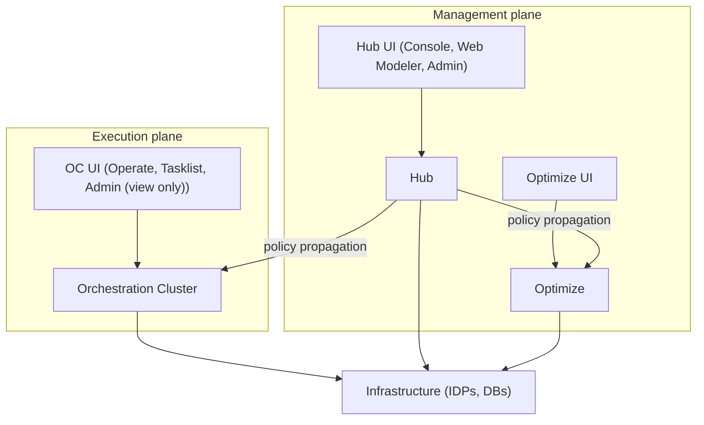
```mermaid
flowchart TB

  subgraph Mgmt["Management plane"]
    HubUi["Hub UI (Console, Web Modeler, Admin)"] 
    Hub["Hub"] 
    OptUi["Optimize UI"]
    Optimize["Optimize"] 
    HubUi --> Hub
    OptUi --> Optimize
  end

  subgraph Execution["Execution plane"]
    OcUi["OC UI (Operate, Tasklist, Admin (view only))"]

    OC["Orchestration Cluster"]

    OcUi --> OC
  end

  Infra["Infrastructure (IDPs, DBs)"]

  Hub -->|"policy propagation"| OC
  Hub -->|"policy propagation"| Optimize
  OC --> Infra
  Hub --> Infra
  Optimize --> Infra
```

- Hub and each OC use the same Camunda Security Library as the shared identity and policy engine.
- Hub and Optimize use the same Camunda Security Library; Optimize applies policies locally and enforces access to analytics and reporting.
- Hub is the single source of truth for all policy and configuration.
- Hub propagates policy changes to OC through a platform-owned propagation channel; OC maintains a local projection and handles runtime enforcement per engine/tenant.
- Hub also propagates policy changes to Optimize through the same platform-owned channel; Optimize maintains a local projection and enforces access policies for analytics.
- Existing infrastructure is reused, no new databases or services are introduced.
- Hub and OC gateway-layer instances of the framework integrate with one or more IdPs (per organization/cluster and mapped to logical Tenants and Physical Tenants) via standard OIDC/SAML clients; engines never integrate with IdPs directly.
- Optimize integrates with the same Enterprise IdP to authenticate users/machines accessing analytics and enforces the same policy model for analytics access control.
- Optimize consumes both policy state (via propagation channel or API) and process execution data (events, process instances, tasks) from OC for analysis and reporting.

### 4.2 OC-only mode (standalone OC without Hub or Optimize)

In OC-only mode, Hub and Optimize are not present. The Orchestration Cluster becomes the local source of truth for all policy and configuration. OC is a first-class deployment option and acts as top-level policy authority for its engines. This mode is useful for development environments and self-contained production scenarios that do not require analytics.

Configuration flows locally: OC manages all policies directly, and the Admin UI in OC runs in read-write mode, allowing full policy authoring and management. Configuration then propagates from OC to individual engines.

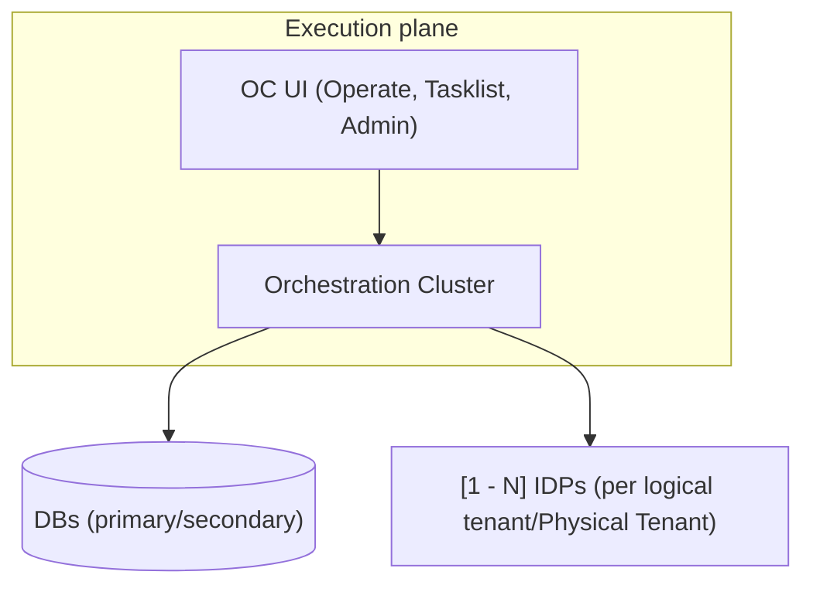
```mermaid
flowchart TB

  subgraph Execution["Execution plane"]
    OcUi["OC UI (Operate, Tasklist, Admin)"]

    OC["Orchestration Cluster"]

    OcUi --> OC
  end

  IdPs["[1 - N] IDPs (per logical tenant/Physical Tenant)"]
  DBs[("DBs (primary/secondary)")]

  OC --> DBs & IdPs
```

- OC is the single source of truth for all policy and configuration.
- The same Camunda Security Library is used but configured for standalone operation.
- Existing infrastructure is reused, no new databases or services are introduced.
- OC owns the IdP client configurations for its tenants and engines; engines still only consume OC-level identity decisions and never call IdPs directly.

### 4.3 OC + Optimize without Hub

In this deployment mode, Optimize is deployed alongside an Orchestration Cluster without Hub. Policy is managed independently in both OC and Optimize — there is no policy distribution between them. Optimize only depends on OC for process execution data (events, process instances, task data) required for analytics and reporting.

Both OC and Optimize have their own Admin UIs and manage their own policies independently. Users must configure policies separately in each system. Optimize authenticates via the same Enterprise IdP as OC.

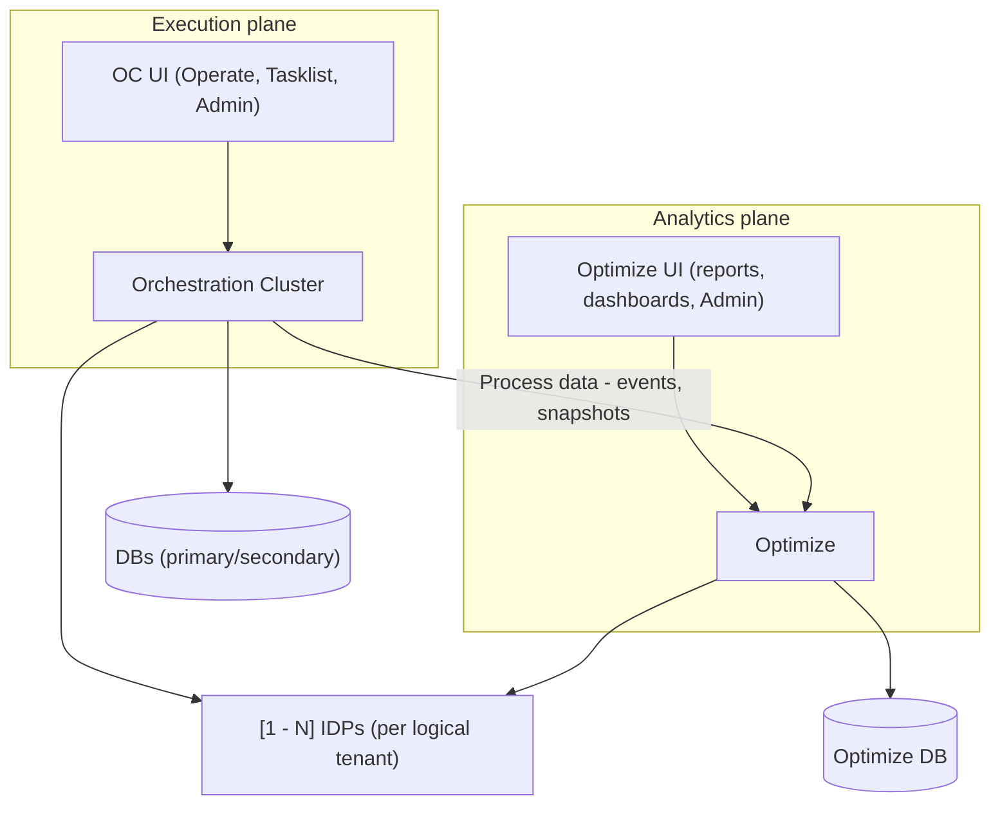
```mermaid
flowchart TB

  subgraph Execution["Execution plane"]
    OcUi["OC UI (Operate, Tasklist, Admin)"]
    OC["Orchestration Cluster"]
    OcUi --> OC
  end

  subgraph Analytics["Analytics plane"]
    OptUi["Optimize UI (reports, dashboards, Admin)"]
    Optimize["Optimize"]
    OptUi --> Optimize
  end

  IdPs["[1 - N] IDPs (per logical tenant)"]
  DBs[("DBs (primary/secondary)")]
  OptDB[("Optimize DB")]

  OC --> DBs & IdPs
  Optimize --> OptDB & IdPs
  OC -->|"Process data - events, snapshots"| Optimize
```

- Policy is managed independently in OC and Optimize — no policy distribution between them.
- Both OC and Optimize have their own Admin UI for policy management (read-write mode in both).
- Optimize only depends on OC for process execution data (events, process instances, snapshots).
- Both OC and Optimize authenticate users and machines via the same Enterprise IdP.
- Optimize maintains a dedicated datastore for analytics caching, session state, and its own policy projection.

### 4.4 Infrastructure implications for policy distribution and Optimize

**Ownership boundary:**

Hub -> OC/Optimize data distribution (transport, retries, sequencing, dispatch, and delivery operations) is **outside this library**. It is a broader Hub/OC platform concern because the same channel must propagate multiple data categories (for example identity policy, secrets, and connection/configuration data), not only identity.

Propagation architecture and operational details are documented in **[docs/hub-oc-data-propagation.md](hub-oc-data-propagation.md)**.

**Datastore and policy persistence for Optimize (CSL-relevant):**

Optimize requires dedicated storage for policy and session state, with different characteristics depending on mode:

- In full-mode deployments, Hub distributes policy to both OC and Optimize through the platform-owned propagation mechanism.
  - Optimize maintains a local database for:
    - Policy projections (tenants, roles, groups, mapping rules, authorizations)
    - Session and authentication state
    - Last applied policy version tracking (`last_applied_version`)
    - Analytics caching and query results

- In OC + Optimize mode (without Hub), policy is maintained independently in each system:
  - OC and Optimize each manage their own policy via their respective Admin UIs
  - No policy propagation occurs between OC and Optimize
  - Optimize maintains a dedicated datastore for:
    - Its own policy state (managed directly, not derived from OC)
    - Session and authentication data
    - Process data consumed from OC (events, snapshots)
    - Query results and analytics caching

**Policy enforcement across planes:**

Optimize enforces the same policy model as OC, using the Camunda Security Library to:
- Authenticate users and machines via the Enterprise IdP (same as OC)
- Derive roles, groups, and tenant assignments from mapping rules
- Enforce per-tenant and per-role access controls on analytics and reports
- Ensure that users can only view reports and data they are authorized to access within their tenant scope

---

## 5. Building block view (target)

### 5.1 High-level components

The following diagrams show the internal structure of Hub and Orchestration Cluster, including how Camunda Security Library instance connects to frontend applications, infrastructure, and (in multiple-Physical-Tenant scenarios) individual engine instances.

Both the Hub and OC instances of the Camunda Security Library maintain their own local state:

- A cluster-scoped policy projection for the relevant cluster(s) they manage.
- Local tracking of the last applied policy version (`last_applied_version` on the OC side, `last_acked_version` per OC on the Hub side).
- Local session state.

#### 5.1.1 Full mode Simple (Hub + OC with one Engine)

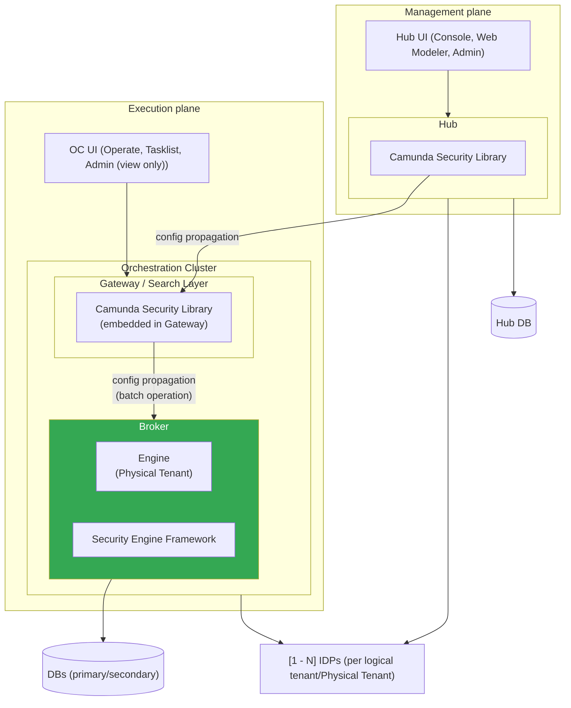
```mermaid
flowchart TB
  subgraph Mgmt["Management plane"]
    HubUi["Hub UI (Console, Web Modeler, Admin)"]

    subgraph Hub["Hub"]
      SecGatHub["Camunda Security Library"]
    end

    HubUi --> Hub
  end

  subgraph Execution["Execution plane"]
    OcUi["OC UI (Operate, Tasklist, Admin (view only))"]

    subgraph OC["Orchestration Cluster"]
      subgraph GatewayLayer["Gateway / Search Layer"]
        SecGatOC["Camunda Security Library</br>(embedded in Gateway)"]
      end

      subgraph Broker["Broker"]
        Engine["Engine</br>(Physical Tenant)"]
        SecEngFrame["Security Engine Framework"]
      end

      SecGatOC -->|"config propagation</br>(batch operation)"| Broker
    end

    OcUi --> GatewayLayer
  end

  IdPs["[1 - N] IDPs (per logical tenant/Physical Tenant)"]
  DBs[("DBs (primary/secondary)")]
  HubDb[("Hub DB")]

  SecGatHub -->|"config propagation"| SecGatOC
  Broker --> DBs
  OC & Hub --> IdPs
  Hub --> HubDb

  style Broker fill:#34a853,color:#fff
```

Key building blocks in full mode simple:

- Hub UI: Unified frontend in the management plane. It includes modeling, management, and admin capabilities, and allows full policy authoring for all configurable layers (Hub, OCs, engines, tenants).
- Hub + Camunda Security Library: Central source of truth. Manages all policy configuration for all clusters, OCs, and engines. All policy changes originate here.
- OC UI: Unified frontend in the execution plane. Its admin section shows the cluster-local projection of Hub policy; configuration there is read-only.
- OC + Camunda Security Library: Per-cluster policy enforcement and projection layer. Receives policy snapshots from Hub via the Hub-to-OC propagation channel. Propagates scoped policy views via batch operation to the single engine.
- Engine (Physical Tenant): A single execution context (Zeebe engine) inside the Broker. A Physical Tenant is an independent execution unit that hosts one or more logical Tenants (e.g., `default`, `retail`). Receives its scoped projection of cluster policy from OC. No direct Hub connection.
- Security Engine Framework: Engine-specific policy enforcement layer.
- Infrastructure (IDPs, DBs): Shared existing persistence and IdP connectivity for authentication and authorization across all layers.

> **Important:** A **Physical Tenant** is an Engine (a physical execution unit). A **Tenant** (like `default`, `retail`, `wholesale`) is a logical partition for data and access. Multiple logical Tenants can execute within a single Physical Tenant (Engine). The policy scopes are: `ALL` (cluster-wide), `TENANT` (specific logical tenant) or `PHYSICAL_TENANT` (specific physical tenant).

Configuration propagation chain: Hub → OC → Physical Tenant (Engine).

For concrete deployment topologies (including multi-gateway and multi-broker layouts), see section [7. Deployment view](#7-deployment-view).

#### 5.1.2 OC-only mode Simple (standalone OC with one Engine)

> **Note on physical layout:** In this diagram, the OC box represents the full logical cluster. At the physical level the Camunda Security Library runs inside the **Gateway / Search Layer** (one or more Zeebe Gateways), and each Broker contains one or more **Engines (Physical Tenants)**. See section 1.1 for details.

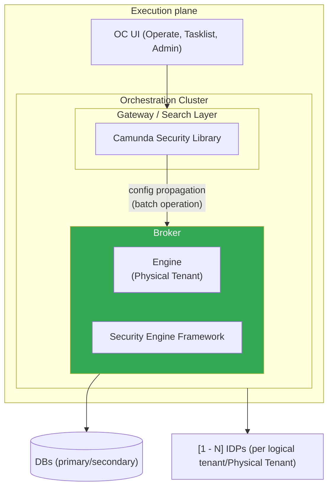
```mermaid
flowchart TB

  subgraph Execution["Execution plane"]
    OcUi["OC UI (Operate, Tasklist, Admin)"]

    subgraph OC["Orchestration Cluster"]
      subgraph GatewayLayer["Gateway / Search Layer"]
        OCLib["Camunda Security Library"]
      end

      subgraph Broker["Broker"]
        Engine["Engine</br>(Physical Tenant)"]
        EngLib["Security Engine Framework"]
      end

      OCLib -->|"config propagation</br>(batch operation)"| Broker
    end
  end

  OcUi --> GatewayLayer

  IdPs["[1 - N] IDPs (per logical tenant/Physical Tenant)"]
  DBs[("DBs (primary/secondary)")]

  Broker --> DBs
  OC --> IdPs

  style Broker fill:#34a853,color:#fff
```

Key building blocks in OC-only mode simple:

- OC UI: Unified runtime frontend that interacts directly with OC. Its admin section allows full policy authoring (no Hub restrictions).
- OC + Camunda Security Library: Local source of truth. Manages all policy and authorization directly without Hub coordination. All policy changes originate here.
- Engine (Physical Tenant): A single execution context (Zeebe engine) inside the Broker. A Physical Tenant is an independent execution unit that hosts one or more logical Tenants (e.g., `default`, `retail`). Receives its scoped projection of local OC policy. No direct Hub connection.
- Security Engine Framework: Engine-specific policy enforcement layer.
- Infrastructure (IDPs, DBs): Local persistence and IdP connectivity; no cross-cluster replication or Hub involvement.

> **Important:** A **Physical Tenant** is an Engine (a physical execution unit). A **Tenant** (like `default`, `retail`, `wholesale`) is a logical partition for data and access. Multiple logical Tenants can execute within a single Physical Tenant (Engine).

For more complex OC-only deployments with multiple brokers and multiple engines per broker, see section [7.1.3 OC-only mode Standalone (2 Gateways + 3 Brokers)](#713-oc-only-mode-standalone-2-gateways--3-brokers).

#### 5.1.3 Full mode Complex (Hub + OC with multiple Brokers and multiple Engines)

This section defines the conceptual behavior only; the complete deployment examples are maintained in section [7. Deployment view](#7-deployment-view).

- Full mode keeps the same propagation chain: Hub (policy SoT) -> OC gateway/search layer (Camunda Security Library) -> broker/engine layer (Security Engine Framework).
- OC may run one or many gateways and one or many brokers depending on scale and availability targets.
- Each broker may host one or many engines (Physical Tenants), and each engine hosts one or many logical tenants.

For concrete diagrams:

- Single-node full mode: [7.1.2 Full mode (Hub + Orchestration Cluster, self-managed)](#712-full-mode-hub--orchestration-cluster-self-managed)
- Standalone multi-node OC-only mode: [7.1.3 OC-only mode Standalone (2 Gateways + 3 Brokers)](#713-oc-only-mode-standalone-2-gateways--3-brokers)

---

## 5.2 Unified policy model

The unified identity architecture is built around a single policy model that is shared between Hub Identity & Policy and OC Identity. Hub is the source of truth for this model per cluster; in shared-Hub deployments, Hub stores it per organization and cluster. Each OC hosts a cluster-local projection of the same concepts for enforcement.

In CSL, a **Policy** means the effective access configuration for a scope, derived from roles, groups, mapping rules, principals, and authorizations.

Iteration one models these building blocks directly (roles, groups, mapping rules, principals, and authorizations) and propagates them as versioned snapshots. We intentionally defer introducing a separate first-class `Policy` aggregate until there is a concrete need for additional abstraction.

At a high level, the shared policy model consists of:

- **Organization**
  - Hub-side partitioning boundary for identity and policy data.
  - In SaaS, one Hub instance serves multiple organizations, so all Hub policy tables and queries must be organization-aware.
  - In early iterations, this separation is logical only: shared Hub infrastructure and databases remain in place, but all policy state is keyed and filtered by organization.
  - Each Orchestration Cluster belongs to exactly one organization boundary for policy propagation at a given time.

- **Tenant**
  - Logical partition for data and access in a cluster (for example `default`, `retail`, `wholesale`, `customer-x`).
  - Used to scope where a principal is allowed to read or write data.
  - Tenant configuration (names, descriptions, flags) is authored in Hub and projected to each OC.

- **Group / Role**
  - **Group**
    - Collection of principals (users, mapping rules, clients) that should share the same permissions.
  - **Role**
    - Reusable set of permissions that can be attached to groups, users, or clients.
    - Roles are used both on the management plane (Hub apps) and execution plane (cluster APIs and UIs).

- **MappingRule**
  - Declarative rule that maps **IdP claims** to Camunda concepts:
    - `claimName` (for example `groups`, `org`, `department`).
    - `operator` (for example `EQUALS`, `CONTAINS`).
    - `claimValue` (for example `camunda-platform-admin`, `Retail`).
  - Targets one or more **roles**, **groups**, and **tenants**:
    - When an incoming token’s claims match, the principal automatically receives those roles/groups/tenants.
  - This is the main mechanism that turns IdP attributes into platform-level permissions.

- **Principal**
  - Represents an actor that can authenticate and be authorized:
  - **User principal**
    - Identified by an IdP user claim (for example `preferred_username`, `email`).
    - May have direct role/group assignments in addition to mapping-rule derived ones.
  - **Machine principal**
    - Identified by client credentials (for example `client_id`).
    - Used by workers, automation, and integrations (job workers, CI/CD, connectors, etc.).

- **Authorization**
  - Fine-grained permission record that ties **owners** to **resources** and **actions**:
  - Conceptually:
    - `(ownerType, ownerId, resourceType, resourceId, permissions[])`
  - Examples:
    - Owner: `GROUP:RetailDevelopers`
      ResourceType: `PROCESS_DEFINITION`
      ResourceId: `*`
      Permissions: `[READ_PROCESS_DEFINITION, READ_PROCESS_INSTANCE, CREATE_PROCESS_INSTANCE]`
    - Owner: `ROLE:ClusterAdmin`
      ResourceType: `CLUSTER_API`
      ResourceId: `*`
      Permissions: `[MANAGE_CLUSTER_SETTINGS, MANAGE_USERS]`
  - The same structure is used on:
    - **OC side** for engine and cluster resources (definitions, instances, tasks, cluster APIs).
    - **Hub side** for management resources (orgs, workspaces, projects, assets, clusters).

#### 5.2.1 Hub vs. OC responsibilities

Both Hub and OC use exactly the same policy model, but with different responsibilities.

- **Hub Identity & Policy** (central policy authoring and propagation)
  - Acts as **policy source of truth** for all clusters in full-mode deployments.
  - Authoring location for tenants, roles, groups, mapping rules, and authorizations (all with full scope awareness: `ALL`, `TENANT`, `PHYSICAL_TENANT`).
  - Stores organization-scoped `PolicyVersion` records per cluster and drives propagation via Outbox/`OutboxEvent`.
  - Handles authentication for Hub applications (Console, Web Modeler, Admin UI) via the same Camunda Security Library instance.
  - Does **not** enforce authorization for runtime execution APIs; that is strictly an OC responsibility.

- **OC Identity** (cluster-local policy enforcement)
  - Hosts a **cluster-local projection** of the same entities received from Hub (or locally authored in OC-only mode).
  - Enforces authorizations for all incoming requests:
    - The OC UI (Operate, Tasklist, Admin).
    - Cluster runtime APIs (gRPC/REST) for workers and integrations.
  - Validates IdP tokens for users and machines accessing the cluster.
  - Derives tenant assignments and roles from token claims via mapping rules.
  - Routes identity-scoped policy updates to engines via the `EngineCommandPort`.
  - Does not invent new policy; it only applies and enforces what Hub (or, in standalone mode, local OC configuration) defines.

This unified model allows:

- The same concepts (tenants, roles, groups, mapping rules, authorizations, principals, scope metadata) to be used consistently on both **management** and **execution** planes.
- Identity-as-code and migrations to operate on one canonical representation (`PolicyVersion`) per cluster, with clear ownership (Hub or OC-local) and enforcement (OC or engine-local).

#### 5.2.2 Responsibility matrix (IdP and policy-related information)

The following table summarizes which information must be known to which component:

| Information type                             | Hub (full mode)                                                | OC (full mode)                                                      | OC-only mode (OC)                | Engine                                 |
|---------------------------------------------|-----------------------------------------------------------------|---------------------------------------------------------------------|----------------------------------|----------------------------------------|
| IdP client credentials (client IDs/secrets) | Yes (managed centrally or per logical Tenant)                  | Yes (cluster-local credentials / secrets per OC / logical Tenant / Physical Tenant) | Yes                              | No                                     |
| IdP connections per logical Tenant (OIDC/SAML) | Yes (for Hub apps)                                          | Yes (for cluster-side authn)                                        | Yes                              | No (trusts OC)                         |
| Organization / cluster ownership metadata   | Yes (organization boundary + OC enumeration via `ClusterRegistryPort`) | Yes (cluster-local identity context)                                | No                               | No                                     |
| Logical Tenant                              | Yes (SoT)                                                      | Yes (projection per cluster)                                        | Yes                              | Indirectly via OC commands             |
| Mapping rules (claims → roles/tenants)      | Yes (SoT)                                                      | Yes (projection per cluster)                                        | Yes                              | No                                     |
| Roles and groups                            | Yes (SoT)                                                      | Yes (projection per cluster)                                        | Yes                              | No (only resulting permissions)        |
| Authorizations (role/group → resource perms)| Yes (SoT)                                                      | Yes (projection per cluster; Physical-Tenant-scoped and logical-Tenant-scoped views) | Yes                              | Indirectly (via engine-local projections) |
| Policy versions and propagation state       | Yes (`PolicyVersion`, `EntityRevision`, optional `PolicyVersionChange`, and per-target acknowledgement state), scoped by organization + cluster in shared Hub deployments | Yes (`last_applied_version` per cluster)                            | Yes (local policy versions only) | No explicit versioning; consumes OC-level updates |
| Session data                                | Yes (Hub sessions only)                                        | Yes (cluster sessions only)                                         | Yes                              | No                                     |

Engines only need to know the effective permissions resulting from the policy model; they neither talk to IdPs nor store policy versions.

### 5.3 Policy propagation boundary and semantic versioning (Hub → OC / Optimize)

For this architecture document, transport mechanics are intentionally out of scope. Hub-to-OC/Optimize delivery (channel type, retries, sequencing, dispatch operations) is a Hub/platform integration concern and is documented in `docs/hub-oc-data-propagation.md`.

What remains in scope for CSL architecture:

- CSL defines propagation semantics and contracts (`PolicyVersion`, `POLICY_SNAPSHOT`, and apply rules).
- Hub persists versioned policy state per organization/cluster using `PolicyVersion`, `EntityRevision`, and optional `PolicyVersionChange`.
- Receiver CSL (`PolicyApplyService`) owns semantic apply behavior: apply newer versions, ignore already-applied versions, and handle replay idempotently.
- Hub tracks per-target acknowledgement state (`last_acked_version`); each receiver tracks local apply progress (`last_applied_version`).
- Engines do not track policy versions; they consume OC-projected effective state.

These rules preserve deterministic policy convergence while keeping transport implementation fully outside the library.

#### 5.3.1 First-iteration semantic contract

In iteration one, CSL semantic apply uses full snapshots:

- Hub emits `POLICY_SNAPSHOT` for each new `PolicyVersion`.
- Receivers apply the snapshot as the desired full state at target version `V`.
- Incremental diff propagation (`POLICY_DIFF`) remains a future optimization and is not required for semantic correctness.

#### 5.3.2 Transport/semantic split

- Transport outcome (`ACK`/`NACK`, retries, sequencing, dead-letter) is platform-owned.
- Semantic correctness (version checks, idempotent replay, state replacement rules) is CSL-owned.
- A successful transport delivery does not replace semantic validation in `PolicyApplyService`.

#### 5.3.3 Linking `PolicyVersion` with the policy data model

At an architecture level, policy state linkage in Hub uses three semantic layers:

- `PolicyVersion`: organization + cluster-scoped commit marker (`version_number`).
- `EntityRevision`: immutable per-entity revision payload (or tombstone) introduced by a specific `PolicyVersion`.
- `PolicyVersionChange` (optional): ordered change index for a `PolicyVersion`, useful for auditability and potential future diff optimization.

This linkage is CSL domain semantics, independent of transport implementation.

#### 5.3.4 Model for policy-version linking

Minimal conceptual schema:

```text
PolicyVersion
  id
  organization_id
  cluster_id
  version_number
  base_version       -- optional; reserved for possible future diff-based propagation

EntityRevision
  id
  organization_id
  entity_type
  entity_id
  introduced_in_policy_version
  scope_type
  scope_id
  is_deleted
  payload            -- single referenced entity JSON

PolicyVersionChange
  policy_version_id
  organization_id
  entity_type
  entity_id
  operation          -- UPSERT | DELETE
  scope_type         -- ALL | TENANT | PHYSICAL_TENANT
  scope_id
  revision_ref       -- reference to concrete entity revision payload

OcSyncState
  organization_id
  oc_id
  cluster_id
  last_acked_version -- semantic acknowledgement progress per target
  last_sync_at
```

Snapshot materialization rule for target version `V`:

- Select revisions with `introduced_in_policy_version <= V` for the target cluster.
- Group by `(entity_type, entity_id, scope_type, scope_id)` and keep the latest revision.
- Drop tombstones (`is_deleted = true`) from the final set.
- Emit the remaining resource set as the effective snapshot at `V`.

#### 5.3.5 Semantic consistency guarantees

- **Eventual convergence:** Hub commit -> receiver apply -> engine projection.
- **Idempotent apply:** same `policyVersionId` replay has no semantic side effects.
- **Monotonic versioning:** receivers accept newer versions and ignore stale/duplicate versions.
- **Deterministic replacement:** snapshot apply reconstructs one known-good effective policy state for target version `V`.

#### 5.3.6 Semantic progress tracking

- Hub tracks per-target semantic acknowledgement (`last_acked_version`).
- Each receiver tracks semantic apply progress (`last_applied_version`).
- Engines do not track policy versions explicitly; they converge to OC-projected effective state.

Example snapshots (semantic contract):

```json
{
  "organizationId": "org-acme",
  "clusterId": "oc-a",
  "policyVersion": 1,
  "kind": "POLICY_SNAPSHOT",
  "tenants": [{"id": "default"}],
  "roles": [{"id": "role-cluster-admin", "permissions": ["MANAGE_CLUSTER_SETTINGS", "MANAGE_USERS"]}]
}
```

```json
{
  "organizationId": "org-acme",
  "clusterId": "oc-a",
  "policyVersion": 2,
  "kind": "POLICY_SNAPSHOT",
  "tenants": [{"id": "default"}],
  "roles": [
    {"id": "role-cluster-admin", "permissions": ["MANAGE_CLUSTER_SETTINGS", "MANAGE_USERS"]},
    {"id": "role-support-agent", "permissions": ["READ_PROCESS_INSTANCE", "READ_TASK", "UPDATE_TASK"]}
  ]
}
```

---

### 5.4 Camunda Security Library – hexagonal architecture

#### CSL and Spring Security

The Camunda Security Library is built on top of Spring Security but does not replace it. Spring Security provides the filter chain, `SecurityContext` management, and the `HttpSecurity` DSL. The CSL configures and extends the Spring Security infrastructure by:

- Assembling Spring Security OIDC infrastructure (`ClientRegistrationRepository`, `JwtDecoder`, token validators) from configuration sourced via `OidcProviderConfigurationPort`.
- Installing a scope-aware authorization filter (`WebAppAuthorizationCheckFilter`) backed by `ResourcePermissionPort`.
- Providing a set of `SecurityFilterChain` configuration classes that consuming applications activate by explicit `@Import`.

Consuming applications should not need to write Spring Security configuration from scratch. CSL ships a set of `@Configuration` classes in the `spring-boot-starter` module, each covering a specific concern (authentication method, session management, OIDC provider wiring, etc.). Hosts opt in by explicitly `@Import`-ing individual configuration classes, or by activating the opt-in umbrella `CamundaSecurityAutoConfiguration` via `@ImportAutoConfiguration`. Nothing activates automatically from adding the Maven dependency alone — see [ADR-0008](adr/0008-no-spring-boot-auto-configuration.md). Every library-supplied bean has `@ConditionalOnMissingBean` so hosts can override individual beans without touching the configuration class.

> Design constraint — lesson from the Identity SDK: The Identity SDK precedent shows that when consuming applications must write significant boilerplate around a shared security library, inconsistencies emerge: auth features present in one application (e.g. Operate) but missing in another (e.g. Tasklist), or bugs fixed in one integration but not others. The CSL must minimize the glue code required in each consumer. All auth logic that is not host-infrastructure-specific belongs in the CSL core, not in consuming-application code.

#### Hexagonal architecture

The Camunda Security Library is a [hexagonal (ports and adapters)](https://herbertograca.com/2017/09/14/ports-adapters-architecture/) library. Its core domain never imports a concrete database class, OIDC library, or Zeebe API — all external dependencies are hidden behind port interfaces that the host application (Hub, OC) wires in.

Key rule: all port interfaces — both inbound and outbound — are defined inside the library core. The host application depends on the library, never the other way around.

In addition to core ports, the library is structured across four Maven modules:

- `core/` — framework-free domain logic and all port interface definitions (`port/in/`, `port/out/`). Zero Spring or persistence dependencies.
- `api/` — public, host-facing surface: model records (`api/model/`), context/helper contracts (`api/context/`), and configuration records bound by Spring in the starter (`api/model/config/`). No dependency on `core/`.
- `validation/` — centralized validators for identity initialization data (users, groups, tenants, roles, mapping rules, authorizations). Used by the starter to validate initialization configuration.
- `spring-boot-starter/` — Spring configuration classes, filter chain assembly, and default port implementations. Hosts activate these via explicit `@Import` (see [ADR-0008](adr/0008-no-spring-boot-auto-configuration.md)).

The `api` contracts are consumer-facing and do not need to be outbound host-implemented adapters.

- **Inbound (driving) side:** A Spring MVC controller or security filter lives in the host application. It imports and calls an inbound port interface (e.g. `ResourcePermissionPort`) from the library. The implementation lives in `spring-boot-starter` and may delegate to outbound ports for data.
- **Outbound (driven) side:** The implementation calls an outbound port interface (e.g. `AuthorizationRepositoryPort`) defined in the library. The host application provides the concrete adapter implementation.

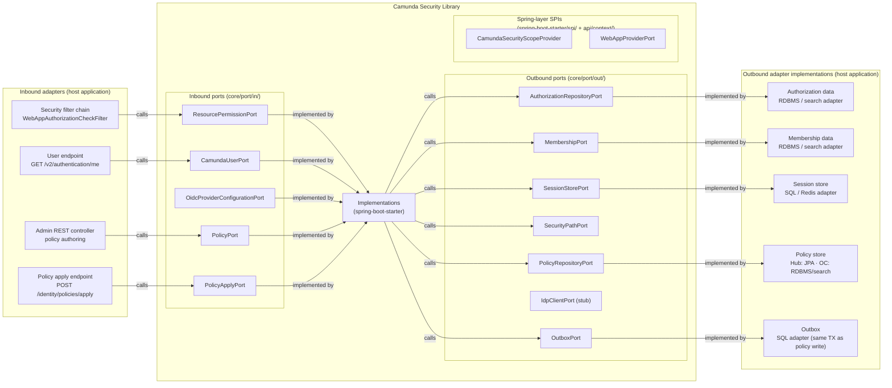
```mermaid
graph LR
  subgraph EXT_IN["Inbound adapters (host application)"]
    SC["Security filter chain</br>WebAppAuthorizationCheckFilter"]
    UE["User endpoint</br>GET /v2/authentication/me"]
    PAC["Policy apply endpoint</br>POST /identity/policies/apply"]
    AC["Admin REST controller</br>policy authoring"]
  end

  subgraph CORE["Camunda Security Library"]
    subgraph IN_PORTS["Inbound ports (core/port/in/)"]
      RPP["ResourcePermissionPort"]
      CUP["CamundaUserPort"]
      OCP["OidcProviderConfigurationPort"]
      PP["PolicyPort"]
      PAP["PolicyApplyPort"]
    end
    DL["Implementations</br>(spring-boot-starter)"]
    subgraph OUT_PORTS["Outbound ports (core/port/out/)"]
      ARP["AuthorizationRepositoryPort"]
      MP["MembershipPort"]
      SSP["SessionStorePort"]
      SECP["SecurityPathPort"]
      PRP["PolicyRepositoryPort"]
      IDP_P["IdpClientPort (stub)"]
      OX["OutboxPort"]
    end
    subgraph SPRING_SPI["Spring-layer SPIs</br>(spring-boot-starter/spi/ + api/context/)"]
      CSSP["CamundaSecurityScopeProvider"]
      WAPP["WebAppProviderPort"]
    end
  end

  subgraph EXT_OUT["Outbound adapter implementations (host application)"]
    ARP_I["Authorization data</br>RDBMS / search adapter"]
    MP_I["Membership data</br>RDBMS / search adapter"]
    SSP_I["Session store</br>SQL / Redis adapter"]
    PRP_I["Policy store</br>Hub: JPA · OC: RDBMS/search"]
    OX_I["Outbox</br>SQL adapter (same TX as policy write)"]
  end

  SC -->|"calls"| RPP
  UE -->|"calls"| CUP
  PAC -->|"calls"| PAP
  AC -->|"calls"| PP

  RPP & CUP & OCP & PP & PAP -->|"implemented by"| DL

  DL -->|"calls"| ARP & MP & SSP & SECP & PRP & OX

  ARP -->|"implemented by"| ARP_I
  MP -->|"implemented by"| MP_I
  SSP -->|"implemented by"| SSP_I
  PRP -->|"implemented by"| PRP_I
  OX -->|"implemented by"| OX_I
```

> Ports marked **Active** have their wiring complete today: inbound Active ports have a default implementation in `spring-boot-starter`; outbound Active ports are consumed by the current starter and require a host-side adapter. Ports marked **Stub** have their contract interface defined in `core/port/in/` or `core/port/out/` but no current CSL wiring — they are reserved for the policy work (Hub/OC strategy enablement).

**Inbound port responsibilities:**

| Inbound port | Responsibility | Status | Deployment strategies | Typical host-side callers |
|---|---|---|---|---|
| `ResourcePermissionPort` | Answers whether the current principal has a given `PermissionType` on a given resource. The library ships a default implementation backed by `AuthorizationRepositoryPort`. | Active | all | `WebAppAuthorizationCheckFilter` |
| `CamundaUserPort` | Returns the currently-authenticated user view and bearer token. The library ships OIDC and basic auth defaults. | Active | all | User-info REST endpoints |
| `OidcProviderConfigurationPort` | Returns OIDC provider configurations keyed by registration ID, supporting multi-IdP and per-tenant OIDC setup. | Active | all | OIDC decoder factory, login picker, client registration |
| `PolicyPort` | Queries and authors the unified policy model (roles, authorizations, mapping rules) in the local source-of-truth runtime. | Stub | `hub`, `oc-standalone` | Admin REST controller, Hub UI / OC UI backend |
| `PolicyApplyPort` | Applies a policy snapshot received from Hub to the local projection. Owns version checks and idempotent apply semantics. | Stub | `oc-managed` | `POST /identity/policies/apply` endpoint |
| `TenantPort` | Tenant lifecycle and lookup operations. | Stub | all | Admin REST controller, request filter |
| `ClusterRegistrationPort` | Registers and deregisters Orchestration Clusters against Hub. | Stub | `hub` | Hub adapter triggered by provisioning events |

**Outbound port responsibilities:**

| Outbound port | Responsibility | Status | Deployment strategies | Typical host-side implementations |
|---|---|---|---|---|
| `AuthorizationRepositoryPort` | Returns `Authorization` records for a principal on a given resource type, resolving identity transitively through groups, roles, and mapping rules. | Active | all | RDBMS / search adapter |
| `AuthorizationScopeRepositoryPort` | Resolves authorization scopes (`ALL`, `TENANT`, `PHYSICAL_TENANT`) for pre-query filtering, point scope checks, and permission discovery on resource detail views. | Active | all | RDBMS / search adapter |
| `AuthorizedComponentsPort` | Returns the list of webapp components the authenticated principal is allowed to access. | Active | all | RDBMS / search adapter |
| `MembershipPort` | Resolves a principal's memberships through a chain: mapping rule IDs → group IDs → role IDs → tenant IDs. | Active | all | RDBMS / search adapter |
| `BasicAuthUserDetailsPort` | Loads a user by username (with stored password hash) for HTTP Basic authentication. | Active | all | RDBMS adapter |
| `AdminUserPresencePort` | Reports whether an admin user has been provisioned; consulted by the admin-user bootstrap filter. | Active | all | RDBMS / user store adapter |
| `SecurityPathPort` | Provides HTTP path patterns the filter chain protects or permits: API paths, webapp paths, unprotected paths, static resource suffixes, admin bypass paths. | Active | all | Host-provided path configuration |
| `SessionStorePort` | Persists and retrieves authenticated web sessions (`get`/`upsert`/`delete`/`getAll` for expiry sweep). | Active | all | SQL session adapter, Redis adapter |
| `PolicyRepositoryPort` | Persists and reads the unified policy projection (tenants, roles, groups, mapping rules, principals, authorizations). | Stub | all | Hub: JPA adapter; OC: RDBMS / search adapter |
| `IdpClientPort` | Communicates with external Identity Providers for OIDC operations. | Stub | all | OIDC client adapter (Keycloak, Entra, Auth0) |
| `OutboxPort` | Records outbox events that carry policy changes from Hub to OCs in the same transaction as the triggering policy write. | Stub | `hub` | SQL propagation adapter |
| `ClusterRegistryPort` | Reads and maintains the registry of known Orchestration Clusters for policy propagation targeting. | Stub | `hub` | Hub adapter backed by cluster registry |
| `FeatureTogglePort` | Evaluates runtime feature toggle values for mode-gated behavior. | Stub | all | Spring `@ConfigurationProperties` adapter, Unleash adapter |

> `EngineCommandPort` — planned outbound port for emitting engine-scoped projection commands from OC to engines. Not yet defined in `core/port/out/`; pending the policy propagation work.

This design guarantees that **swapping a database, replacing the IdP client, or adding engine projection requires only a new adapter class** — no changes to the domain core.

Inbound and outbound ports are CSL boundaries; concrete transport adapters on both sides are owned by host platform integration.

#### 5.4.1 Property-driven runtime mode switching

The same library core is reused in all deployments. **In every runtime mode, AuthN and AuthZ enforcement is always active** — the library always configures a Spring Security filter chain to authenticate inbound requests and enforce scope-aware authorization decisions. What differs per mode is which additional capabilities (authoring, policy propagation dispatch, engine projection) are switched on.

Mode activation is property-driven via Spring Boot conditions (`@ConditionalOnProperty`, or a small custom `@Conditional` when multiple properties contribute to the decision), not via Spring profiles.

**Current implementation state:** authentication method selection (`camunda.security.authentication.method=basic|oidc`) is active today and governs which filter chains are assembled. The `hub` / `oc-managed` / `oc-standalone` deployment strategy property is defined in the configuration model but is not yet consumed by the filter chain layer — it is planned for the policy work that wires `PolicyPort`, `PolicyApplyPort`, and the Hub/OC-specific outbound ports.

Hub enforces AuthN/AuthZ for the Hub UI. This is exactly the same `ResourcePermissionPort` and `IdpClientPort` used by OC, just configured with Hub-scoped resources instead of cluster/engine resources.

**Camunda Security Library responsibilities by deployment strategy:**

| Deployment strategy | AuthN/AuthZ enforcement | Policy source | Policy authoring | Outbox dispatch to OCs | Engine projection | Cluster registry | Runtime context |
|---|---|---|---|---|---|---|---|
| `HUB` | ✅ Hub-scoped (org, workspace, cluster resources) | Hub is SoT | ✅ via Hub UI/API | ✅ via `OutboxPort` | ❌ no engines in Hub | ✅ `ClusterRegistrationService` + `ClusterRegistryPort` | Hub authentication and policy management for the Hub UI |
| `OC_MANAGED` | ✅ Cluster-scoped (engine, tenant, task resources) | Receives from Hub | ❌ (read-only in the admin section of the OC UI) | ❌ | ✅ via `EngineCommandPort` | ❌ | OC receives policy via `/identity/policies/apply` endpoint from Hub; enforces for all cluster requests and exposes the applied policy through the admin section of the OC UI |
| `OC_STANDALONE` | ✅ Cluster-scoped (engine, tenant, task resources) | OC is local SoT | ✅ via the admin section of the OC UI and OC APIs | ❌ | ✅ via `EngineCommandPort` | ❌ | OC is fully autonomous; local policy authoring and engine projection through the admin section of the OC UI |

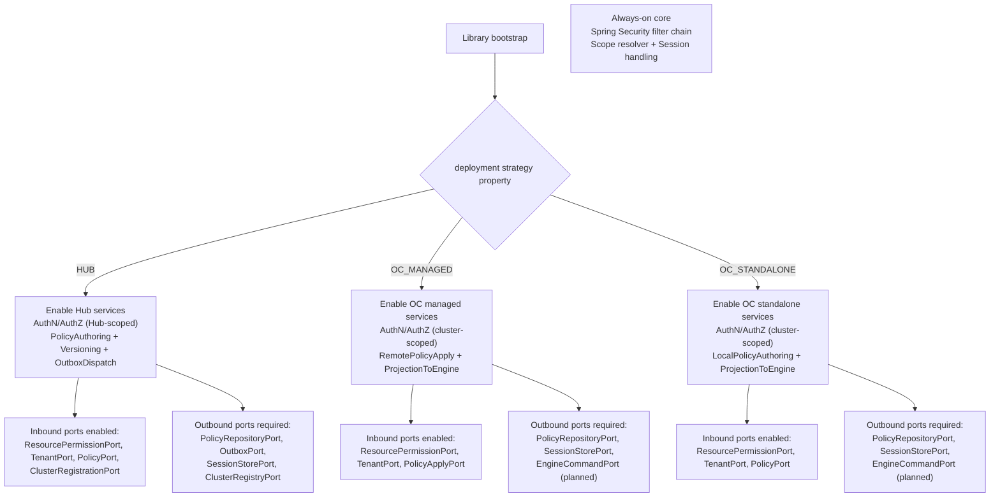
```mermaid
flowchart TB
  Start["Library bootstrap"] --> Mode{"deployment strategy property"}

  Mode -->|"HUB"| Hub["Enable Hub services<br>AuthN/AuthZ (Hub-scoped)<br>PolicyAuthoring + Versioning + OutboxDispatch"]
  Mode -->|"OC_MANAGED"| OCM["Enable OC managed services<br>AuthN/AuthZ (cluster-scoped)<br>RemotePolicyApply + ProjectionToEngine"]
  Mode -->|"OC_STANDALONE"| OCS["Enable OC standalone services<br>AuthN/AuthZ (cluster-scoped)<br>LocalPolicyAuthoring + ProjectionToEngine"]

  Core["Always-on core<br>Spring Security filter chain<br>Scope resolver + Session handling"]

  Hub --> HubIn["Inbound ports enabled:<br>ResourcePermissionPort, TenantPort, PolicyPort,<br>ClusterRegistrationPort"]
  OCM --> OCMIn["Inbound ports enabled:<br>ResourcePermissionPort, TenantPort, PolicyApplyPort"]
  OCS --> OCSPin["Inbound ports enabled:<br>ResourcePermissionPort, TenantPort, PolicyPort"]

  Hub --> HubPorts["Outbound ports required:<br>PolicyRepositoryPort, OutboxPort,<br>SessionStorePort, ClusterRegistryPort"]
  OCM --> OCMPorts["Outbound ports required:<br>PolicyRepositoryPort, SessionStorePort,<br>EngineCommandPort (planned)"]
  OCS --> OCSPorts["Outbound ports required:<br>PolicyRepositoryPort, SessionStorePort,<br>EngineCommandPort (planned)"]
```

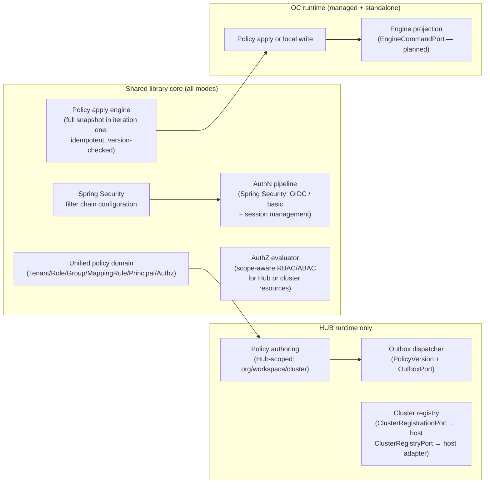
```mermaid
flowchart LR
  subgraph SharedCore["Shared library core (all modes)"]
    SpringSec["Spring Security<br>filter chain configuration"]
    AuthN["AuthN pipeline<br>(Spring Security: OIDC / basic<br>+ session management)"]
    AuthZ["AuthZ evaluator<br>(scope-aware RBAC/ABAC<br>for Hub or cluster resources)"]
    Domain["Unified policy domain<br>(Tenant/Role/Group/MappingRule/Principal/Authz)"]
    Apply["Policy apply engine<br>(full snapshot in iteration one;<br>idempotent, version-checked)"]

    SpringSec --> AuthN
  end

  subgraph HubRuntime["HUB runtime only"]
    HubAuthoring["Policy authoring<br>(Hub-scoped: org/workspace/cluster)"]
    HubOutbox["Outbox dispatcher<br>(PolicyVersion + OutboxPort)"]
    HubCluster["Cluster registry<br>(ClusterRegistrationPort ← host<br>ClusterRegistryPort → host adapter)"]
    HubAuthoring --> HubOutbox
  end

  subgraph OcRuntime["OC runtime (managed + standalone)"]
    OcWrite["Policy apply or local write"]
    OcProject["Engine projection<br>(EngineCommandPort — planned)"]
    OcWrite --> OcProject
  end

  Domain --> HubAuthoring
  Apply --> OcWrite
```

- There is no dedicated or separate IdP "for the gateway"; the framework acts as the OIDC client against the configured IdPs.

#### 5.4.2 Why a shared Camunda Security Library layer?

The extra layer between UIs/clients and engines is intentional:

- Centralized policy enforcement
  - The Hub UI, the OC UI, and all API clients (workers, automation, integrations) talk to the same policy engine per deployment boundary (Hub or OC).
  - Engines no longer need to embed IdP and policy logic; they only evaluate engine-local projections and commands.
- Reuse across Hub and OC
  - The same library, with the same domain model and ports, is embedded into Hub and OC.
  - Differences between full mode (Hub + OC) and OC-only mode are expressed via adapters and configuration, not divergent business logic.
- Clean separation of concerns
  - IdP integration, session handling, multi-tenancy, mapping rules, and authorization decisions are handled in one place.
  - Engine integration is reduced to a narrow command API (Security Engine Framework) that can evolve independently.
- Pluggable backends
  - Concrete persistence (SQL, search), propagation transport, and IdP clients can be swapped or customized by providing alternative adapters, without changing the domain model.

#### 5.5 Security Engine Framework

The **Security Engine Framework** is the identity sub-framework embedded directly inside each engine (Zeebe). It is the engine-side counterpart to the Camunda Security Library and follows the same hexagonal principle: all external dependencies are hidden behind port interfaces.

The OC Camunda Security Library communicates with each engine exclusively through the `EngineCommandPort` outbound port, which translates into engine-level identity commands. The Security Engine Framework receives those commands via its own inbound port and decides how to persist and apply the identity state changes inside the engine.

**Key rule:** engines never talk to IdPs directly, never hold policy versions, and never interpret scope metadata beyond what is needed for their own authorization decisions. The Camunda Security Library on the OC side is responsible for deciding what to forward and how to scope it; see [ ADR-0004](adr/0004-oc-identity-data-persistence-and-engine-command-scope.md) for the open decision on how scope metadata flows into the engine.

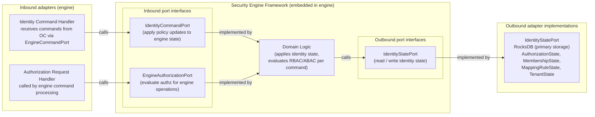
```mermaid
graph LR
  subgraph EXT_IN_SEF["Inbound adapters (engine)"]
    CMD_IN["Identity Command Handler</br>receives commands from OC via EngineCommandPort"]
    AUTHZ_IN["Authorization Request Handler</br>called by engine command processing"]
  end

  subgraph SEF["Security Engine Framework (embedded in engine)"]
    subgraph IN_PORTS_SEF["Inbound port interfaces"]
      ICP["IdentityCommandPort</br>(apply policy updates to engine state)"]
      EAP["EngineAuthorizationPort</br>(evaluate authz for engine operations)"]
    end
    SEF_LOGIC["Domain Logic</br>(applies identity state,</br>evaluates RBAC/ABAC per command)"]
    subgraph OUT_PORTS_SEF["Outbound port interfaces"]
      ISP["IdentityStatePort</br>(read / write identity state)"]
    end
  end

  subgraph EXT_OUT_SEF["Outbound adapter implementations"]
    ROCKS["IdentityStatePort</br>RocksDB (primary storage)</br>AuthorizationState, MembershipState,</br>MappingRuleState, TenantState"]
  end

  CMD_IN -->|"calls"| ICP
  AUTHZ_IN -->|"calls"| EAP
  ICP & EAP -->|"implemented by"| SEF_LOGIC
  SEF_LOGIC -->|"calls"| ISP
  ISP -->|"implemented by"| ROCKS
```

**Inbound port responsibilities:**

| Inbound port | Responsibility |
|---|---|
| `IdentityCommandPort` | Receive and apply identity state updates forwarded by the OC Camunda Security Library (tenants, roles, mapping rules, authorizations). Persists the effective state to primary storage via `IdentityStatePort`. |
| `EngineAuthorizationPort` | Evaluate whether a given engine command (e.g. create process instance, complete user task) is authorized for the requesting principal, using the identity state held in primary storage. |

**Outbound port responsibilities:**

| Outbound port | Responsibility |
|---|---|
| `IdentityStatePort` | Read and write identity state (authorizations, tenants, memberships) to the engine's primary storage (RocksDB). Abstracts the concrete state class layer from the domain logic. |

**Open question:** how identity data is persisted in the OC (direct write from the OC CSL to secondary storage vs. routing through engine commands and the exporter) is an unresolved design question that also determines what scope metadata the engine must receive. See [ADR-0004: Identity data persistence in the Orchestration Cluster](adr/0004-oc-identity-data-persistence-and-engine-command-scope.md).

#### 5.5.1 Why a shared Security Engine Framework layer?

The dedicated enforcement layer inside each engine is intentional:

- Command-time authorization isolated from business logic
  - All engine commands requiring authorization pass through `EngineAuthorizationPort`. Command processors focus on process execution and never embed role or tenant logic directly.
- Primary-storage-optimized identity state
  - Identity state (authorizations, tenants, memberships) is held in RocksDB (primary storage), co-located with engine state, avoiding round-trips to secondary storage on every command.
  - Query-time authorization for UIs and APIs is handled by the OC Camunda Security Library against secondary storage; the Security Engine Framework covers command-time decisions only.
- Engine state is a projection, never a source of truth
  - Engines only apply what the OC Camunda Security Library forwards; they cannot author or override policy.
- Pluggable state adapter
  - `IdentityStatePort` decouples authorization logic from the concrete persistence backend (RocksDB today), so the backend can be swapped without changing domain logic.

#### 5.5.2 Config propagation to the engine via batch operations

When the OC Camunda Security Library needs to propagate a policy change to a Physical Tenant (Engine) inside a Broker, it must create a potentially large number of identity commands and/or resources inside the engine (tenants, roles, mapping rules, authorizations). Creating these one-by-one would be fragile and slow.

**The propagation is therefore implemented using the engine's existing Batch Operation feature.** The `EngineCommandPort` adapter creates for each Physical Tenant a single batch operation. This gives us:

- **Atomicity:** all identity resources for one policy update land in the engine together as one batch job.
- **Scalability:** the batch operation infrastructure already handles large volumes of commands efficiently.
- **Observability:** batch operation progress and failure are visible through existing batch operation monitoring.
- **Consistency with the engine's design:** no new ad-hoc bulk command mechanism is introduced; we reuse an already-solved problem.

This is the primary mechanism by which the OC Gateway/Search Layer propagates Physical Tenant configuration to Brokers and their engines.

Open Topic: Currently, in batch operation we just handover lists of numbers to the engine. For this feature, we need to push a list of objects ...

### 5.6 Persistent sessions

Persistent sessions are required for the OC authentication UX and remain part of the unified architecture.

#### Current status

- OC already uses persistent server-side web sessions.
- Sessions are backed by existing secondary storage integrations (RDBMS or search backends).
- Session cleanup and logout invalidation are already implemented in the current authentication module.

#### Target in unified architecture

- Keep persistent sessions as the default behavior in `Camunda Security Library`.
- Expose session persistence behind a `SessionStore` port so integrating applications can choose the backend.
- Enforce timeout-based expiry (idle and absolute timeout) and explicit logout invalidation.
- Keep session handling local per deployment:
  - In full mode, Hub and each OC manage their own sessions independently.
  - In OC-only mode, OC is the only session authority.
- Session data is not propagated via the policy propagation flow.

### 5.7 Frontend integration (Hub and OC)

For frontend composition, the target approach is **Option 2 from ADR-0005**: integrate the identity Admin UI as a **versioned npm package** in both Hub and OC.

This aligns with current Camunda frontend practices in this monorepo, where shared UI capabilities are consumed as packages in React-based applications.

#### 5.7.1 Chosen integration model (Option 2)

- Deliver the identity Admin UI as an npm package consumed by:
  - Hub UI (management plane)
  - OC UI (execution plane)
- Keep package contracts narrow and explicit:
  - input props/configuration
  - callbacks/events
  - auth/session and tenant context expectations
- Compose through existing host providers (routing, auth, i18n, theming, telemetry), instead of introducing an isolated embedding boundary.

#### 5.7.2 Why this model

- Matches existing package-based composition already used in Camunda frontend codebases.
- Preserves type-safe contracts and compile-time validation in TypeScript.
- Reduces integration friction for Hub and OC teams by reusing established React patterns.
- Keeps versioning and dependency management explicit per consuming application.

#### 5.7.3 Fallback strategy

If a future host cannot consume React packages directly, add a thin web-component adapter on top of the npm package instead of changing the primary delivery model.

Reference: [ADR-0005: Frontend integration approach for Hub and Orchestration Cluster Admin UI](adr/0005-frontend-integration-for-hub-and-oc.md).

### 5.8 Scoped Policies

#### 5.8.1 Physical Tenant support (formerly: Multi Engine support)

The unified identity plane supports multiple Physical Tenants (Engines) per Orchestration Cluster in both deployment modes. Each Physical Tenant is an Engine inside a Broker — a scoped execution context with its own identity projection (see section 1.1).

- Full mode (Hub + OC): Hub as SoT defines cluster-scoped policies (roles, mappings, logical Tenants, authorizations), OC projects them, and engines consume scoped views.
- OC-only mode: OC is SoT for local policies and propagates scoped views directly to engines.
- Policy scoping supports all levels needed for multiple-Physical-Tenant and multi-logical-tenant operation: `ALL` (cluster-wide), `TENANT` (logical-tenant-wide) and `PHYSICAL_TENANT` (Physical-Tenant-wide).
- In both modes: Engines do not define their own identity models.
- One Physical Tenant can host multiple logical Tenants.

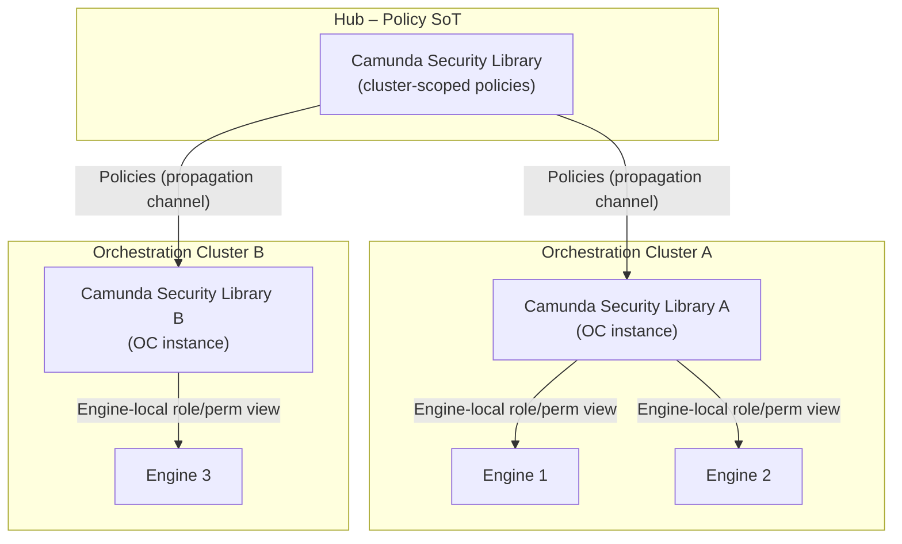
```mermaid
flowchart TB
  subgraph HubLayer["Hub – Policy SoT"]
    HubPolicy["Camunda Security Library</br>(cluster-scoped policies)"]
  end

  subgraph OC1["Orchestration Cluster A"]
    OC1Id["Camunda Security Library A</br>(OC instance)"]
    E1["Engine 1"]
    E2["Engine 2"]
  end

  subgraph OC2["Orchestration Cluster B"]
    OC2Id["Camunda Security Library B</br>(OC instance)"]
    E3["Engine 3"]
  end

  HubPolicy -->|"Policies (propagation channel)"| OC1Id & OC2Id

  OC1Id -->|"Engine-local role/perm view"| E1 & E2
  OC2Id -->|"Engine-local role/perm view"| E3
```

- In full mode, Hub is the single SoT; policy flows downward: Hub -> all OCs -> all Physical Tenants.
- OC identity instances maintain cluster-local projections and handle Physical-Tenant-level scoping.
- OC identity instances also enforce logical-Tenant-level scoping and combined logical-Tenant+Physical-Tenant scoping where required.
- Engines consume the cluster-level projection; they do not define their own identity models and cannot override OC policy.
- In OC-only mode, the same projection model applies with local flow: OC → Engines.

#### 5.8.2 Logical Tenant support

Logical multi-tenancy is a first-class concern in the policy model. Logical Tenant configuration is authored once in Hub and propagated top-down to OC and then to engines. Each layer maintains logical-tenant-aware roles, mapping rules, and authorizations.

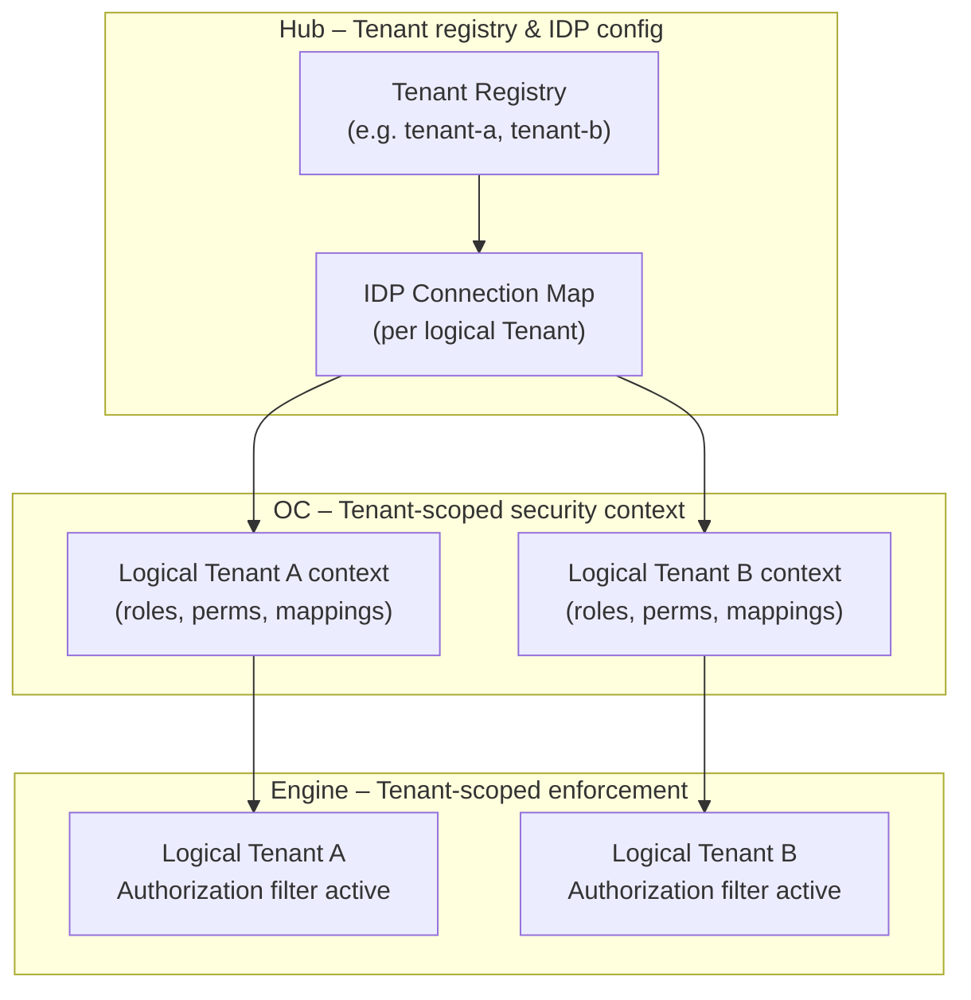
```mermaid
graph TB
  subgraph HubTenants["Hub – Tenant registry & IDP config"]
    TR["Tenant Registry</br>(e.g. tenant-a, tenant-b)"]
    IdpMap["IDP Connection Map</br>(per logical Tenant)"]
  end

  subgraph OCView["OC – Tenant-scoped security context"]
    OC_TA["Logical Tenant A context</br>(roles, perms, mappings)"]
    OC_TB["Logical Tenant B context</br>(roles, perms, mappings)"]
  end

  subgraph EngineView["Engine – Tenant-scoped enforcement"]
    ENG_TA["Logical Tenant A</br>Authorization filter active"]
    ENG_TB["Logical Tenant B</br>Authorization filter active"]
  end

  TR --> IdpMap
  IdpMap --> OC_TA & OC_TB
  OC_TA --> ENG_TA
  OC_TB --> ENG_TB
```

On each request, the Camunda Security Library:

1. Resolves the logical-tenant context from token claims and/or headers.
2. Loads the logical-tenant-specific policy view (roles, mappings, authorizations).
3. Enforces permissions within the logical-tenant boundary, preventing cross-tenant data access.

#### 5.8.3 Global vs scoped policies (logical Tenant and Physical Tenant)

The policy model supports both:

- Global roles and permissions
  - Roles (for example `ClusterAdmin`, `SupportAgent`) are defined once per cluster in Hub or OC.
  - Authorizations with scope `ALL` apply across all engines in the cluster.
- Logical-Tenant- and Physical-Tenant-scoped authorizations
  - The same role can have additional authorizations restricted to a logical Tenant (`scope_type = TENANT`) or a specific Physical Tenant (`scope_type = PYSICAL_TENANT`).
  - Example: `SupportAgent` role may have:
    - Global read/update access to user tasks across all engines (`ALL`).
    - Additional read access to process instances only on `engine-2` (`PHYSICAL_TENANT`).
    - Access to process instances only for tenant `retail` (`TENANT`).

Roles and groups are always defined at the OC/cluster level; engine-specific behavior is expressed through scoping of authorizations, not through engine-local role definitions.

---

## 6. Runtime view (selected scenarios)

This section illustrates selected runtime flows as concrete user journeys, focusing on who performs which action at which point in time.

### 6.1 Admin configures cluster policies in full mode (Hub + OC)

1. Admin logs into the Hub UI.
2. Hub Camunda Security Library authenticates the user against the configured IdP for the Hub organization and derives roles/tenants via mapping rules.
3. Admin creates or updates tenants, roles, mapping rules, and authorizations for a specific Orchestration Cluster in the Hub UI.
4. Hub Camunda Security Library:
- Resolves the organization and target cluster context via `ClusterRegistryPort`.
- Validates and persists the changes in the Hub DB under that organization scope.
- Writes a new `PolicyVersion` and associated `EntityRevision` and `PolicyVersionChange` rows.
- Writes one or more `OutboxEvent`s in status `PENDING` for the affected OCs.
5. Outbox Dispatcher picks up the new events and delivers the full `POLICY_SNAPSHOT` for the target `PolicyVersion` to each affected OC via the configured transport (see `docs/hub-oc-data-propagation.md`).
6. OC Camunda Security Library:
- Applies the full policy snapshot to its local projection and updates `last_applied_version`.
- Propagates engine-scoped changes to engines via the engine command path / Security Engine Framework.

From the admin’s perspective, all policy changes are made centrally in Hub; the OC and engines converge asynchronously.

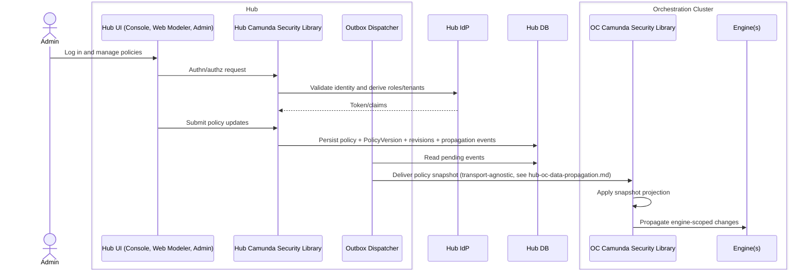
```mermaid
sequenceDiagram
  actor Admin
  box Hub
    participant HubUI as Hub UI (Console, Web Modeler, Admin)
    participant HubCSL as Hub Camunda Security Library
    participant Outbox as Outbox Dispatcher
  end
  participant IdP as Hub IdP
  participant HubDB as Hub DB
  box Orchestration Cluster
    participant OCSLF as OC Camunda Security Library
    participant Engine as Engine(s)
  end

  Admin->>HubUI: Log in and manage policies
  HubUI->>HubCSL: Authn/authz request
  HubCSL->>IdP: Validate identity and derive roles/tenants
  IdP-->>HubCSL: Token/claims
  HubUI->>HubCSL: Submit policy updates
  HubCSL->>HubDB: Persist policy + PolicyVersion + revisions + propagation events
  Outbox->>HubDB: Read pending events
  Outbox->>OCSLF: Deliver policy snapshot (transport-agnostic, see hub-oc-data-propagation.md)
  OCSLF->>OCSLF: Apply snapshot projection
  OCSLF->>Engine: Propagate engine-scoped changes
```

### 6.2 End user uses the OC UI in full mode

1. User opens the OC UI in the browser.
2. The OC UI delegates authentication to the OC's Camunda Security Library (for example via OAuth2 login flow or existing session cookie).
3. OC Camunda Security Library:
- Redirects or talks to the configured IdP for the user's logical Tenant.
- Validates the returned OIDC/SAML token and derives the principal's roles, groups, and logical-Tenant assignments from mapping rules and direct assignments.
4. For each incoming request from the OC UI:
- OC resolves the logical-Tenant context (from token claims and/or headers).
- Loads the logical-Tenant- and Physical-Tenant-scoped policy view from its local projection (which is synchronized from Hub).
- Evaluates whether the principal has the required permissions on the requested resource (for example reading process instances in a given logical Tenant).
5. If the check passes:
- OC forwards or executes the corresponding operation against the engine(s).
- Engines apply their own runtime-level checks (for example engine-level authorization filters) based on the OC-provided projections.
6. If the check fails:
- OC denies the request and returns an appropriate error to the OC UI.

The user never interacts directly with Hub; Hub’s role is to define the policy that OC enforces.

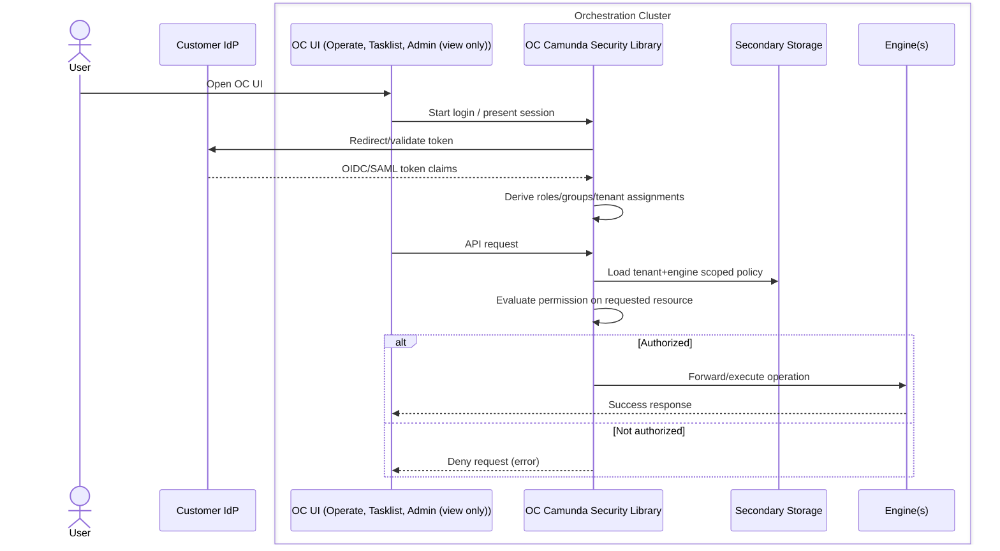
```mermaid
sequenceDiagram
  actor User
  participant IdP as Customer IdP
  box Orchestration Cluster
    participant OcUi as OC UI (Operate, Tasklist, Admin (view only))
    participant OCSLF as OC Camunda Security Library
    participant SecStore as Secondary Storage
    participant Engine as Engine(s)
  end

  User->>OcUi: Open OC UI
  OcUi->>OCSLF: Start login / present session
  OCSLF->>IdP: Redirect/validate token
  IdP-->>OCSLF: OIDC/SAML token claims
  OCSLF->>OCSLF: Derive roles/groups/tenant assignments

  OcUi->>OCSLF: API request
  OCSLF->>SecStore: Load tenant+engine scoped policy
  OCSLF->>OCSLF: Evaluate permission on requested resource
  alt Authorized
    OCSLF->>Engine: Forward/execute operation
    Engine-->>OcUi: Success response
  else Not authorized
    OCSLF-->>OcUi: Deny request (error)
  end
```

### 6.3 Worker authenticates against cluster APIs

1. A worker application gets a token from the customer’s IdP using the configured client credentials (machine principal).
2. The worker calls OC gRPC/REST APIs with the token.
3. OC Camunda Security Library:
- Validates the token against the IdP.
- Maps its claims to machine principal permissions via mapping rules and authorizations (for example which tenants and which process instances the worker can access).
4. If authorized, the worker’s request is executed against the engine(s); otherwise it is rejected.

The same policy model governs both human users and machine principals.

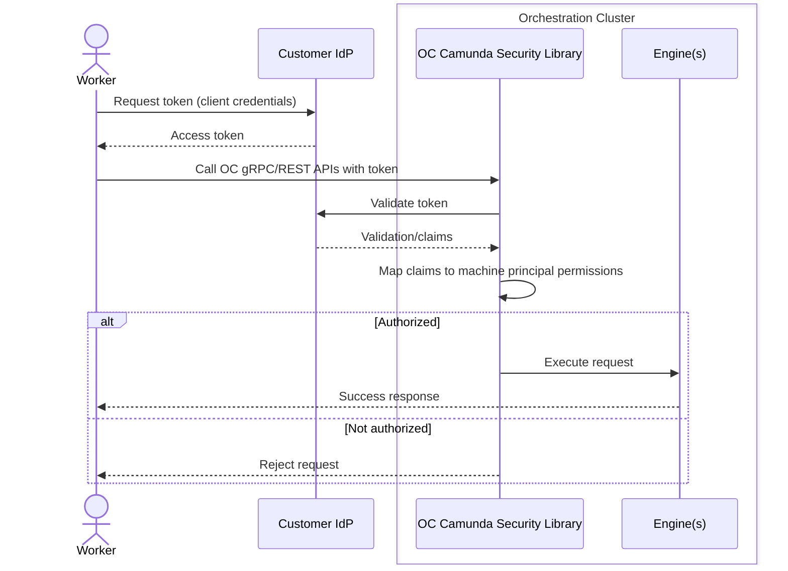
```mermaid
sequenceDiagram
  actor Worker
  participant IdP as Customer IdP
  box Orchestration Cluster
    participant OCSLF as OC Camunda Security Library
    participant Engine as Engine(s)
  end

  Worker->>IdP: Request token (client credentials)
  IdP-->>Worker: Access token
  Worker->>OCSLF: Call OC gRPC/REST APIs with token
  OCSLF->>IdP: Validate token
  IdP-->>OCSLF: Validation/claims
  OCSLF->>OCSLF: Map claims to machine principal permissions
  alt Authorized
    OCSLF->>Engine: Execute request
    Engine-->>Worker: Success response
  else Not authorized
    OCSLF-->>Worker: Reject request
  end
```

---

## 7. Deployment view

### 7.1 Self-Managed deployment

In Self-Managed, the customer owns and operates all infrastructure. Three deployment views are shown below, mirroring the general modes and scaling variants from section 4.

#### 7.1.1 OC-only mode (standalone Orchestration Cluster)


- OC acts as local SoT for identity and policy.
- The Enterprise IdP is integrated directly via OIDC/SAML; no Camunda-operated broker is involved.
- OC includes an embedded gateway/search layer and a broker/engine layer; policy is enforced by Camunda Security Library (gateway) and Security Engine Framework (broker/engine).
- Multiple engines per cluster are supported with OC-level policy propagation.
- Suitable for production use cases that do not require cross-cluster policy management.

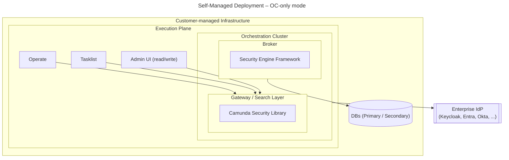
```mermaid
---
title: Self-Managed Deployment – OC-only mode
---
flowchart TB
  subgraph Customer["Customer-managed Infrastructure"]
    subgraph Execution["Execution Plane"]
      Operate["Operate"]
      Tasklist["Tasklist"]
      AdminUI["Admin UI (read/write)"]

      subgraph OC["Orchestration Cluster"]
        subgraph GatewayLayer["Gateway / Search Layer"]
          SecGatOC["Camunda Security Library"]
        end

        subgraph Broker1["Broker"]
          SecEngFrame1["Security Engine Framework"]
        end
      end

      Operate & Tasklist & AdminUI --> GatewayLayer
    end

    DBs[("DBs (Primary / Secondary)")]
    Broker1 --> DBs
  end

  EnterpriseIdP[["Enterprise IdP</br>(Keycloak, Entra, Okta, ...)"]]
  OC --> EnterpriseIdP
```

#### 7.1.2 Full mode (Hub + Orchestration Cluster, self-managed)

An advanced Self-Managed topology where the customer also operates Hub. Hub becomes the central policy SoT, and policy is propagated to each OC via the platform-owned channel. The Admin UI on OC runs in read-only mode; all policy authoring happens in Hub.

- Hub and all OC instances are deployed and operated by the customer on their own infrastructure.
- The Enterprise IdP is integrated at both Hub (management plane auth) and OC (execution plane auth) levels.
- Cluster discovery and registration are handled via the `ClusterRegistryPort` and `ClusterRegistrationService` ports; the host application's adapter determines how new OCs are discovered and registered.
- OC is configured with an embedded gateway/search layer and broker/engine layer; Camunda Security Library runs in gateway, Security Engine Framework runs in broker/engine.
- Policy flows top-down: Hub -> Gateway -> Broker(Engine), same as in SaaS, but without a Camunda-operated broker.
- Suitable for large-scale or multi-cluster Self-Managed environments requiring centralized policy governance.

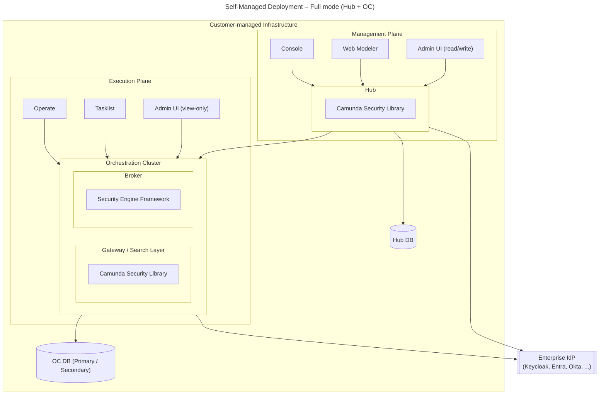
```mermaid
---
title: Self-Managed Deployment – Full mode (Hub + OC)
---
flowchart TB
  subgraph Customer["Customer-managed Infrastructure"]
    subgraph MgmtPlane["Management Plane"]
      Console["Console"]
      WebModeler["Web Modeler"]
      AdminHub["Admin UI (read/write)"]

      subgraph Hub["Hub"]
        SecGatHub["Camunda Security Library"]
      end

      Console & WebModeler & AdminHub --> Hub
    end

    subgraph Execution["Execution Plane"]
      Operate["Operate"]
      Tasklist["Tasklist"]
      AdminOC["Admin UI (view-only)"]

      subgraph OC["Orchestration Cluster"]
        subgraph GatewayLayer["Gateway / Search Layer"]
          SecGatOC["Camunda Security Library"]
        end

        subgraph Broker1["Broker"]
          SecEngFrame1["Security Engine Framework"]
        end
      end

      Operate & Tasklist & AdminOC --> OC
    end

    HubDB[("Hub DB")]
    OCDB[("OC DB (Primary / Secondary)")]

    Hub --> OC
    Hub --> HubDB
    OC --> OCDB
  end

  EnterpriseIdP[["Enterprise IdP</br>(Keycloak, Entra, Okta, ...)"]]
  Hub & OC --> EnterpriseIdP
```

#### 7.1.3 OC-only mode Standalone (2 Gateways + 3 Brokers)

Standalone OC topology for higher throughput and availability. Hub is not present; OC remains the local policy source of truth. Two gateways provide ingress and search-layer responsibilities, and three brokers execute workloads.

- Two gateways each run the Camunda Security Library and connect clients (Operate, Tasklist, Admin UI, workers) to the cluster.
- Three brokers run the Security Engine Framework and receive policy snapshots from the gateway layer.
- Each broker hosts multiple engines (Physical Tenants); logical tenants are scoped onto those engines using `ALL`, `TENANT` and `PHYSICAL_TENANT`.
- Suitable for larger standalone Self-Managed deployments that need horizontal scale without Hub.

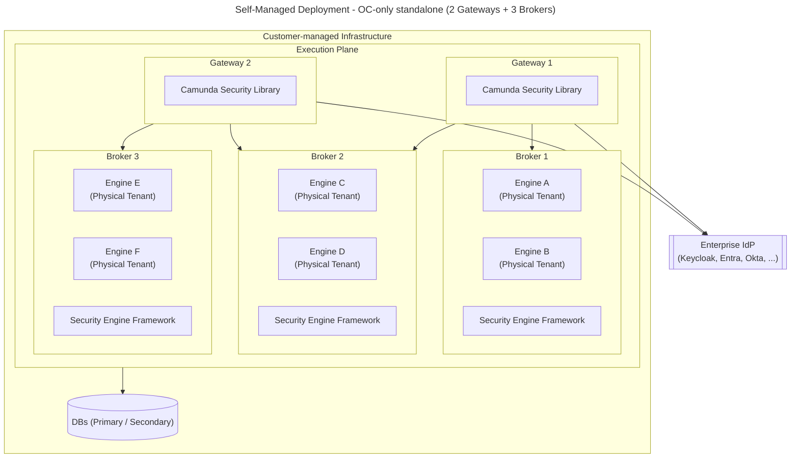
```mermaid
---
title: Self-Managed Deployment - OC-only standalone (2 Gateways + 3 Brokers)
---
flowchart TB
  subgraph Customer["Customer-managed Infrastructure"]
    subgraph Execution["Execution Plane"]
      subgraph GW1["Gateway 1"]
        GW1CSL["Camunda Security Library"]
      end
      subgraph GW2["Gateway 2"]
        GW2CSL["Camunda Security Library"]
      end

      subgraph Broker1["Broker 1"]
        B1E1["Engine A</br>(Physical Tenant)"]
        B1E2["Engine B</br>(Physical Tenant)"]
        B1SEF["Security Engine Framework"]
      end

      subgraph Broker2["Broker 2"]
        B2E1["Engine C</br>(Physical Tenant)"]
        B2E2["Engine D</br>(Physical Tenant)"]
        B2SEF["Security Engine Framework"]
      end

      subgraph Broker3["Broker 3"]
        B3E1["Engine E</br>(Physical Tenant)"]
        B3E2["Engine F</br>(Physical Tenant)"]
        B3SEF["Security Engine Framework"]
      end

      GW1 --> Broker1
      GW1 --> Broker2
      GW2 --> Broker2
      GW2 --> Broker3
    end

    DBs[("DBs (Primary / Secondary)")]
  end

  EnterpriseIdP[["Enterprise IdP</br>(Keycloak, Entra, Okta, ...)"]]
  Execution --> DBs
  GW1 & GW2 --> EnterpriseIdP
```

---

### 7.2 SaaS deployment

In SaaS, Camunda operates one shared Hub instance for many customer organizations. The unified identity library therefore has to support multi-organization policy authoring and propagation inside a single Hub runtime.

- One shared Hub instance serves **many organizations** (one per customer); policy and identity data in Hub must therefore be partitioned by organization. Each organization owns one or more OC clusters. This is in direct contrast to Self-Managed, where there is always exactly one organization.
- In the first iterations, this partitioning is logical only: shared Hub infrastructure and databases are reused, while policy tables and queries are keyed by `organization_id`.
- Each OC remains associated with exactly one organization boundary for policy propagation.
- Cluster discovery and registration in Hub are handled via `ClusterRegistryPort` (outbound) and `ClusterRegistrationService` (inbound) ports. How Hub's adapter implementation populates the cluster registry is a host-application integration concern, not a library concern.
- During migration, SaaS may still keep Auth0 or another broker as an internal implementation detail; this does not change the target policy model.

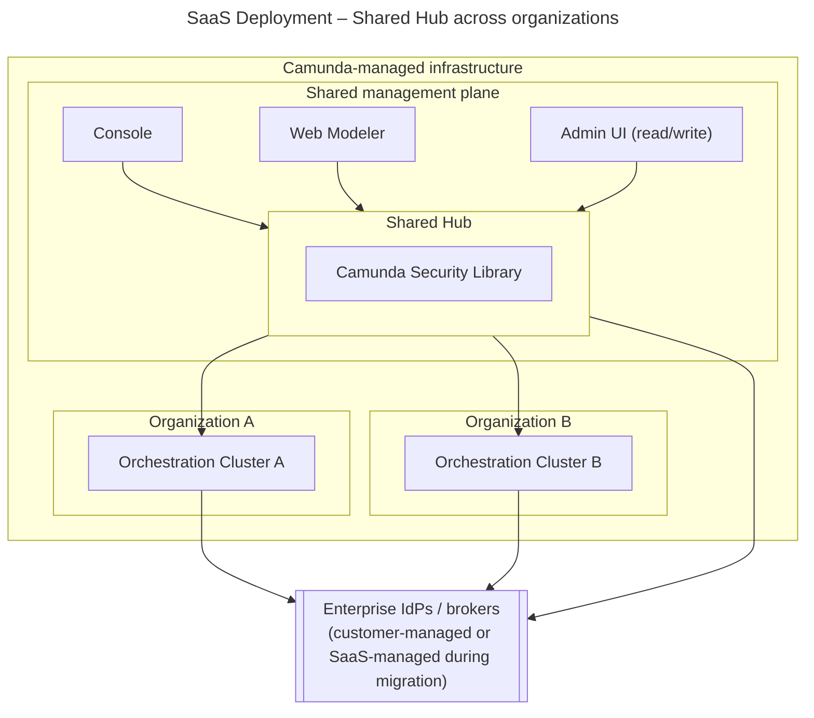
```mermaid
---
title: SaaS Deployment – Shared Hub across organizations
---
flowchart TB
  subgraph Camunda["Camunda-managed infrastructure"]
    subgraph SharedMgmt["Shared management plane"]
      Console["Console"]
      WebModeler["Web Modeler"]
      AdminHub["Admin UI (read/write)"]

      subgraph Hub["Shared Hub"]
        SecGatHub["Camunda Security Library"]
      end

      Console & WebModeler & AdminHub --> Hub
    end

    subgraph OrgA["Organization A"]
      OCA["Orchestration Cluster A"]
    end

    subgraph OrgB["Organization B"]
      OCB["Orchestration Cluster B"]
    end

    Hub --> OCA
    Hub --> OCB
  end

  EnterpriseIdP[["Enterprise IdPs / brokers</br>(customer-managed or SaaS-managed during migration)"]]
  Hub & OCA & OCB --> EnterpriseIdP
```

---

## 8. Crosscutting concepts (target)

- IdP-agnostic: Any OIDC/SAML IdP integrating via standards (no IdP-specific code in the domain layer).
- RBAC + ABAC: Roles and authorizations with optional attribute-based policies (resource attributes, environment conditions).
- Multi-tenancy: Tenant-aware identity context propagated from tokens/headers; tenant-specific policy and IdP configuration; propagation filters by tenant.
- Lifecycle handling: Principal and tenant assignment are derived from IdP claims and mapping rules; clusters receive derived principals and policies from Hub.
- Observability: Identity flows emit metrics, logs, and traces (e.g. authn attempts, authz decisions, propagation delay, health indicators). For Spring Security instrumentation, align with the Spring Security observability integration guidance: https://docs.spring.io/spring-security/reference/reactive/integrations/observability.html

### 8.1 Scalability and operational considerations

The unified identity architecture must support SaaS deployments at significant scale:

**Current operational metrics (SaaS):**
- Approximately 47,000 organizations
- Approximately 24,000 users who have accepted invitations into SaaS
- Largest single organization successfully onboarded ~200 users
- Approximately 43,000 total clusters created across all organizations

**Implications for Hub and OC:**

1. **Policy propagation scale**: Hub must reliably propagate policy changes to 43k+ clusters without overwhelming either Hub or OC infrastructure.
2. **Visibility and monitoring**: At this scale, operators must be able to track policy rollout state across thousands of clusters in real time. Hub must surface which clusters are on which policy versions, and what delivery state each cluster is in (pending, delivered, failed, retrying).
3. **Rate limiting and backpressure**: Both push-based and pull-based propagation require careful handling of load spikes:
  - Push: Hub propagation dispatcher must respect OC capacity and not flood clusters with simultaneous policy updates.
  - Pull: OCs must not synchronize polling (thundering herd problem) to avoid overwhelming Hub with simultaneous policy version queries.
4. **Idempotency**: At this scale, retries are frequent and necessary. All policy applies must be idempotent per `policyVersionId` to ensure correctness despite network failures and replay scenarios.
5. **Observability requirements**: Logs, metrics, and traces must emit at a reasonable volume even with 43k+ clusters. Per-cluster granular logging is necessary for debugging but must be carefully sampled or aggregated for operational dashboards.

These constraints directly inform the choice and implementation details of ADR-0003 (Push vs Pull Policy Propagation); see section 9.2 for detailed analysis.

---

## 9. Architecture decisions and open points

This unified architecture builds on existing identity arc42 docs and ADRs for OC Identity and Management Identity; those ADRs remain the canonical source for detailed trade-offs. The main new decisions here are:

- Use a shared hexagonal Camunda Security Library with SPIs for persistence, propagation, IdP, OC commands, and (optionally) engine-level integration.
- Use Hub as policy SoT whenever present; OC-only deployments are treated as documented first-class modes, not afterthoughts.
- Ship a single shared Admin UI package, feature-gated by configuration for Hub vs OC, standalone vs Hub-managed.
- Make logical-tenant and Physical-Tenant support explicit in the core model and diagrams, not side effects.

### 9.1 Open High Level points (to be refined in separate ADRs):

- **SPI boundaries for OC/engine command creation** (`EngineCommandPort`): still open. Webapp, session, user, and scope provider SPI boundaries have been defined (ADRs 0009, 0010, 0017, 0021, 0025, 0027); the engine-command interface is the remaining open design question.
- Migration path from current Auth0-based SaaS setup to “Enterprise IdP as SoT” while keeping Auth0 as a private implementation detail.
- If the endpoints to apply policy changes are public, Hub will not be aware of what a customer applies to OC and will run out of sync.
- How can we apply a snapshot multiple times? How could we reset the projections in primary and secondary storage?

### 9.2 Detailed ADRs

This section contains detailed Architectural Decision Records (ADRs) for the Camunda Security Library. Each ADR documents a specific decision, the context, alternatives considered, and consequences.

- [ADR-0001: PolicyVersion commits and full-policy propagation](adr/0001-policy-version-change-sets.md)
- [ADR-0002: Placement of the Camunda Security Library (embedded vs standalone service)](adr/0002-placement-of-the-security-gateway-framework.md)
- [ADR-0003: Push vs Pull Policy Propagation (Hub ↔ Orchestration Clusters)](adr/0003-push-vs-pull-policy-propagation.md)
- [ADR-0004: Identity data persistence in the Orchestration Cluster (Open)](adr/0004-oc-identity-data-persistence-and-engine-command-scope.md)
- [ADR-0005: Frontend integration approach for Hub and Orchestration Cluster Admin UI](adr/0005-frontend-integration-for-hub-and-oc.md)
- [ADR-0006: Central Spring Security filter chains](adr/0006-central-security-filter-chains.md)
- [ADR-0007: Two-port authorization surface (`ResourcePermissionPort` and `AuthorizationRepositoryPort`)](adr/0007-resource-permission-port-and-authorization-repository.md)
- [ADR-0008: No Spring Boot auto-configuration — hosts explicitly import configurations](adr/0008-no-spring-boot-auto-configuration.md)
- [ADR-0009: Web-app authorization SPIs](adr/0009-web-app-authorization-spis.md)
- [ADR-0010: Admin-user setup SPIs](adr/0010-admin-user-setup-spis.md)
- [ADR-0011a: Admin user check filter — Basic auth only](adr/0011-admin-user-check-filter-basic-auth-only.md)
- [ADR-0011b: Lazy-load authentication memberships](adr/0011-lazy-load-authentication-memberships.md)
- [ADR-0012: OIDC logout success handler](adr/0012-oidc-logout-success-handler.md)
- [ADR-0013: Multi-IdP OIDC configuration](adr/0013-multi-idp-oidc-configuration.md)
- [ADR-0014: OIDC UserInfo enabled toggle](adr/0014-oidc-user-info-enabled-toggle.md)
- [ADR-0015: Additional JWK Set URIs — composite decoder](adr/0015-additional-jwk-set-uris-composite-decoder.md)
- [ADR-0016: Authorization enum ownership and layered usage](adr/0016-authz-enum-ownership-and-layered-usage.md)
- [ADR-0017: Session store port and web-session ownership](adr/0017-session-store-port-and-web-session-ownership.md)
- [ADR-0018: CamundaUserPort — user resolution port](adr/0018-camunda-user-port.md)
- [ADR-0019: Authorization runtime check migration and no Jackson in domain](adr/0019-authorization-runtime-check-migration-and-no-jackson-in-domain.md)
- [ADR-0020a: Issuer-aware JWT decoder](adr/0020-issuer-aware-jwt-decoder.md)
- [ADR-0020b: SecurityContext and condition types migration](adr/0020-security-context-and-condition-types-migration.md)
- [ADR-0021: User details port](adr/0021-user-details-port.md)
- [ADR-0022: Resource access control framework ownership](adr/0022-resource-access-control-framework-ownership.md)
- [ADR-0023a: Hand-authored Spring configuration metadata](adr/0023-hand-authored-spring-configuration-metadata.md)
- [ADR-0023b: OIDC bearer tokens on API chain only](adr/0023-oidc-bearer-tokens-on-api-chain-only.md)
- [ADR-0024: Validation module](adr/0024-validation-module.md)
- [ADR-0025: `CamundaSecurityScopeProvider` SPI](adr/0025-camunda-security-scope-provider-spi.md)
- [ADR-0026: UserInfo claim augmentation](adr/0026-userinfo-claim-augmentation.md)
- [ADR-0027: Scoped webapp security chains and per-scope sessions](adr/0027-scoped-webapp-security-chains-and-per-scope-sessions.md)

---

## 10. Migration path

The migration path from the current split identity systems (Auth0 in SaaS, Management Identity, and OC Identity in Self-Managed) to the unified Camunda Security Library is documented in a dedicated file:

- **[Migration Path](migration_path.md)**

---

### Sources

- [Unified Identity Target Architecture for Camunda Hub and Orchestration Clusters](https://docs.google.com/document/d/1ExLH2KYmz_V7Zq51adzz9c1Yk2s5ZR7ZhhIKwaEcPs0)

