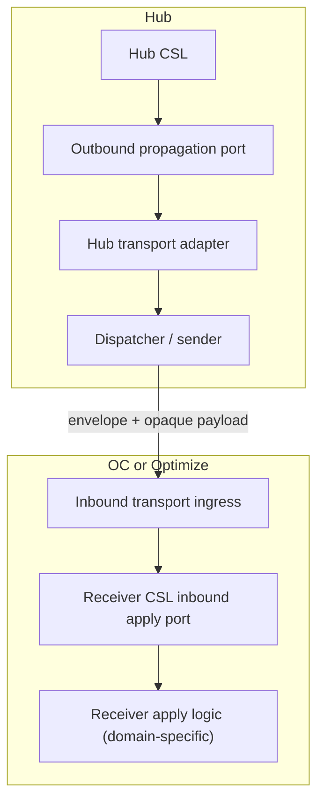

# Hub -> OC / Optimize Data Propagation

> **Scope note:** This document is a proposal for the **transport mechanism only**. It does not define policy/domain payload semantics. Payload content is opaque to transport and may represent identity policy, secrets, connection metadata, or other Hub-managed data.
>
> This mechanism is **not part of the Camunda Security Library core domain**. It is owned by Hub/OC platform integration. CSL participates only via outbound/inbound ports.

---

## 1. Proposal status and intent

This is a **new proposal**. Hub does not currently use one standardized pattern for propagating data changes to OC/Optimize.

Goal: define one generic Hub -> OC/Optimize propagation channel in the platform layer that can transfer **any payload type** from a Hub CSL outbound port to a receiver CSL inbound port, without CSL core depending on a specific transport implementation.

Non-goals for this document:

- Defining policy model details
- Defining payload-specific schemas
- Defining domain-specific apply logic

Those details stay in architecture/domain documentation.

---

## 2. Abstract transport model

### 2.1 Port boundary

- **Hub CSL boundary:** CSL emits outbound propagation intent through an outbound port.
- **Hub platform adapter:** creates envelope metadata, schedules dispatch, performs retries, and sends payload to receiver.
- **Receiver platform ingress (OC/Optimize):** validates transport contract and calls the receiver CSL inbound apply port.
- **Receiver CSL boundary:** applies payload semantics according to CSL domain rules.

Transport handles routing/delivery/observability. Payload interpretation is delegated to receiver apply logic.

### 2.2 Opaque payload principle

Payload is treated as an opaque blob by transport components.

- Hub transport adapter does not parse payload domain fields.
- Dispatch/retry/order logic uses only envelope metadata.
- Receiver transport layer only validates envelope + transport integrity, then forwards payload to receiver apply logic.

---

## 3. Proposed envelope (transport metadata only)

Minimal envelope metadata (illustrative):

- `messageId`: globally unique delivery id (idempotency key)
- `producer`: emitting system/component (`hub`)
- `targetType`: `OC` | `OPTIMIZE`
- `targetId`: logical destination id
- `payloadType`: opaque type discriminator (for routing only)
- `payloadSchemaVersion`: payload contract version label
- `createdAt`: producer timestamp
- `orderingKey`: key for in-order delivery per target stream
- `attempt`: delivery attempt counter
- `payload`: opaque bytes/json

Notes:

- Metadata is transport-owned.
- Payload is domain-owned by sender/receiver contracts, not by transport.

---

## 4. Proposed end-to-end flow

High-level steps:

1. Hub CSL calls outbound propagation port with payload + routing metadata.
2. Hub transport adapter (platform layer) persists/schedules message for delivery.
3. Dispatcher sends envelope + opaque payload to target ingress.
4. Receiver ingress (platform layer) validates envelope/idempotency and forwards payload to CSL inbound apply port.
5. Receiver apply logic decides payload semantics and returns ACK/NACK.
6. Transport updates delivery state and retries on failure.

---

## 5. Delivery semantics (transport)

### 5.1 Reliability

- At-least-once delivery per target
- Retry with backoff and bounded attempts
- Dead-letter handling for exhausted retries

### 5.2 Idempotency

- Receiver must handle duplicate `messageId`
- Transport records terminal delivery state per `(targetId, messageId)`

### 5.3 Ordering

- Ordering guaranteed per `orderingKey` (typically per target stream)
- No global ordering guarantee across independent targets

### 5.4 ACK/NACK contract

- `ACK`: payload accepted and applied (or already applied idempotently)
- `NACK_RETRYABLE`: transient error; retry
- `NACK_TERMINAL`: non-retryable; move to dead-letter

---

## 6. Transport options

The proposal is transport-agnostic. Possible implementations:

- HTTP push (Hub dispatcher calls receiver endpoint)
- Message queue / broker
- Event stream

Selection criteria:

- Target scale and throughput
- Operational model and failure handling
- Security and network topology
- Observability requirements

---

## 7. Security and operations

### 7.1 Transport security

- Mutual authentication between sender and receiver
- Authorization on ingress per producer/target
- Integrity checks on envelope/payload

### 7.2 Observability

- Metrics: queue depth, success/failure rate, retry count, end-to-end latency
- Logs: message lifecycle keyed by `messageId`
- Traces: sender -> transport -> receiver ingress -> apply port

### 7.3 Runbook expectations

- Replay a failed message by `messageId`
- Pause/resume dispatch per target
- Inspect dead-letter messages and remediation status

---

## 8. Relationship to architecture docs

This document defines only **how bytes move** from Hub outbound port to OC/Optimize inbound port.

Payload semantics (for example policy model rules, version semantics, and apply behavior) remain in architecture/domain docs and are intentionally not duplicated here.

CSL semantic ownership remains unchanged:

- `PolicyVersion` is the semantic commit marker for policy state.
- Hub tracks semantic delivery acknowledgement per target (`last_acked_version`).
- Receiver tracks semantic apply progress (`last_applied_version`).
- `PolicyApplyService` decides semantic apply/version behavior (accept newer, ignore already-applied, idempotent replay).
- Transport ACK/NACK reports delivery outcomes; semantic correctness is enforced by CSL apply logic.

Scope mapping:

- Transport delivery state is described here.
- CSL semantic apply-state and policy-version ownership are described in `docs/architecture_docs.md` section `5.3`.

