# Unified Identity Architecture for Camunda Hub &amp; Orchestration Clusters
Patrick Wunderlich – Identity Architecture

---

## 1. Current identity architecture (SaaS &amp; Self-Managed)

- Identity is split across management-plane and execution-plane runtimes.
- SaaS and Self-Managed differ in integration stack and operational model.
- Authentication patterns are not uniform across management-plane components.
- Runtime authorization is primarily enforced through OC Identity in each cluster.

### SaaS today

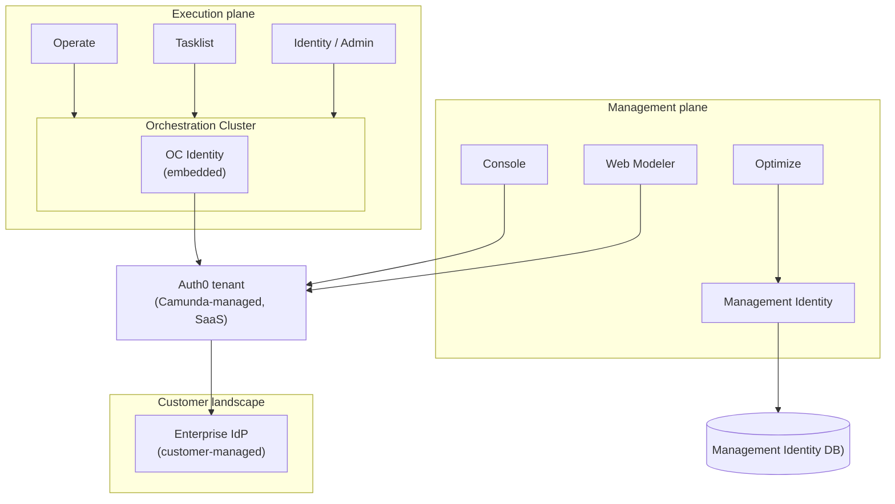

### Self-Managed today

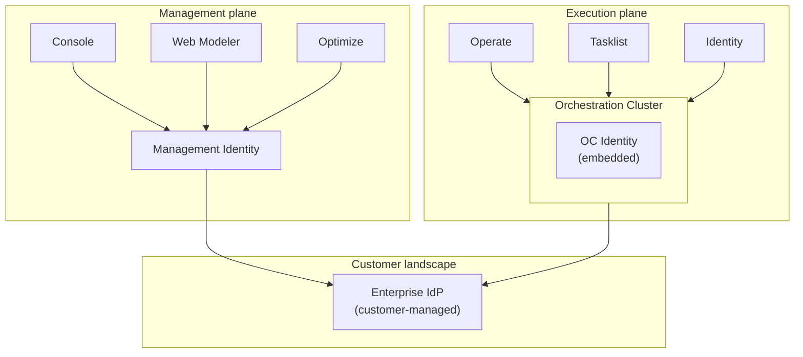

---

## 2. Why we want a new architecture

- Split identity (Management Identity vs OC Identity, plus Auth0)
- Different models and capabilities between SaaS and Self-Managed
- Multiple, inconsistent auth flows on the management plane
- Hard to reason about policy and to achieve parity at scale
- Manual lifecycle/configuration steps (tenants, roles, mappings) remain too high
- Migration/rollout and observability are weaker than required at scale

---

## 3. Solution strategy – unified identity plane

- One consistent identity &amp; policy model shared by Hub and all OCs
- Security Gateway Framework (SGF) as shared hexagonal library
  - Adapter-driven integration keeps domain logic independent from host infrastructure
- Hub as policy SoT when present; OC-only as first-class mode
- AuthN/AuthZ enforcement always active in all runtime profiles
- Same core semantics across Hub and OC reduce behavior drift

---

## 4. Target system context (Full mode &amp; OC-only)

- In both modes, engines do not integrate with IdPs directly.
- Existing infra (IdPs, DBs) is reused; no extra standalone identity service.

### Full mode (Hub + OC)

- Hub authors and distributes policy; OC enforces projected policy.
- Engines do not integrate with IdPs directly.
- Existing infra (IdPs, DBs) is reused; no extra standalone identity service.

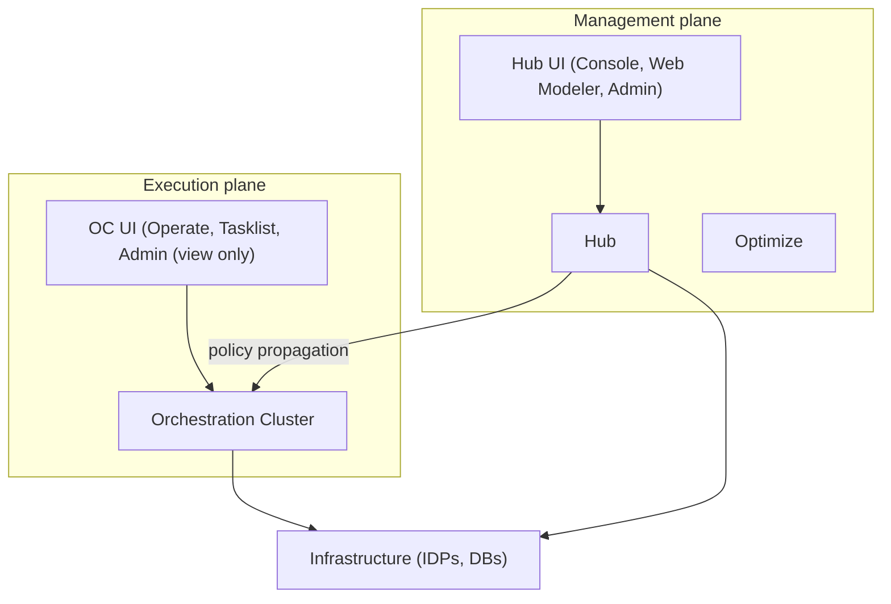

### OC-only mode

- OC-only mode: OC is local policy SoT and enables admin read/write.
- Engines do not integrate with IdPs directly.
- Existing infra (IdPs, DBs) is reused; no extra standalone identity service.

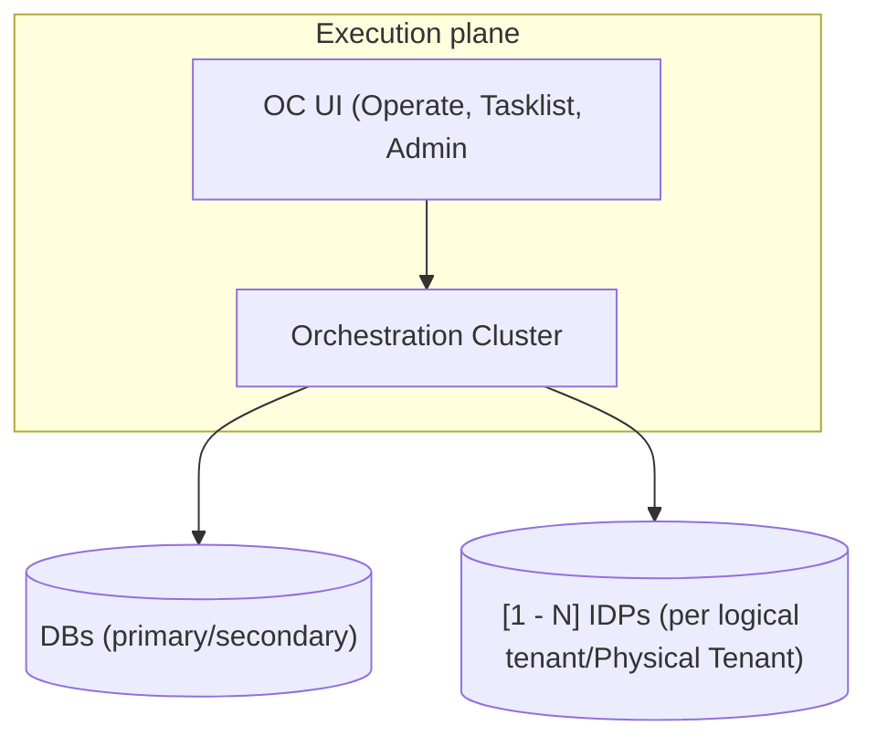

---

## 5. Building block view – high level

- Hub and OC embed the same SGF core, configured per runtime profile.
- OC uses Security Engine Framework for command-time enforcement in engines.
- Propagation chain is Hub -> OC -> Engine (full mode) or OC -> Engine (standalone).
- Policy scoping supports cluster-wide, logical-tenant, and physical-tenant use cases.

### Full mode – simple (Hub + OC with one engine)

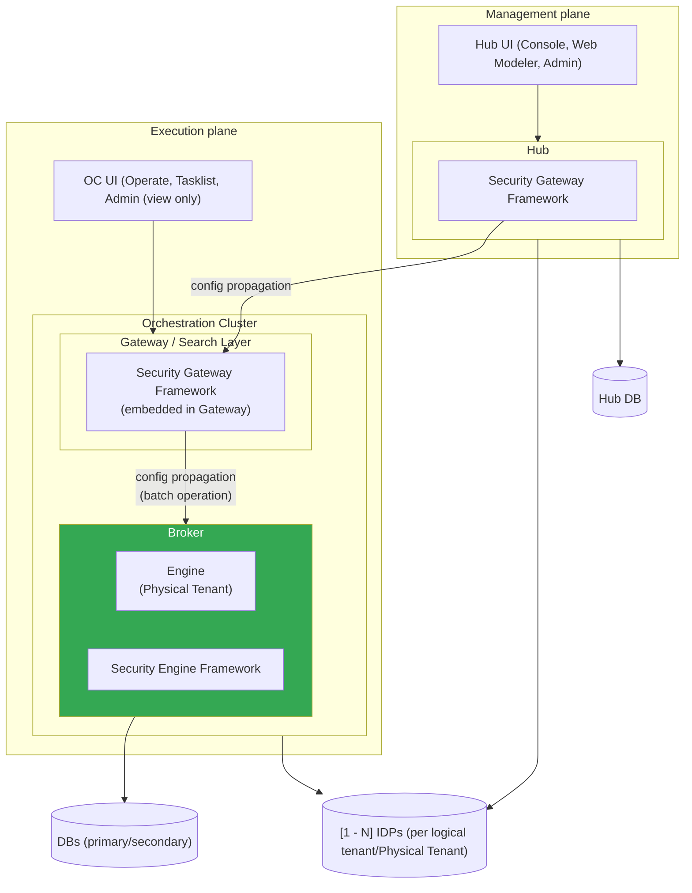

### OC-only mode – simple (standalone OC with one engine)

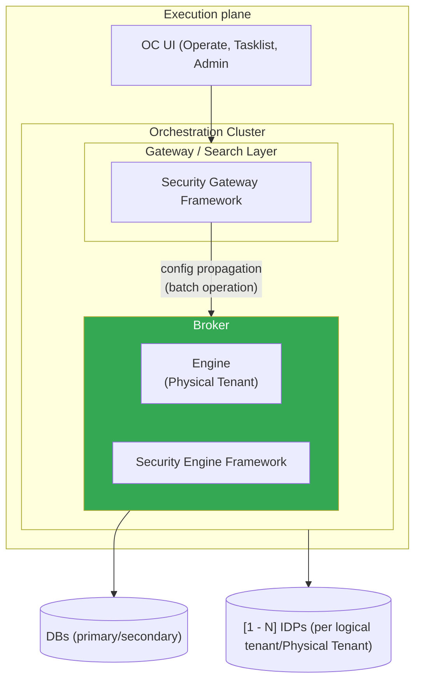

---

## 6. Unified policy model

- Organization (Hub partition, esp. SaaS)
- Tenant (logical)
- Group and Role
- MappingRule
- Principal (user/machine)
- Authorization (owner → resource → permissions, with ALL / TENANT / PHYSICAL_TENANT scopes)
- Same model is used for Hub authoring and OC/engine enforcement
- Mapping rules bridge IdP claims to platform permissions
- Supports human users and machine principals consistently

---

## 7. Outbox-based policy propagation (Hub → OCs)

- Hub writes `PolicyVersion` and `OutboxEvent` in one transaction.
- OCs apply snapshots idempotently and track `last_applied_version`.
- Hub tracks per-OC ack state (`OcSyncState`) for rollout visibility.
- Delivery is at-least-once; retries are explicit and observable.
- OC applies payloads via batch operations to engines (per Physical Tenant).
- Engine applies identity policy to primary storage; exporters project it to OC secondary storage.

### High-level flow

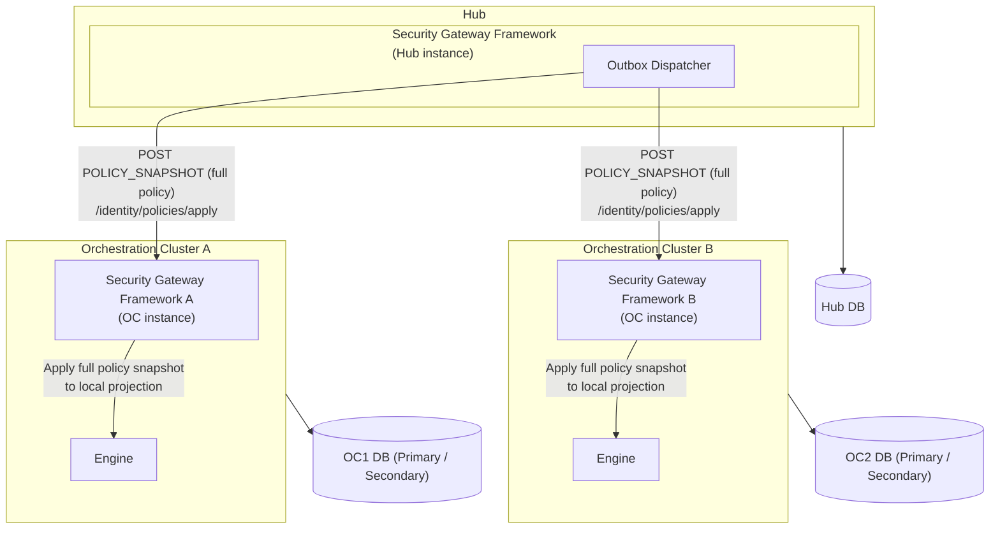

### Detailed outbox flow

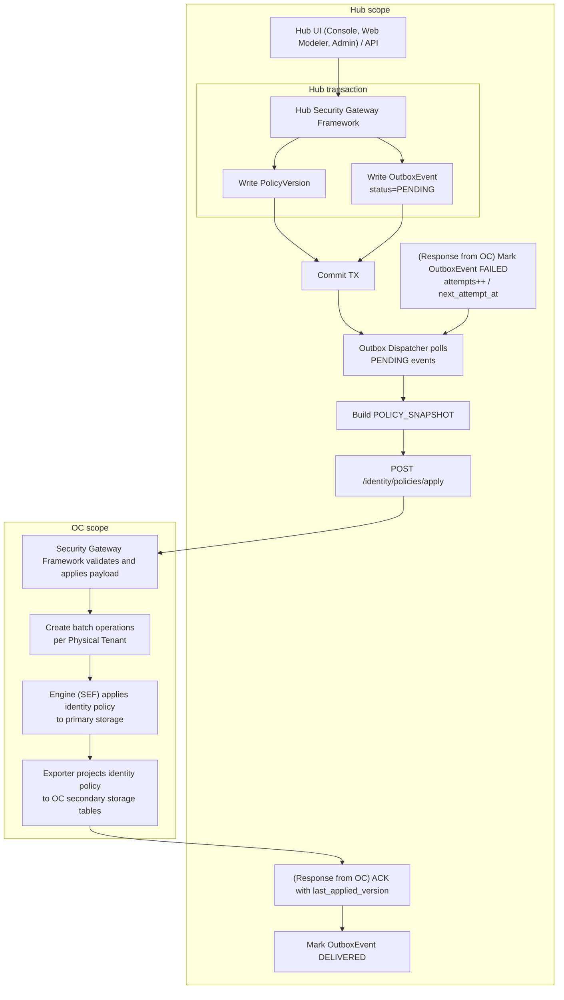

---

## 8. Policy data model

Minimal conceptual schema:

```text
OcSyncState
  organization_id    -- organization boundary in Hub
  oc_id              -- stable identifier of the target OC
  cluster_id
  last_acked_version -- last PolicyVersion successfully delivered and ACKed
  last_sync_at

OutboxEvent
  id
  organization_id
  oc_id              -- target OC for this delivery attempt
  policy_version_id
  event_type         -- POLICY_SNAPSHOT (iteration one; extensible)
  status             -- 'PENDING' | 'DELIVERED' | 'FAILED'
  attempts
  next_attempt_at

PolicyVersion
  id
  organization_id
  cluster_id
  version_number
  base_version       -- optional; reserved for possible future diff-based propagation

EntityRevision
  id
  organization_id
  entity_type
  entity_id
  introduced_in_policy_version
  scope_type
  scope_id
  is_deleted
  payload            -- single referenced entity JSON
```

- `OutboxEvent`
  - One row per policy delivery attempt to a specific cluster.
  - In shared-Hub deployments, includes the organization boundary and concrete target OC to make routing and operations explicit.
  - `event_type` is `POLICY_SNAPSHOT`.
  - Drives asynchronous delivery and retry without coupling Hub writes to OC availability.
- `OcSyncState`
  - One row per target OC.
  - Scoped by organization in shared-Hub deployments.
  - Tracks `last_acked_version`: the last `PolicyVersion` successfully delivered and acknowledged.
  - Read by the Outbox Dispatcher to track delivery progress and retries per OC.
- `PolicyVersion`
  - One row per cluster and version of the desired policy.
  - Represents the canonical policy commit for a cluster within one organization boundary.
- `EntityRevision`
  - Immutable revision payload per changed entity.
  - Stores one referenced entity JSON payload per row or delete tombstones (`is_deleted`).
  - Used to reconstruct snapshots (latest non-deleted revision per entity/scope up to target version).
  - Practical persistence split:
    - Keep canonical current-state tables per entity (role/group/authorization/etc.) for normal queries and constraints.
    - Keep `EntityRevision.payload` as JSON for versioned transport, idempotent apply, and snapshot/diff reconstruction.
    - Do not require fully normalized historical tables per version.

---

## 9. Security Gateway Framework

- Inbound and outbound ports are defined in the library core.
- Host applications provide adapters; core stays infrastructure-agnostic.
- The same port model is used in Hub and OC runtimes.
- Swapping persistence/IdP/dispatch adapters does not change domain logic.

This is just an example of the library core! 
We still have to define how we really want to implement it. 

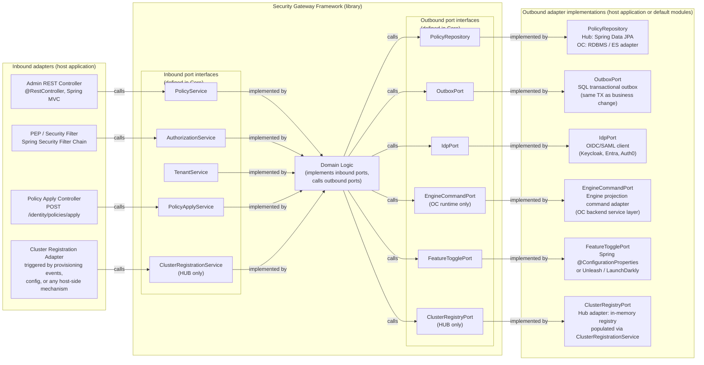

---

## 10. Runtime profiles and mode switching

- Profile selects capabilities; AuthN/AuthZ remains always on.
- `HUB` enables policy authoring, versioning, outbox, and cluster registration.
- `OC_MANAGED` enables remote apply + engine projection (admin read-only).
- `OC_STANDALONE` enables local authoring + engine projection (admin read/write).
- All profiles reuse the same shared core and policy semantics.

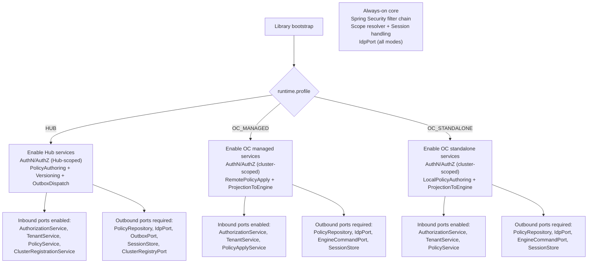

### 10.1 Shared components

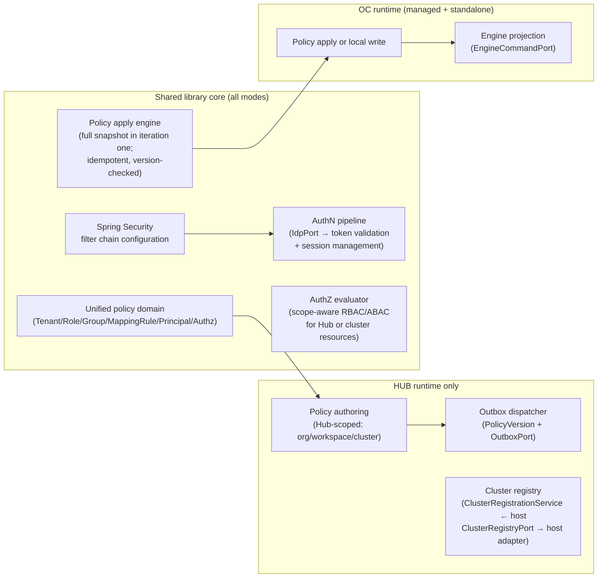

---

## 11. Security Engine Framework

- Engine-side counterpart to SGF, embedded in Zeebe engine runtime.
- Receives identity commands from OC via `EngineCommandPort` mapping.
- Performs command-time authorization using local projected identity state.
- Keeps engine independent from direct IdP integration.

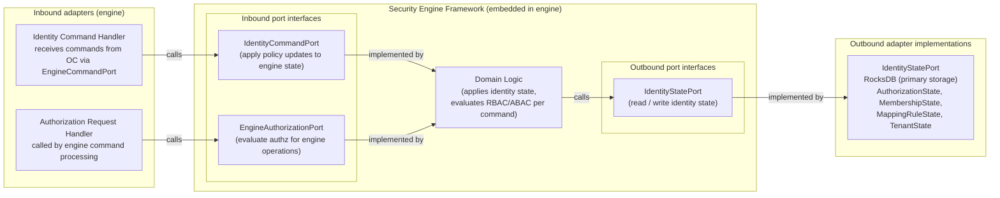

---

## 12. Config propagation to the engine via batch operations
- Use existing Batch Operation feature per Physical Tenant
- Single batch per engine per policy update
- Atomicity, scalability, observability via batch infrastructure
- Reuses existing engine infrastructure; no bespoke bulk command channel
- Fits OC-to-engine projection model and failure-handling semantics

---

## 13. Frontend integration

- Identity Admin UI as versioned npm package
- Consumed by Hub UI and OC UI
- Narrow, explicit contracts; React-based composition
- Host applications provide auth/routing/theme/i18n/telemetry context
- Keep fallback option: thin web-component wrapper only if needed
- Goal: minimize app-specific glue code and cross-app UX drift

---

## 14. Runtime view – admin configures cluster policies in full mode

- Admin authors policy centrally in Hub for target clusters.
- Hub validates principal context and persists policy/version/outbox atomically.
- Outbox dispatcher pushes full snapshots to target OCs.
- OC applies snapshots idempotently and propagates engine-scoped changes.
- OC UI admin section shows projected state in read-only mode.

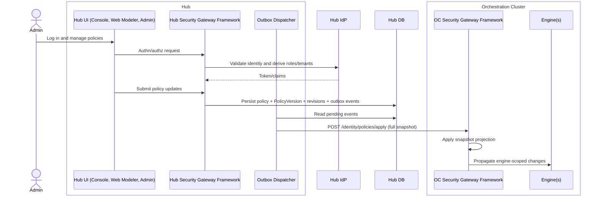

---

## 15. Deployment view

- Supports Self-Managed OC-only, Self-Managed full mode, and SaaS shared-Hub models.
- Keeps same identity core while varying operational topology.
- Preserves clear SoT boundaries and propagation responsibilities.
- Reuses existing customer/Camunda infrastructure depending on deployment model.


### Self-Managed – full mode (Hub + OC)

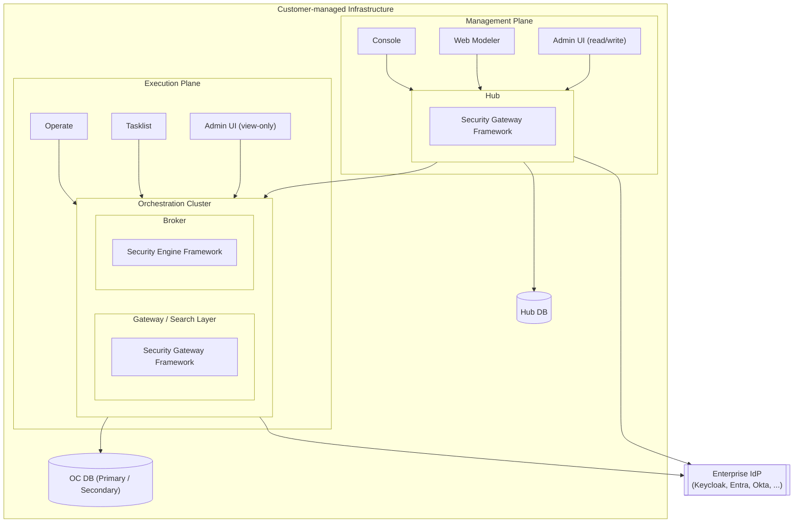

### Self-Managed – OC-only standalone (2 gateways + 3 brokers)

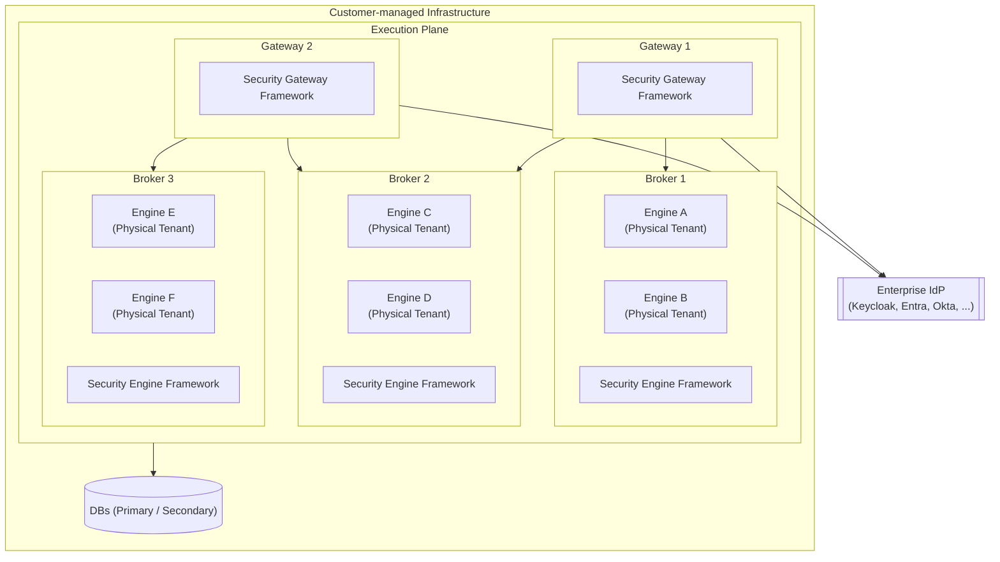

### Self-Managed – OC-only mode

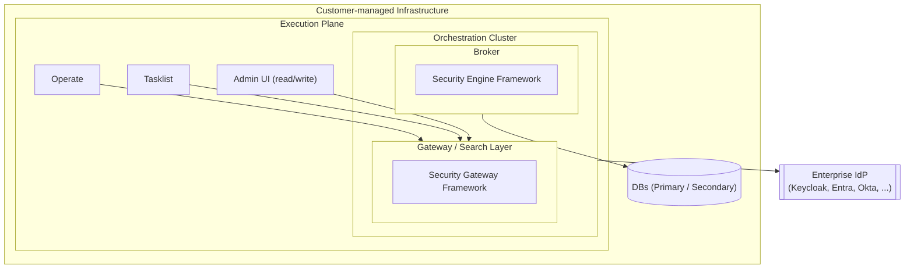

### SaaS – shared Hub across organizations

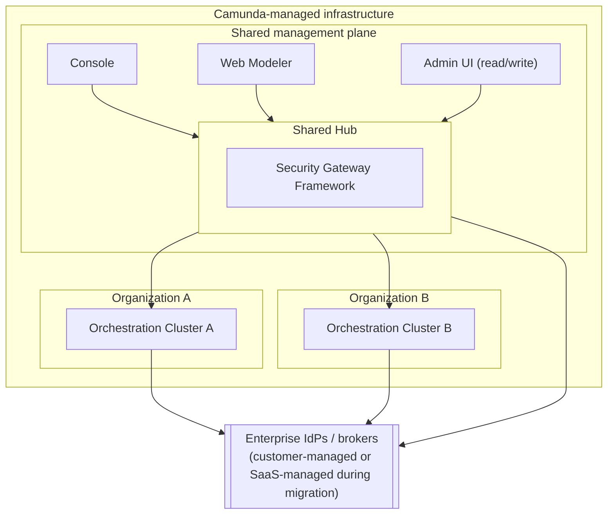
