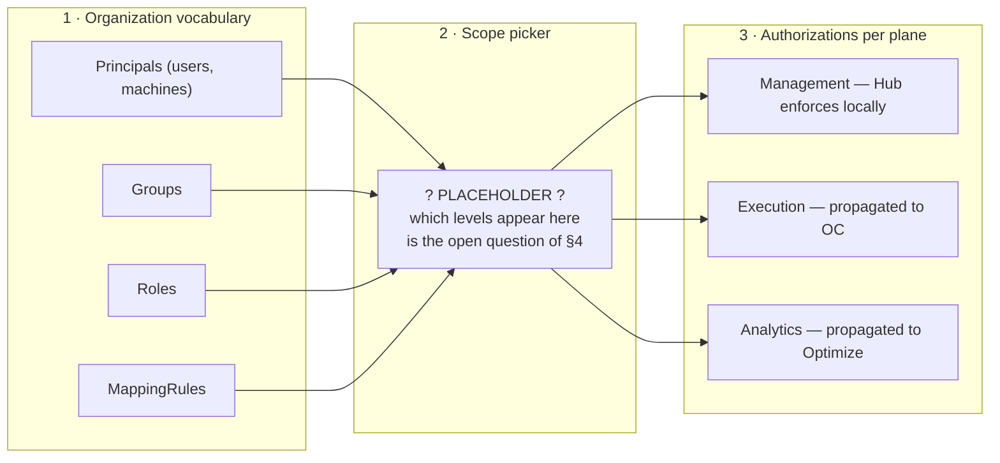

# The Unified Policy Model

> **Draft, not a proposal.** Discussion input for a workshop with the OC, Hub, and Optimize teams.
> Nothing here is decided — proposals are marked as such, open questions are marked as open.
> `status: Draft`, not `Proposed`: there is no single decision on the table yet.

## 1. Why one model

Four fixed constraints:

- One unified policy model, used by every component.
- Authored centrally in Hub, distributed downward to every OC.
- Distribution/transport is not CSL's concern — CSL supplies the model and the in/out ports, not the
  wire format.
- Hub's own management-plane authz is in scope of the unified model.

CSL owns the model and the ports. Not transport, not UI, not storage — full breakdown in §7.

Precedent already in force: [ADR-0008](../adr/0008-authz-enum-ownership-and-layered-usage.md) makes
CSL's authz enums the canonical source for OC's Service, Search, Exporter, and Persistence layers.
This document asks whether that precedent extends past OC.

## 2. Where we are today

Four components, four incompatible grant shapes — not just four vocabularies.

| Component | Grant shape | Catalogue | Storage | Scoping |
|---|---|---|---|---|
| OC/CSL | `(ownerId, ownerType, resourceType, permissionType, scope)` | Closed enum: 24 `AuthorizationResourceType` × 47 `PermissionType`, matrix-constrained | Host-provided persistence | `AuthorizationResourceMatcher{UNSPECIFIED, ANY, ID, PROPERTY}` |
| Hub | Fixed role per resource instance: `project_permissions(user_id, project_id, permission)` | `ProjectPermissionLevel{ADMIN, WRITE, READ, COMMENT, NONE}`; role→action matrix (`ProjectOperation`, 28 constants) compiled into an enum, not data | `project_permissions` table | One row per (user, project) |
| Management Identity | Audience-scoped free-form strings (`write:*`, `admin:clusters`) | `ResourceType` record seeded from YAML (`identity.resource-types`) — ships exactly two: `process-definition`, `decision-definition` | Data-seeded | String match |
| Optimize | `RoleType{VIEWER, EDITOR, MANAGER}`, compared by `ordinal()` | None | `data.roles` array nested inside each collection document | Instance-wide YAML flags `AuthorizationType{CSV_EXPORT, ENTITY_EDITOR}` |

**OC/CSL** is already the canonical authz catalogue — for OC. `security-protocol/README.md:35`:
*"CSL is the canonical catalogue of all possible values. Hosts (including this module) mirror the
values they need and map via `AuthzModelMapper`."* Extending it platform-wide is an extension
question, not a greenfield one.

**Hub** authors no org-level roles at all — it consumes them: `owner`/`admin` from the Auth0 `orgs`
claim (SaaS), or `admin:*` / `admin:clusters` / `admin:catalog` / `write:*` from Management Identity
(SM). No groups, no mapping rules, no service accounts, no outbox, no policy versioning — zero hits
in `restapi/db/src/main`.

**Management Identity**'s migration controllers cover tenants/groups/roles/mapping-rules/memberships,
not `resource_authorizations` — the identity graph migrates, the grants do not.

**Optimize** uses CSL today, for authentication and session storage only.
`OptimizeMembershipAdapter` implements `MembershipPort` with all four methods returning `List.of()`.
No authorization index, table, or store exists; `data.roles` is the only authz data it owns, and
there is nowhere to put a policy. Zero declarative enforcement
(`@PreAuthorize`/`@Secured`/`@RolesAllowed` = 0 files) — every check is hand-written per REST
method. Per-definition authorization was lost in C8: CCSM reduces it to tenant authorization, SaaS
returns `true` unconditionally (3×). Public shares under `/api/external/**` carry no identity at
all. (Current line: `workdir/camunda/optimize`, `io.camunda.optimize`, 8.11 — not the legacy C7
`workdir/camunda-optimize` line.)

**What the old §5.2 said that no code backs:**
- `AuthorizationLevel{ALL, TENANT, PHYSICAL_TENANT}` — zero hits anywhere in the OC monorepo.
- Org-wide grants authored in Hub — Hub authors nothing; it only consumes claims.
- Optimize resource types — no catalogue, no store.
- A shared Hub-plane resource-type enum — Hub's permissions are a compiled `ProjectOperation` enum,
  not catalogue entries.
- Hierarchy edges that are missing or sit at the wrong level — see §4.

## 3. The model as a proposal

### 3.1 One sentence

A grant is `(owner) × (resource) × (actions) × (scope)` — the OC/CSL shape. Adopting it
platform-wide is the proposal.

### 3.2 The plane insight

`resourceType` decides who enforces:

| Resource type | Enforced by |
|---|---|
| `PROCESS_DEFINITION` | OC |
| A Hub-plane type | Hub, local, never propagated |
| An Optimize type | Optimize |

One vocabulary, three enforcers. Precedent in Hub's own code: `ClusterAppType` maps ten apps onto
`AppClusterType{AUTOMATION, MANAGEMENT}` — `IDENTITY`/`HUB` → `MANAGEMENT`;
`ORCHESTRATION`/`OPERATE`/`TASKLIST`/`OPTIMIZE`/`CONNECTORS`/`ZEEBE_BROKER`/`ZEEBE_GATEWAY`/`ADMIN`
→ `AUTOMATION`. A two-way split over deployed apps, not a three-way split over resource types — a
precedent, not proof.

### 3.3 What each component must give up

- **Hub** — fixed roles become derived presets over grant tuples.
- **Management Identity** — free-form strings become catalogued pairs.
- **Optimize** — needs a policy store and an enforcement point it does not have.
- **OC** — gains resource types it does not enforce and must ignore safely.

### 3.4 Hub navigation sketch

The question this document started from: *I log into Hub — where do I maintain my policy?* Three
levels.



Level 2 is drawn as a placeholder deliberately. Filling it in would presuppose the answer to §4.1.

## 4. Open question: where does policy attach?

Proposed Hub structure, from a slide, not from code:

```
Organization
 ├── Workspaces
 │   └── Projects
 └── Clusters
     └── Physical Tenants
         └── Logical Tenants
```

To a workspace user, Cluster / Physical Tenant / Logical Tenant are collectively just an
**Environment** — the kind does not matter to them.

### 4.1 Which scopes can carry a policy?

Which of these six levels is a valid attachment point for a grant, and which is addressing detail?
Not every level in a navigation tree is a policy scope.

The tree itself needs a correction: `Physical Tenant → Logical Tenant` is drawn as containment;
neither codebase models it that way.
- CSL: `core`/`api` contain zero physical-tenant mentions. The logical-tenant type is
  `TenantCheck(boolean enabled, List<String> tenantIds)` — a flat list, no parent, no containment.
- OC: `PhysicalTenantIds` (`cluster/src/main/java/io/camunda/cluster/PhysicalTenantIds.java`) is a
  flat `Set<String>` with a `DEFAULT_PHYSICAL_TENANT_ID`, consumed by partition/routing config
  (`FixedPartition.physicalTenantId`, `PhysicalTenantResolver`).

Orthogonal config dimensions, not a hierarchy. Reasoning about inheritance down that edge reasons
about something that does not exist.

### 4.2 How does inheritance work across the two branches?

Does a grant at Organization flow down both branches? Override/deny at a lower level, or
additive-only?

Recommendation, not a decision: additive-only — far cheaper to reason about and to project into OC.

### 4.3 The Workspace → Environment edge — the crux

Can a Workspace-level policy — including engine rules — apply to that workspace's assigned
environments? Can a workspace user configure their environments at workspace level at all?

Evidence, strongest first:

1. **Hub's own code states the gap outright.** `RuntimeConfigurationValidationRequest.java:19-20`,
   verbatim: *"`physicalTenantId` identifies the orchestration cluster (engine) holding the
   configuration; `null` unless Hub has an authoritative cluster-to-engine mapping, which it does
   not today."* Not an inference — Hub documenting itself.
2. **The environment edge exists — one level too low, wrong flavour.** `ProcessApplication` (v2
   *Project*) has `defaultDevClusterId` / `defaultTestClusterId` / `defaultStageClusterId` /
   `defaultProdClusterId`. `Project` (v2 *Workspace*) has no cluster reference at all.
   `ProjectDeploymentFile` joins `processApplication` + `clusterId` + `DeploymentStage stage` +
   `DeploymentStatus`. Today: environments attach to a Project, as four fixed deployment-target
   defaults — not to a Workspace, not as an identity scope. Sharper question: is the existing
   Project-level, stage-keyed edge the right thing to lift to Workspace level and repurpose as a
   policy scope, or does identity need its own n:m assignment?
3. **The org→cluster column is absent, with a caveat.** `Cluster.java`'s full field list — `id,
   name, namespace, version, authentication, authorizationEnabled, created, createdBy, updated,
   updatedBy, license, apps, tags, customProperties, discoveredProperties` — has no
   `organization_id`. SM has exactly one organization by design (`04-system-context.md:13`:
   *"`organization_id` is fixed and the multi-org partitioning is present in the model but not
   operationally relevant"*), and whether SaaS sources org→cluster from Console is not established
   from this repo. Not a proven gap — we could not find it here.

Conclusion: not "should we allow it" but "which of these edges do we lift, and is that Hub schema
work in scope."

`IdpApplication.java` already joins a Workspace to a cluster and a tenant (`Project project`,
`Folder folder`, non-null `clusterId`, nullable `tenantId`) — but for Intelligent Document
Processing, an unrelated feature (§8's landmine).

### 4.4 Do org-level defaults for the execution plane exist?

Precedent first: Hub already ships org-level-default-with-per-cluster-override, for credentials.
`Credential` is org-scoped (`organization_id`, `nullable = false`, plus
`credential_organization_id_name_unique_idx`) and carries `sameConfigForAllClusters`, Javadoc
verbatim: *"When `true`, `configJson` is the shared value for every target cluster. When `false`,
config lives per-cluster in `CredentialCluster`."* `CredentialCluster` is `(credential, clusterId,
configJson, secretRefsJson)`. `Cluster.authorizationEnabled` shows Hub already stores a per-cluster
authz-shaped flag. Proven for a non-identity concern; open question is whether identity adopts the
same shape.

The void this was reaching for: `AuthorizationLevel{ALL, TENANT, PHYSICAL_TENANT}` in the old §5.2
has zero code behind it (§2). Sub-question: does an authorization-level concept get built, or struck
from the docs?

### Scope-vs-plane matrix

| Scope | Management | Execution | Analytics |
|---|---|---|---|
| Organization | ? | ? | ? |
| Workspace | ? | ? | ? |
| Project | ? | ? | ? |
| Cluster | ? | ? | ? |
| Physical Tenant | ? | ? | ? |
| Logical Tenant | ? | ? | ? |

Empty cells are the discussion — the artifact most likely to get drawn on in the room.

Cross-references: 4.3 → journey 2 and journey 4; 4.4 → §3.2.

## 5. Further open questions

Numbering continues from §4 — Q1 is §4, Q2–Q8 here. Q1–Q3 are entangled; take as one conversation.

**Blocking — decide in the workshop:**

- **Q2 What shape is a grant?** OC's tuple is shipped, canonical per ADR-0008, already mirrored by
  hosts. Hub's, Management Identity's, and Optimize's shapes are each local to one component with no
  cross-component consumer. Not "pick one of four peers" — "does everyone adopt the shape that is
  already canonical, and what does each give up." CSL delivers the model; CSL's model is the tuple.
- **Q3 Does the catalogue stay closed?** Closed enum + host mirrors + `AuthzModelMapper` (ADR-0008,
  shipped, SBE/RocksDB stability constraints) vs. data-seeded registry (Management Identity,
  shipped). Two live precedents — pick one. Leftover from the old "top scope and authority"
  question, now folded into §4: who authors org-level roles, given Hub only reads them from claims
  today and has no table behind them.

**Needs an owner, not a decision:**

- **Q4 Does Optimize get a policy store?** Not "what are its resource types" — it has no
  authorization storage, no declarative enforcement point, non-functional memberships, and lost
  per-definition authz in C8. Do public shares stay identity-free? Optimize team owns.
- **Q5 Mapping-rule matching primitive.** OC: exact match only, the rule is itself a grantable
  principal. Management Identity: `Operator{CONTAINS, EQUALS}` + `MappingRuleType{ROLE, TENANT,
  GROUP}` — OC cannot express `CONTAINS`.
- **Q6 The Hub↔cluster schema work implied by §4.3.** An authoritative cluster→engine mapping (Hub's
  own Javadoc says absent); whether the Project-level `default*ClusterId` slots get lifted to
  Workspace level and generalised beyond dev/test/stage/prod, or identity gets its own assignment
  table; whether `organization_id` on `clusters` is actually needed or supplied by Console in SaaS.
  Hub team owns — a consequence of §4, not a second discussion of it.

**Park:**

- **Q7** Property-scoped grants (`AuthorizationResourceMatcher.PROPERTY`) — real,
  implementation-shaped.
- **Q8** Where identity-provider connection configuration lives (org / cluster / physical tenant).
  Spelled out as "identity-provider" deliberately — in Hub, `Idp*` means something else entirely
  (§8).

## 6. User journeys

Each ends with what records this produces and what propagates where. The propagation vocabulary —
`PolicyVersion`, `POLICY_SNAPSHOT`, `EngineCommandPort` — is itself unbuilt: it belongs to
[policy-version-change-sets.md](./policy-version-change-sets.md), and
`05-building-block-view.md:405` records `EngineCommandPort` as *"not yet defined in
`core/port/out/`"*. Journeys use it as shared vocabulary, not as shipped mechanics.

1. **Org admin sets up baseline access after connecting the identity provider.** Connects an IdP in
   Hub → creates a MappingRule matching an IdP claim → assigns a default Role/Group. Records:
   MappingRule, Role/Group assignment in Hub, a `PolicyVersion` bump. Propagates: full
   `POLICY_SNAPSHOT` to every OC in the organization.

2. **Grant a team runtime access to one cluster's logical tenant.** Walks Organization → Cluster →
   Physical Tenant → Logical Tenant. Bites on the missing `organization_id` (§4.3 point 3) and the
   missing cluster→engine mapping (§4.3 point 1, Q6). Records: an Authorization scoped to the
   logical tenant. Propagates: via `EngineCommandPort`, once the edges above are resolved.

3. **Grant at Workspace level, applied to that workspace's environments (including engine rules).**
   The user's question, directly. Unbuildable today — included anyway, because the clicks make §4.3
   concrete. What this needs: a lift, not an invention. Hub resolves environments today from
   `ProcessApplication.default{Dev,Test,Stage,Prod}ClusterId` — one level below the Workspace, fixed
   to four stages, meant as deployment targets. This journey needs that resolution at Workspace
   level, general in arity, and readable as a policy scope.

4. **Grant a team Optimize access — blocked three times over.**
   a. The model cannot express it — no Optimize resource types in the catalogue.
   b. Optimize could not receive it — no authorization store; `OptimizeMembershipAdapter` returns
      `List.of()` for all four membership methods.
   c. Optimize could not enforce it if it did — zero declarative enforcement, every check
      hand-written per REST method, per-definition authz lost in C8.

   Answer: not without a policy store, a projection path, and an enforcement point in Optimize
   first.

5. **Grant Hub-internal workspace access (a Project/Workspace grant) — never leaves Hub.** Contrast
   with journey 3: same word "workspace", but management-plane only, and buildable today as
   `project_permissions`. Points at Q2 — Hub's shape is not a tuple.

6. **Onboard a machine principal / worker.** Client-credentials principal registered → assigned
   Role/Group or matched by a MappingRule on a client claim. Records: Principal (machine),
   Role/Group assignment, `PolicyVersion` bump. Propagates: `POLICY_SNAPSHOT` to the target cluster;
   the engine sees only the resulting permissions.

7. **The same policy, in OC-standalone, without Hub.** No Hub, no `PolicyVersion`, no propagation —
   OC authors and enforces locally. Records and enforcement live entirely in the OC-local
   projection. Tests whether every journey above still makes sense with the Hub half removed.

## 7. What CSL owns and what it does not

| CSL owns | CSL does not own |
|---|---|
| The policy model — roles, groups, mapping rules, principals, authorizations | Transport/delivery mechanics between Hub and OC (`docs/hub-oc-data-propagation.md`) |
| The in/out port contracts (`*Port`) | Authoring UI/navigation |
| Check semantics (`AuthorizationCheckPort`, `AuthorizationService`) | Persistence implementation (host-provided adapters) |
| The authz catalogue for OC (ADR-0008) | Whether/how the catalogue extends to Hub or Optimize (§5, Q3) |

## 8. Naming appendix

**Landmine:** `Idp*` in Hub means Intelligent Document Processing, not Identity Provider —
`IdpApplication`, `IdpProvider`, `idp_*` tables (`ExtractionEngine`, `IdpDocument`,
`IdpExtractionField`, `idp_document_extraction_field_values`,
`IdpUnstructuredExtractionTestCaseResult`, `IdpConnectorTemplate`). An identity audience will
misread every one of these on sight.

- **Workspace rename, split across layers.** The v2 API speaks `Workspace*`
  (`WorkspaceCreateRequest`, `WorkspaceResult`, `WorkspaceFilter`) and routes
  `/workspaces/{wsId}/projects` via `WorkspaceProjectsV2Controller`. Persistence still calls a
  Workspace a `Project` (entity `Project` → table `projects`); the v2 *Project* is entity
  `ProcessApplication` → table `hub_projects`. `IdpApplication` even carries a
  `ws_migration_original_folder_id` column.
- `tenant` means a logical Camunda tenant in OC; in Hub it appears in only two entities
  (`IdpApplication`, `AzureSyncSettings`).
- `EntityType` means three different things across the repos.
- `START_PROCESS_INSTANCE` (Management Identity) vs. `CREATE_PROCESS_INSTANCE` (OC).
- `RoleType` (Optimize) vs. `Role` (unified model).
- Cross-repo ADR links have drifted: OC's README cites "CSL ADR-0016" for what is
  [ADR-0008](../adr/0008-authz-enum-ownership-and-layered-usage.md) here; Optimize's
  `OptimizeSecurityPathAdapter` cites "ADR-0038" for what is
  [ADR-0018](../adr/0018-optimize-reuses-stateful-oidc-webapp-chain.md). Hygiene note, not a
  question.

Agree on words before models: §4's diagram already uses "Workspace" and "Project" in the v2 API
sense.
