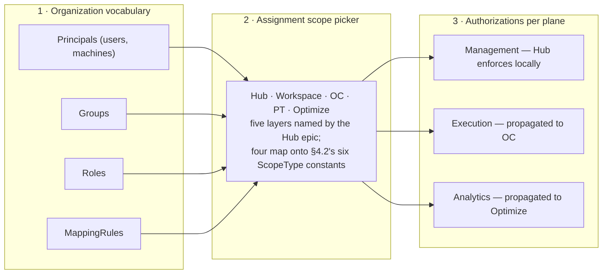

# The Unified Policy Model

> **Draft, not a proposal.** Discussion input for a workshop with the OC, Hub, and Optimize teams.
> Nothing here is decided — proposals are marked as such, open questions are marked as open.
> `status: Draft`, not `Proposed`: there is no single decision on the table yet.

## 1. Why one model

Six fixed constraints:

- One unified policy model, used by every component.
- **It extends what CSL already ships — this is not a greenfield design.** The building blocks are
  in the codebase today: `Authorization`, `AuthorizationScope`, `AuthorizationResourceType`,
  `PermissionType`, and `AuthorizationResourceMatcher` in
  [`api/model/authz/`](../../api/src/main/java/io/camunda/security/api/model/authz/);
  `AuthorizationCheckPort`, `AuthorizationService`, `AuthorizationChecker`, `MappingRuleMatcher`,
  and `MembershipPort` in `core/`; `ConfiguredRole` / `ConfiguredGroup` / `ConfiguredTenant` /
  `ConfiguredMappingRule` / `ConfiguredAuthorization` in `api/model/config/initialization/`. The
  work is extending these to fit the unified model, not replacing them.
- **The model is not hierarchical, and a role assignment carries its scope.** One rule set per
  level: being an admin of the organization does not make you an admin of a workspace inside it —
  that has to be configured additionally. The consequence is that the same subject holds different
  roles in different places, so the place rides on the *assignment* rather than in the role name:
  *(subject, role, scope)*, where a scope is a `(scopeType, scopeId)` pair naming any of the six
  levels of §4's tree. §4.2 has the detail, §8 the term. External
  source: the Hub team's
  [product-strategy#46](https://github.com/camunda/product-strategy/issues/46) specifies that
  *"Hub and Workspaces get a two-layer role model (Hub platform role + per-workspace role)"*. Why
  now: the same initiative lists *"CSL-based APIs for role assignment across Hub, Workspace, OC, and
  PT"* as a dependency on rock-12 / Identity, wanted at the start of 8.11 epic work.
- Authored centrally in Hub, distributed downward to every OC — in **Hub-managed** deployments. Hub
  is not deployed alongside the execution plane: it runs in the management plane and configures each
  execution plane remotely. [`07-deployment-view.md`](../architecture/07-deployment-view.md) §7.1.2
  already draws that split, and Hub's own code encodes it — `ClusterAppType.HUB` is an
  `AppClusterType.MANAGEMENT` app while the orchestration apps it deploys to are `AUTOMATION`,
  reached per request over `cluster_apps.grpc_url` / `rest_url`. So every execution-plane grant Hub
  authors has to cross a wire: propagation is structural, not an optimisation.
  In `oc-standalone` there is no Hub: OC is the local source of truth and authors its own policy
  (see the deployment-strategy table in `AGENTS.md`). Same model, no propagation — journey 6 walks
  that case, and it is in scope, not an exception to the model.
- Distribution/transport is not CSL's concern — CSL supplies the model and the in/out ports, not the
  wire format.
- Hub's own management-plane authz is in scope of the unified model.

CSL owns the model and the ports. Not transport, not UI, not storage — full breakdown in §7.

Precedent already in force: [ADR-0008](../adr/0008-authz-enum-ownership-and-layered-usage.md) makes
CSL's authz enums the canonical source for OC's Service, Search, Exporter, and Persistence layers.
This document asks whether that precedent extends past OC.

## 2. Where we are today

One shipped canonical grant shape — CSL's, canonical per ADR-0008 and already mirrored by hosts —
plus three component-local ones, none with a cross-component consumer. Four vocabularies, but not
four peers: the starting point is extending the canonical shape, not choosing between equals.

| Component | Grant shape | Catalogue | Storage | Scoping |
|---|---|---|---|---|
| **CSL** (shipped; OC consumes it) | `(ownerId, ownerType, resourceType, permissionType, AuthorizationScope)` | CSL's own, in [`api/model/authz/`](../../api/src/main/java/io/camunda/security/api/model/authz/): closed enums, 24 `AuthorizationResourceType` × 47 `PermissionType`, matrix-constrained via `getSupportedPermissionTypes()` | Host-provided persistence, behind `AuthorizationScopeRepositoryPort` | `AuthorizationResourceMatcher{UNSPECIFIED, ANY, ID, PROPERTY}` |
| Hub | Fixed role per resource instance: `project_permissions(user_id, project_id, permission)` | `ProjectPermissionLevel{ADMIN, WRITE, READ, COMMENT, NONE}`; role→action matrix (`ProjectOperation`, 28 constants) compiled into an enum, not data | `project_permissions` table | One row per (user, project) |
| Management Identity | Audience-scoped free-form strings (`write:*`, `admin:clusters`) | `ResourceType` record seeded from YAML (`identity.resource-types`) — ships exactly two: `process-definition`, `decision-definition` | Data-seeded | String match |
| Optimize | `RoleType{VIEWER, EDITOR, MANAGER}`, compared by `ordinal()` | None | `data.roles` array nested inside each collection document | Instance-wide YAML flags `AuthorizationType{CSV_EXPORT, ENTITY_EDITOR}` |

**CSL** already owns the canonical authz catalogue — for OC. `security-protocol/README.md:35`:
*"CSL is the canonical catalogue of all possible values. Hosts (including this module) mirror the
values they need and map via `AuthzModelMapper`."* Extending it platform-wide is an extension
question, not a greenfield one.

**Hub** authors no org-level roles at all — it consumes them: `owner`/`admin` from the Auth0 `orgs`
claim (SaaS), or `admin:*` / `admin:clusters` / `admin:catalog` / `write:*` from Management Identity
(SM). No groups, no mapping rules, no service accounts, no outbox, no policy versioning exist in
Hub's schema (`restapi/db/src/main`) today.

What Hub *does* already have is an assignment narrowed to one place:
`project_permissions(user_id, project_id, permission)`, one row per (user, project). It carries a
fixed permission enum where the unified model would carry a Role reference, which makes it the
precedent §4.2's scoped assignment generalises rather than replaces.

**Management Identity**'s migration controllers cover tenants/groups/roles/mapping-rules/memberships,
not `resource_authorizations` — the identity graph migrates, the grants do not.

**Optimize** uses CSL today, for authentication and session storage only.
`OptimizeMembershipAdapter` implements `MembershipPort` with all four methods returning `List.of()`.
No authorization index, table, or store exists; `data.roles` is the only authz data it owns, and
there is nowhere to put a policy. Zero declarative enforcement
(`@PreAuthorize`/`@Secured`/`@RolesAllowed` = 0 files) — every check is hand-written per REST
method. Per-definition authorization was lost in C8: CCSM reduces it to tenant authorization, SaaS
returns `true` unconditionally (3×). Public shares under `/api/external/**` carry no identity at
all. (Current line: `workdir/camunda/optimize`, `io.camunda.optimize`, 8.11 — not the legacy C7
`workdir/camunda-optimize` line.)

**What the old §5.2 described but nothing implements:** `AuthorizationLevel{ALL, TENANT,
PHYSICAL_TENANT}`, org-wide grants authored in Hub, Optimize resource types, and a shared Hub-plane
resource-type enum. That section documented a model that was never built, so these are gaps in the
document, not findings about the code. Its hierarchy edges are picked up in §4.

## 3. The proposed extension

### 3.1 One sentence

A grant is `(owner) × (resource) × (actions) × (resource scope)` — CSL's shipped shape. That last
element is the resource-instance selector, `AuthorizationScope`, and not §4.2's assignment scope;
§8 keeps the two apart. The proposal is not a new model: it is extending that one platform-wide,
keeping the tuple and widening the catalogue and the set of enforcers.

### 3.2 The plane insight

`resourceType` decides who enforces. The catalogue itself is not hypothetical — it ships in CSL as
[`io.camunda.security.api.model.authz.AuthorizationResourceType`](../../api/src/main/java/io/camunda/security/api/model/authz/AuthorizationResourceType.java),
24 constants today, each declaring its own supported `PermissionType`s via
`getSupportedPermissionTypes()`. The table below is not a new catalogue; it is which plane enforces
which entry:

| Resource type | Enforced by |
|---|---|
| `PROCESS_DEFINITION` (ships today) | OC |
| A Hub-plane type (would be added) | Hub, local, never propagated |
| An Optimize type (would be added) | Optimize |

One vocabulary, three enforcers. Precedent in Hub's own code: `ClusterAppType` maps ten apps onto
`AppClusterType{AUTOMATION, MANAGEMENT}` — `IDENTITY`/`HUB` → `MANAGEMENT`;
`ORCHESTRATION`/`OPERATE`/`TASKLIST`/`OPTIMIZE`/`CONNECTORS`/`ZEEBE_BROKER`/`ZEEBE_GATEWAY`/`ADMIN`
→ `AUTOMATION`. A two-way split over deployed apps, not a three-way split over resource types — a
precedent, not proof.

### 3.3 What each component must give up

- **Hub** — fixed roles become derived presets over grant tuples.
- **Management Identity** — free-form strings become catalogued pairs.
- **Optimize** — needs an enforcement point and a projection into its search-backend store (Q4);
  neither exists today.
- **OC** — gains resource types it does not enforce and must ignore safely.
- **CSL** — extends its catalogue and model; the tuple, the ports, and the check semantics stay as
  shipped.

### 3.4 Hub navigation sketch

The question this document started from: *I log into Hub — where do I maintain my policy?* Three
levels.



Level 2 is where an assignment scope gets picked (§4.2) — the epic's *"one place"* for setting a
group's whole access picture. Which levels appear there is no longer wide open: the Hub team's
[product-strategy#46](https://github.com/camunda/product-strategy/issues/46) names Hub, Workspace,
OC, Physical Tenant, and Optimize, the last as a yes/no boundary rather than a role. The *shape*
CSL represents them in is settled too — a `(scopeType, scopeId)` pair over six constants (§4.2).
With the organization settled as the top-level scope and Optimize not a level at all, four of the
epic's five layers line up directly: Hub reads as `(ORGANIZATION, <orgId>)`, Workspace as
`WORKSPACE`, OC as `CLUSTER`, PT as `PHYSICAL_TENANT`. That is this document's reading, not
something #46 states. What it leaves over is `PROJECT` and `LOGICAL_TENANT`, which #46 does not
name, and §4.1's question of which of the six can carry a policy.

## 4. Where policy attaches, and what scope a role assignment carries

Proposed Hub structure, from a slide, not from code:

```
Organization
 ├── Workspaces
 │   └── Projects
 └── Clusters
     └── Physical Tenants
         └── Logical Tenants
```

**Organization is the top-level scope** — settled design input; nothing sits above it. On this
document's reading that makes #46's *"Hub platform role"* an organization-scoped assignment rather
than a level of its own, though #46 does not say so itself.

**The two branches are not disjoint.** A project points at the runtime it deploys to, and several
workspaces or projects can point at the same physical tenant — design input, and the shipped
analogue at cluster level already permits it: the per-project cluster pointers on `hub_projects`
(`ProcessApplication.java:81-87`) are unannotated, nullable, non-foreign-key `String` columns, and
the table's only indexes are `created_by`, `project_id`, and `updated_by`
(`ProcessApplication.java:47-53`) — nothing there stops two projects, in one workspace or in
different ones, naming the same cluster. At the physical-tenant level the claim stays design intent:
Hub has no physical-tenant concept yet (Q6). The consequence worth naming is directional — *"who can
reach this physical tenant"* is a union over the workspaces and projects pointing at it, not a walk
up a parent chain, which runs the same way round as §4.2's no-inheritance ruling.

Hub itself sits outside every box from the cluster line down (§1): it configures all of them across
a wire. That is why propagation is structural rather than an optimisation, and why the missing
cluster→engine mapping (Q6) blocks journey 2 rather than merely complicating it.

### 4.1 Which scopes can carry a policy?

Which of these six levels is a valid attachment point for a grant, and which is addressing detail?
All six are expressible *as* scopes: per §4.2 they are exactly the six `ScopeType` constants, so
this heading's "scope" and the matrix column below it are the same word on purpose. What stays open
is narrower — which of the six can carry a **policy**, rather than only address one.

The containment in the tree is real. A physical tenant lives inside a cluster and owns its own
infrastructure — its own database, its own identity-provider connection — with logical tenants below
it. That isolation is the OC model as the OC team describes it, not something grepped here. What is
code-verified: physical tenant IDs live in `PhysicalTenantIds`
(`cluster/src/main/java/io/camunda/cluster/PhysicalTenantIds.java`), there is always at least
`DEFAULT_PHYSICAL_TENANT_ID` (`"default"`), and partition/routing config consumes them
(`FixedPartition.physicalTenantId`, `PhysicalTenantResolver`).

Physical tenancy is an OC concept, and CSL deliberately never learns what one *is*. CSL speaks only
an opaque **scope** key that the host maps to its own concept, and names the host-facing types
`Scoped*` accordingly (the convention block in `AGENTS.md`; ADR-0009, ADR-0013, ADR-0019).
[`ScopedAuthorizationCheckPortFactory`](../../core/src/main/java/io/camunda/security/core/authz/ScopedAuthorizationCheckPortFactory.java)
hands back one `AuthorizationCheckPort` per scope — `forScope(final String scope)`
(`ScopedAuthorizationCheckPortFactory.java:124`) — and OC maps each scope to a physical tenant.

That opaque key and §4.2's assignment scope are the **same axis**. This is settled design input, and
it reverses an earlier reading of this document: the key is a `scopeId`, and its `scopeType` is
`PHYSICAL_TENANT`. What CSL gains is a scope's *kind*, not its *meaning* —
[`CamundaSecurityScopeProvider`](../../api/src/main/java/io/camunda/security/api/context/CamundaSecurityScopeProvider.java)'s
*"Scope-agnostic: CSL never interprets the meaning of a scope"*
(`CamundaSecurityScopeProvider.java:15-16`) survives as written, while CSL does learn that a given
scope names a physical tenant rather than a workspace. That distinction is the hinge of the whole
decision, and it is what the ADR named in §4.2 has to amend the opacity wording for.

One caveat, so the merge is not overclaimed: the opaque key is not one uniform thing today. The
authz surface keys by that opaque `String scope`, but the chain-building surface keys by base path —
`ScopedSecurityDescriptor(String basePath, AuthenticationConfiguration authentication)`,
*"A path-scoped security chain request"* (`ScopedSecurityDescriptor.java:12-14`). The unification is
clean for the check-port key; the chain-building key is a routing axis and stays outside it.

What follows for this question: CSL's logical-tenant check carries a flat ID list —
`TenantCheck(boolean enabled, List<String> tenantIds)` — because the containment lives in host
configuration, not in CSL's types. The containment in the tree is real for addressing, and it
carries no rule inheritance (§4.2): CSL evaluates the rule set as authored for the level it is asked
about, with no resolution step sitting above it.

Admitting `LOGICAL_TENANT` as a `ScopeType` (§4.2) opens a question here that did not exist before:
"on this logical tenant" becomes expressible twice — as the scope on an assignment, and through the
shipped `CamundaAuthentication.authenticatedTenantIds` / `TenantCheck` path. Which of the two is
authoritative for an execution-plane check is open, and it is a direct consequence of taking the
whole tree as scope types rather than stopping at the physical tenant.

### 4.2 No inheritance — one rule set per level

Settled, not open: the model is **not hierarchical**. Every level has its own rule set and nothing
flows down either branch. Being an admin of the organization does not make you an admin of a
workspace inside it, nor an admin of a cluster in it — and being an admin of one cluster says
nothing at all about the next. Each of those is its own rule set, and has to be configured
additionally. The Hub team's
[product-strategy#46](https://github.com/camunda/product-strategy/issues/46) describes the same
shape from the product side: a group gets *"their Hub role, their role in each Workspace, their role
on each OC, their role on each PT, and their access to Optimize"* — five assignments authored
independently, not one that cascades. The last of those is a different kind, worth flagging:
Optimize is a yes/no boundary rather than a role.

**The consequence: the same subject holds different roles in different places.** A user is admin in
Workspace 1 but just reader in Workspace 2, and reader in Project A of Workspace 1. None of that is
expressible today. So the place a role applies to rides on the *assignment*:

> *(subject, role, scope)*, where a scope is a `(scopeType, scopeId)` pair

The **scope** is the level an assignment is narrowed to, carried as a typed pair: a `scopeType`,
settled as spanning all six levels of §4's tree — `ORGANIZATION`, `WORKSPACE`, `PROJECT`,
`CLUSTER`, `PHYSICAL_TENANT`, `LOGICAL_TENANT` — plus the `scopeId` naming the instance. Calling it
*scope* is a deliberate reversal: earlier revisions of this note called it the *assignment target*
precisely to keep it away from `core`'s opaque host key, and that reasoning is withdrawn — the two
are one axis (§4.1), with the physical-tenant key one `scopeType` among six. §8 records the three
things CSL now calls "scope" and which of them unify. It attaches to the assignment whatever
the subject is: `AuthorizationOwnerType` already spans `USER`, `CLIENT`, `GROUP`, `ROLE` and
`MAPPING_RULE`, so a scoped assignment can name any of those (its `TENANT` and `UNSPECIFIED`
constants are not assignment subjects). #46's primary authoring path picks an IdP group —
*"which IdP group maps to which Hub platform role, which Workspace role"* — with principals
reaching the role through group membership; that is one path onto the tuple, not a restriction on
it.

#46 names the workspace level explicitly and defers *"Fine-grained, project/file-level RBAC"* to a
later cycle. Read precisely, that deferral is about RBAC granularity *inside* a project (files,
resources), which may or may not be the same axis as scoping an assignment *at* a project. So
whether a project is a scope that can carry a *policy* — as opposed to one that is merely
expressible, which all six are — is noted here and left open, not sequenced.

**The alternative we are not taking:** encoding the level in the role name — `workspace-admin`,
`project-admin`, and one more for every level and every flavour. The scope belongs on the
assignment, not in the name. (For a sense of scale: CSL ships six bootstrap role IDs in
`DefaultRole` — `admin`, `readonly-admin`, `rpa`, `connectors`, `app-integrations`, `task-worker`.
A `workspace-admin` would be an authored `Role` entity rather than a new constant there, so this is
not a claim about that enum growing; the point is only how quickly role names multiply once the
level lives inside them.)

**Where this gets built.** CSL has no notion of a scoped assignment today, so this is forward
work, and it lands on five surfaces:

| Will need to carry the scope | Why |
|---|---|
| [`MembershipPort`](../../core/src/main/java/io/camunda/security/core/port/out/MembershipPort.java) / [`MembershipQuery`](../../core/src/main/java/io/camunda/security/core/port/out/MembershipQuery.java) | Where a role assignment is asked for and answered. `roleIds(MembershipQuery)` (`MembershipPort.java:37`) answers per principal; it will need to answer per *(principal, scope)* |
| [`CamundaAuthentication`](../../api/src/main/java/io/camunda/security/api/model/CamundaAuthentication.java) | Carries resolved membership into every check, so a scoped assignment has to survive that trip |
| `ConfiguredRole` and its siblings in [`api/model/config/initialization/`](../../api/src/main/java/io/camunda/security/api/model/config/initialization/) | How assignments are declared at startup; a scoped assignment needs a declaration form |
| The authoring surface | Where an admin picks *(subject, role, scope)* — §3.4's level 2, and #46's *"one place"* |
| Propagation | A scoped assignment has to cross the Hub→OC wire and land in the OC projection |

Two of those force a decision rather than an edit. `MembershipPort` is a **shipped outbound contract
with host implementers** — OC, and Optimize's `OptimizeMembershipAdapter` (§2) — so changing its
signature is a breaking change, which by this repo's own rules makes it ADR territory. And
`CamundaAuthentication` (`CamundaAuthentication.java:39-47`) holds membership as flat sibling lists,
`authenticatedRoleIds` beside `authenticatedTenantIds` — a scoped role is precisely what one more
flat list cannot express.

**Direction:** extend membership so that it knows the scope — `scopeType` and `scopeId`. There is no
unscoped assignment: because `ORGANIZATION` is itself a `scopeType`, what an earlier revision of
this note called an untargeted assignment (#46's Hub platform role) is `(ORGANIZATION, <orgId>)`.
Nothing here is nullable, which is the point of admitting the whole tree rather than only the levels
below the organization.

Being expressible is not the same as having an ID space, and one of the six constants shows it.
`ORGANIZATION`'s ID exists but is inert in self-managed — `04-system-context.md:13` again:
*"`organization_id` is fixed and the multi-org partitioning is present in the model but not
operationally relevant"* — so `(ORGANIZATION, <orgId>)` carries real information in SaaS and reads
as "everywhere" in self-managed.

**Open — shape, not approach.** Half of this is now settled: the scope is a typed
*(scopeType, scopeId)* pair rather than a bare ID, which admitting six kinds leaves no way around.
What stays open is narrower. Whether the pair rides as two components on the existing assignment
tuple or as its own record, which decides how much of the `MembershipPort` contract moves. And where
the scope enters that contract: as fields on
[`MembershipQuery`](../../core/src/main/java/io/camunda/security/core/port/out/MembershipQuery.java),
which all four `MembershipPort` methods already take, or as per-scope overloads beside them. Both
want settling before the ADR is written.

The enforcement-side question is reshaped by this rather than removed. Its second branch — that CSL
gains another host-mapped notion beside the opaque scope key — is in effect what the typed pair
chooses, except that it is not a *second* notion: it is the same one, now carrying its kind (§4.1).
What genuinely remains open is **resolution**. An execution-plane check runs against a physical
tenant, so something still has to turn a workspace- or project-scoped assignment into the physical
tenants behind it — a relation that is many-to-many in both directions (§4), which makes the
resolution a union rather than a walk. Whether Hub resolves it before the wire or the receiving OC
resolves it locally is open; knowing a scope's kind is what makes the question askable, not what
answers it.

**This needs an ADR, deliberately not written in this pass.** It has to name `ScopeType` and its
six constants, change
[`MembershipPort`](../../core/src/main/java/io/camunda/security/core/port/out/MembershipPort.java) —
the shipped outbound contract with host implementers called out two paragraphs above — and amend the
opacity wording that has CSL knowing nothing at all about a scope: ADR-0009, ADR-0013, ADR-0019, and
`AGENTS.md`'s convention block (*"`core` has no notion of a physical tenant — only an opaque
*scope* key"*, *"Don't introduce tenant-flavored names … in `core`"*). Those files are left
untouched here on purpose: this note is discussion input, and a decided ADR is amended by writing a
new one.

### 4.3 Organization-level defaults for the execution plane — configuration, not inheritance

Precedent first: Hub already ships org-level-default-with-per-cluster-override, for credentials.
`Credential` is org-scoped (`organization_id`, `nullable = false`, plus
`credential_organization_id_name_unique_idx`) and carries `sameConfigForAllClusters`, Javadoc
verbatim: *"When `true`, `configJson` is the shared value for every target cluster. When `false`,
config lives per-cluster in `CredentialCluster`."* `CredentialCluster` is `(credential, clusterId,
configJson, secretRefsJson)`. `Cluster.authorizationEnabled` shows Hub already stores a per-cluster
authz-shaped flag. Proven for a non-identity concern; open question is whether identity adopts the
same shape.

Note the tension with §4.2: an organization-level default with a per-cluster override *is* a
hierarchical shape, and §4.2 rules that out for policy. The precedent is proven for configuration,
not adoptable as-is for authorization — a default that silently applies wherever nothing was
authored is inheritance under another name. §4.2's ruling is unchanged.

Sub-question: does an authorization-level concept get built at all, or get struck from the docs?
The old §5.2's `AuthorizationLevel{ALL, TENANT, PHYSICAL_TENANT}` (§2) is the unimplemented shape it
was reaching for — and under §4.2 it leans towards struck: in a non-hierarchical model whose
assignments already carry the scope they apply to — a `(scopeType, scopeId)` pair that can name any
of the six levels — a level attached to the grant has no work left to do.

### Scope-vs-plane matrix

| Scope | Management | Execution | Analytics |
|---|---|---|---|
| Organization | ? | ? | ? |
| Workspace | ? | ? | ? |
| Project | ? | ? | ? |
| Cluster | ? | ? | ? |
| Physical Tenant | ? | ? | ? |
| Logical Tenant | ? | ? | ? |

Empty cells are the discussion — the artifact most likely to get drawn on in the room. Under §4.2
every cell is independent: none is implied by the row above it, and each has to be authored on its
own. #46's five layers (Hub, Workspace, OC, Physical Tenant, Optimize) read across these rows
closely enough to use — "product" in that framing is a flavour of level, not a row of its own.
The rows are the candidate `ScopeType` constants (§4.2), and per the settled design input all six
are in — so what the empty cells decide is which rows can carry a **policy**, not which are
expressible as a scope. That is what ties this matrix to the assignment question.

Cross-references: 4.2 → journeys 1, 2, and 4; 4.3 → §3.2.

## 5. Further open questions

Numbering continues from §4 — Q1 is §4.1's attachment question, Q2–Q8 here. Q1–Q3 are entangled;
take as one conversation. (§4.2 is not one of them: it is a settled constraint plus the open
questions that constraint leaves behind — the pair's shape, where it enters `MembershipPort`,
resolution of a workspace- or project-scoped assignment, and whether a project can carry a policy —
all kept there rather than renumbered into here.)

**Blocking — decide in the workshop:**

- **Q2 What shape is a grant?** CSL's tuple is shipped, canonical per ADR-0008, already mirrored by
  hosts. Hub's, Management Identity's, and Optimize's shapes are each local to one component with no
  cross-component consumer. Not "pick one of four peers" — "does everyone adopt the shape that is
  already canonical, and what does each give up." CSL delivers the model; CSL's model is the tuple,
  extended rather than replaced.
- **Q3 Does the catalogue stay closed?** Closed enum + host mirrors + `AuthzModelMapper` (ADR-0008,
  shipped, SBE/RocksDB stability constraints) vs. data-seeded registry (Management Identity,
  shipped). Two live precedents — pick one. Leftover from the old "top scope and authority"
  question, now folded into §4: who authors org-level roles, given Hub only reads them from claims
  today and has no table behind them.

**Needs an owner, not a decision:**

- **Q4 How does Optimize store and enforce a policy?** The store is settled: reuse the search
  backend Optimize already runs — Elasticsearch, or OpenSearch where that is the deployed one
  (Optimize supports both, via its `database.type` build profile and
  `OptimizeOpenSearchClientFactory` / `RichOpenSearchClient`). Open is everything around it: no
  authorization index exists today, no declarative enforcement point, non-functional memberships,
  and per-definition authz was lost in C8. Do public shares stay identity-free? Optimize team owns.
  [product-strategy#46](https://github.com/camunda/product-strategy/issues/46) settles the
  *boundary* without settling the substrate: Optimize access is *"Hub-level yes/no access, data
  always scoped to the viewer's own OC/PT permissions"*, so nothing is authored Optimize-side — but
  something there still has to hold that yes/no and derive the data scoping from it.
- **Q5 Mapping-rule matching primitive.** OC: exact match only, the rule is itself a grantable
  principal. Management Identity: `Operator{CONTAINS, EQUALS}` + `MappingRuleType{ROLE, TENANT,
  GROUP}` — OC cannot express `CONTAINS`.
- **Q6 The Hub↔cluster schema work.** First, an authoritative cluster→engine mapping. Hub's own
  code states the gap outright — `RuntimeConfigurationValidationRequest.java:19-20`, verbatim:
  *"`physicalTenantId` identifies the orchestration cluster (engine) holding the configuration;
  `null` unless Hub has an authoritative cluster-to-engine mapping, which it does not today."* That
  is not an inference but Hub documenting itself, and because Hub is not co-deployed with the
  execution plane (§1) the mapping is not a detail on the path to the engine: it *is* the path.
  Second, *where* the org→cluster relation lives is settled but differs per flavour: `Cluster.java`
  carries no `organization_id`, self-managed declares clusters in configuration
  (`ClusterProperties`, `camunda.modeler.clusters[*]`) and syncs them into the `clusters` table,
  while SaaS resolves them per organization through Cloud Console
  (`CloudConsoleService.getClusters(organizationId, token)`). So an assignment at that level has two
  shapes to satisfy, and the open part is whether Hub needs an `organization_id` on `clusters` of
  its own at all, or whether identity gets its own assignment table. Hub team owns — a consequence
  of §4, not a second discussion of it.

**Park:**

- **Q7** Property-scoped grants (`AuthorizationResourceMatcher.PROPERTY`) — real,
  implementation-shaped.
- **Q8** Where identity-provider connection configuration lives (org / cluster / physical tenant).
  Spelled out as "identity-provider" deliberately — in Hub, `Idp*` means something else entirely
  (§8). #46 answers the policy half: a customer may point one OC/PT *"directly to their own IdP,
  bypassing the shared model for that boundary"* and have it coexist with shared boundaries in the
  same organization. Where that configuration *lives* is still open.

One divergence to record rather than resolve: the journeys in §6 speak `POLICY_SNAPSHOT`, while #46
specifies Hub calling each OC/PT's own API, *"with per-boundary (not all-or-nothing)
success/failure"* and no introspection API. That is delivery mechanics rather than the authz model
— see [push-vs-pull-policy-propagation.md](./push-vs-pull-policy-propagation.md).

## 6. User journeys

Each ends with what records this produces and what propagates where. The propagation vocabulary —
`PolicyVersion`, `POLICY_SNAPSHOT`, `EngineCommandPort` — is itself unbuilt: it belongs to
[policy-version-change-sets.md](./policy-version-change-sets.md), and
`05-building-block-view.md:405` records `EngineCommandPort` as *"not yet defined in
`core/port/out/`"*. Journeys use it as shared vocabulary, not as shipped mechanics.

The authoritative product-side journey set lives in the Hub team's
[product-strategy#46](https://github.com/camunda/product-strategy/issues/46); the six below are
CSL's own reading of what those ask of this library.

1. **Org admin sets up Organization-level access after connecting the identity provider.** Connects
   an IdP in Hub → creates a MappingRule matching an IdP claim → assigns a role to what that rule
   matches, scoped to the organization. #46's equivalent maps *"which IdP group maps to which Hub
   platform role, which Workspace role"*. Records: MappingRule, a role assignment in Hub whose
   scope is `(ORGANIZATION, <orgId>)`, a `PolicyVersion` bump. Propagates: full
   `POLICY_SNAPSHOT` out of the management plane to every OC in the organization (§1). Note what
   this is *not*: an Organization-level
   assignment is one level's rule set, not a starting point that descends into workspaces (§4.2) —
   the snapshot distributes the authored facts, it does not widen them.

2. **Grant a team runtime access to one cluster's logical tenant.** Walks Organization → Cluster →
   Physical Tenant → Logical Tenant. Bites on the missing cluster→engine mapping (Q6); the
   org→cluster step above it is not blocked but is represented differently per deployment flavour,
   so an assignment there has two shapes to satisfy (Q6). Records: an
   Authorization whose scope is `(LOGICAL_TENANT, <tenantId>)` — the one scope type that overlaps a
   shipped path, since the same reach is already expressible through `authenticatedTenantIds` /
   `TenantCheck` (§4.1). Propagates: via `EngineCommandPort`, once the edges above are resolved.

3. **Grant a team Optimize access — blocked three times over.**
   a. The model cannot express it — though #46 says it does not need to express it *as a role*:
      Optimize access is *"a yes/no granted at the Hub level, tied to the OC/PT view permission they
      already hold"*. What is missing is that boundary on the assignment, not a catalogue of
      Optimize resource types.
   b. Optimize could not receive it — no authorization store *today*. The intended substrate is the
      search backend Optimize already runs (Q4), but nothing writes a policy into it, and
      `OptimizeMembershipAdapter` returns `List.of()` for all four membership methods.
   c. Optimize could not enforce it if it did — zero declarative enforcement, every check
      hand-written per REST method, per-definition authz lost in C8.

   Answer: smaller than it first looked, still blocked. The boundary needs no Optimize resource
   catalogue — #46 renders report data *"scoped to their own view permissions"*, derived from OC/PT
   rather than authored in Optimize — but something in Optimize still has to store that yes/no,
   receive it, and enforce it, and none of the three exists today.

4. **Grant Hub-internal workspace access (a Project/Workspace grant) — never leaves Hub.** The same
   word "workspace" as the execution-plane grants above, but management-plane only, and buildable
   today as `project_permissions`. It is also the closest thing to a shipped scope:
   `project_permissions` holds one row per (user, project) — a role held at one place rather than
   organization-wide (§2, §4.2). Points at Q2 — Hub's shape is not a tuple.

5. **Onboard a machine principal / worker.** Client-credentials principal registered → assigned
   Role/Group or matched by a MappingRule on a client claim. Records: Principal (machine),
   Role/Group assignment, `PolicyVersion` bump. Propagates: `POLICY_SNAPSHOT` to the target cluster;
   the engine sees only the resulting permissions.

6. **The same policy, in OC-standalone, without Hub.** No Hub, no `PolicyVersion`, no propagation —
   OC authors and enforces locally. Records and enforcement live entirely in the OC-local
   projection. Tests whether every journey above still makes sense with the Hub half removed.
   Distinct from #46's two-path model, which is a per-boundary opt-out *inside* an organization —
   one OC/PT wired *"directly to their own IdP"* while the rest of the fleet stays shared — rather
   than a Hub-less deployment.

## 7. What CSL owns and what it does not

| CSL owns | CSL does not own |
|---|---|
| The policy model — roles, groups, mapping rules, principals, authorizations | Transport/delivery mechanics between Hub and OC ([hub-oc-data-propagation.md](../hub-oc-data-propagation.md)) |
| The in/out port contracts (`*Port`) | Authoring UI/navigation |
| Check semantics (`AuthorizationCheckPort`, `AuthorizationService`) | Persistence implementation (host-provided adapters) |
| The authz catalogue for OC (ADR-0008) | Whether/how the catalogue extends to Hub or Optimize (§5, Q3) |

One line [product-strategy#46](https://github.com/camunda/product-strategy/issues/46) draws for us:
what a role can actually *do* — role definition, mapping-rule mechanics — belongs to the separate
Unified Custom Roles initiative, while *"CSL-based APIs for role assignment across Hub, Workspace,
OC, and PT"* is what its dependency table asks of this library. The model and the assignment
contract are CSL's; the catalogue of what each role means is not settled here.

## 8. Naming appendix

**Landmine:** `Idp*` in Hub means Intelligent Document Processing, not Identity Provider —
`IdpApplication`, `IdpProvider`, `idp_*` tables (`ExtractionEngine`, `IdpDocument`,
`IdpExtractionField`, `idp_document_extraction_field_values`,
`IdpUnstructuredExtractionTestCaseResult`, `IdpConnectorTemplate`). An identity audience will
misread every one of these on sight.

- **Workspace rename, split across layers.** The v2 API speaks `Workspace*`
  (`WorkspaceCreateRequest`, `WorkspaceResult`, `WorkspaceFilter`) and routes
  `/workspaces/{wsId}/projects` via `WorkspaceProjectsV2Controller`. Persistence still calls a
  Workspace a `Project` (entity `Project` → table `projects`); the v2 *Project* is entity
  `ProcessApplication` → table `hub_projects`. `IdpApplication` even carries a
  `ws_migration_original_folder_id` column.
- `tenant` means a logical Camunda tenant in OC; in Hub it appears in only two entities
  (`IdpApplication`, `AzureSyncSettings`).
- `EntityType` means three different things across the repos.
- `START_PROCESS_INSTANCE` (Management Identity) vs. `CREATE_PROCESS_INSTANCE` (OC).
- `RoleType` (Optimize) vs. `Role` (unified model).
- Cross-repo ADR links have drifted: OC's README cites "CSL ADR-0016" for what is
  [ADR-0008](../adr/0008-authz-enum-ownership-and-layered-usage.md) here; Optimize's
  `OptimizeSecurityPathAdapter` cites "ADR-0038" for what is
  [ADR-0018](../adr/0018-optimize-reuses-stateful-oidc-webapp-chain.md). Hygiene note, not a
  question.

- **"scope"** — in this note, the level a single role assignment is narrowed to, carried as a
  `(scopeType, scopeId)` pair (§4.2). `scopeType` spans all six levels of §4's tree:
  `ORGANIZATION` — the top-level scope, with nothing above it — `WORKSPACE`, `PROJECT`, `CLUSTER`,
  `PHYSICAL_TENANT`, `LOGICAL_TENANT`. Earlier revisions of this note called it the *assignment
  target* and avoided the word *scope* on purpose; that was reversed as design input — the two are
  one axis.

  The word now has three referents in CSL, two of which unify and one of which does not. The
  assignment scope above is the new one. The opaque check-port key — `forScope(final String scope)`
  (`ScopedAuthorizationCheckPortFactory.java:124`), one `AuthorizationCheckPort` per scope, each
  mapped by OC to a physical tenant — **is** the same thing: a `scopeId` whose type is
  `PHYSICAL_TENANT`.
  [`AuthorizationScope`](../../api/src/main/java/io/camunda/security/api/model/authz/AuthorizationScope.java)
  is **not**: `(matcher, resourceId, resourcePropertyName)` selects *resource instances* inside a
  single grant — an unrelated concept with a colliding name. So a plain *scope* here is always the
  assignment scope, and the other sense is written **resource scope** or named as
  `AuthorizationScope` (§2's grant-shape row and §3.1's tuple mean that one).

  None of the three is the "target cluster" / "deployment target" sense used elsewhere in this
  document. That reading of *target* is unaffected by the rename and stays as written.
- **"runtime environment"** — dev/test/staging/production is a **tag on a cluster**: not a level of
  §4's tree and not authorization-relevant (design input, reversing earlier revisions of this note
  that modelled it as a level between Organization and Clusters), Hub's shipped surface for it is
  the `DeploymentStage` enum, and a bare *Environment* is never used as a level name here.

Agree on words before models: §4's diagram and §4.2's assignment examples already use "Workspace"
and "Project" in the v2 API sense.
